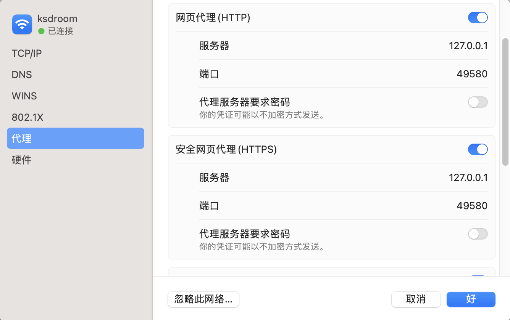
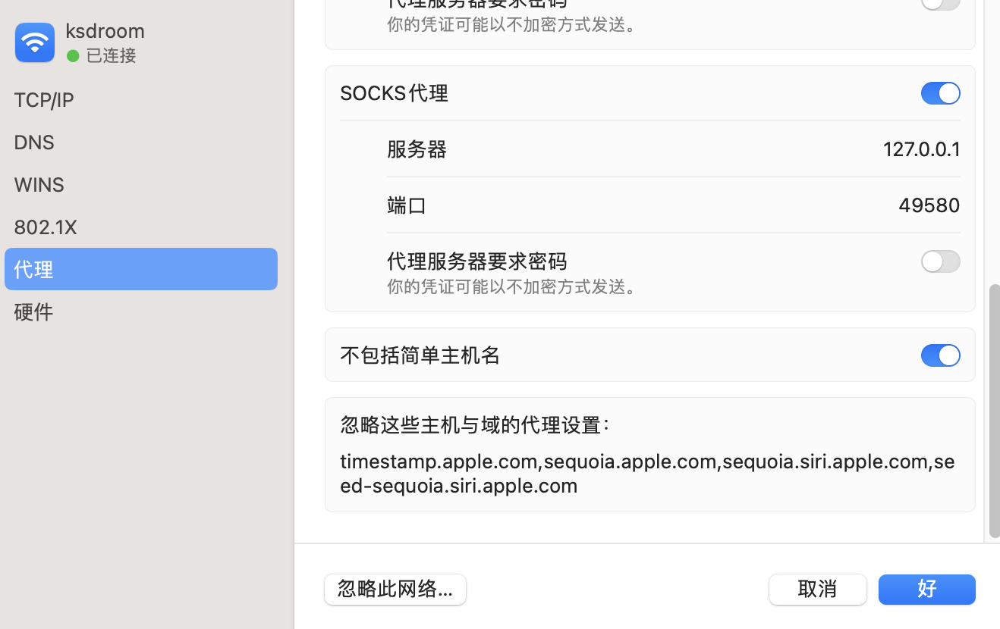

# C𝜆ash 系统代理

<p class="archive-time">archive time: 2023-11-07</p>

<p class="sp-comment">还是有点麻烦啊，始终不能理解</p>

[[toc]]

最近由于 _clash for windows_ 作者出事，导致 _clash_ 全系列，包括相关的程序都删库或者存档了

不过目前看来，_clash_ 本身还是可以用的，所以我自己还是在用

但是在 **_macOS_** 上，_clash_ 的系统代理还是有不小的麻烦

因为 **_macOS_** 上有许多服务是需要联网的，而在系统代理的过程中就会有不小的影响

比较典型的，就是系统的 _翻译_ 功能

解决方法也比较简单，那就是 `bypass` + _tun_

首先进入到系统设置，找到网络相关的地方，设置好 **http** 以及 **https** 代理



**socks** 我个人感觉不太需要，不过我还是勾选上了

然后就是勾选 _不包括简单主机名_，然后在下面 **_忽略这些主机与域的代理设置_** 中填入:

```text
192.168.0.0/16,10.0.0.0/8,172.16.0.0/12,127.0.0.1,localhost,*.local,timestamp.apple.com,sequoia.apple.com,seed-sequoia.siri.apple.com
```

注意，不能换行，用逗号隔开，空格好像也不太行（？）



然后就可以正常使用代理以及系统功能了

不过我很不解的就是，为什么我在 `Merge Profile` 里使用 `prepend-rules` 没有效果

~~但是问题被解决就好~~
