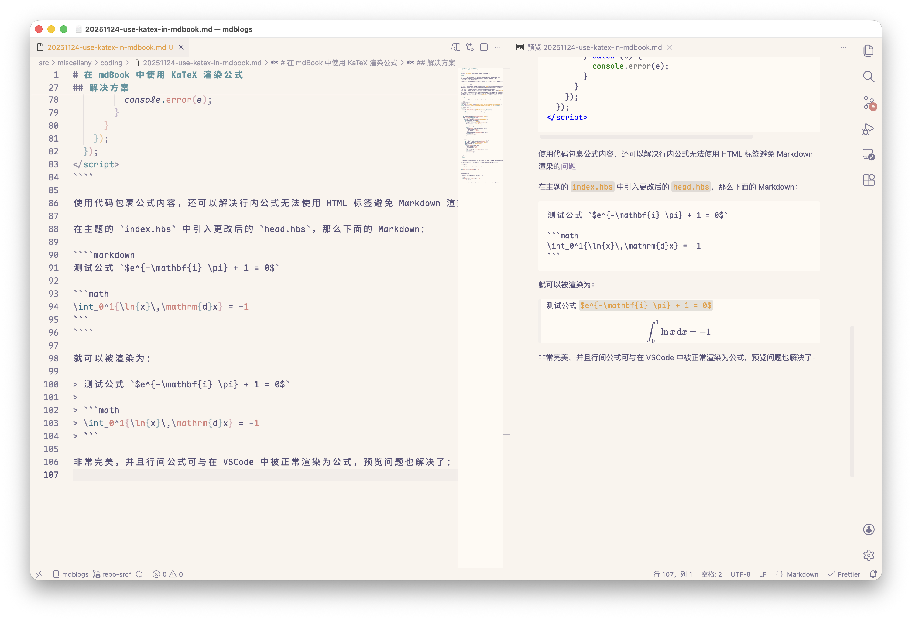

# 在 mdBook 中使用 KaTeX 渲染公式

<p class="archive-time">archive time: 2025-11-24</p>

<p class="sp-comment">现在 mdBook 可以不使用插件了</p>

## 缘起

在 `0.4.x` 版本时，mdBook 有一个非常好用的插件，叫做 **_mdbook-katex_**，
通过这个插件，设置好公式起始符号，就可以像 **正常** Markdown 一样，
使用 `$` 以及 `$$` 来书写公式了

同时，mdBook 还没有内置的章节目录，所以还需要使用 **_mdbook-toc_** 来生成目录，方便阅读

但是这在 mdBook 更新到 `0.5.0` 后就改变了

在 `0.5.0` 版本，mdBook 支持了内置目录，虽然有 [Bug](https://github.com/rust-lang/mdBook/issues/2944)，
但很快就在 `0.5.1` 版本中修复，这个新目录虽然不太完美，但是对我而言够用了，而 **_mdbook-toc_** 插件不再是必需品

另外一个则是 **_mdbook-katex_** 插件，这个插件已经很久没更新了，
之前一直靠着 `0.4.x` 的兼容性，勉强能够使用，但是在更新到 `0.5.0` 后就[不再兼容](https://github.com/lzanini/mdbook-katex/issues/130)

更加糟糕的是 **_mdbook-katex_** 插件作者的维护意愿，导致我不得不放弃使用这个插件，
但是如果要完全转向 mdBook 支持的 MathJaX，那简直是地狱，需要数不清的转义符号才能让一个稍微复杂一点的物理公式正常渲染，
然后我就在 mdBook 的 issue 评论中看到了[这么一条回复](https://github.com/rust-lang/mdBook/issues/1402#issuecomment-747023782)

## 解决方案

具体来说，可以使用代码来包裹公式，然后在渲染公式时从代码内容中选出真正的公式来渲染即可：

````html
<!-- head.hbs -->
<!-- KaTeX -->
<link rel="stylesheet" href="https://unpkg.com/katex@0/dist/katex.min.css" />
<script defer src="https://unpkg.com/katex@0/dist/katex.min.js"></script>

<!-- KaTeX 渲染 -->
<script>
  document.addEventListener("DOMContentLoaded", function () {
    if (typeof katex === "undefined") {
      console.error("KaTeX failed to load!");
      return;
    }

    var codes = document.querySelectorAll("code");
    codes.forEach(function (code) {
      // 行间公式 ```math ```
      if (code.classList.contains("language-math")) {
        var pre = code.parentNode;
        if (pre.tagName === "PRE") {
          var div = document.createElement("div");
          div.className = "math-block";
          div.style.overflowX = "auto";
          div.style.margin = "1em 0";
          try {
            katex.render(code.textContent, div, {
              displayMode: true,
              throwOnError: false,
            });
            pre.parentNode.replaceChild(div, pre);
          } catch (e) {
            console.error(e);
          }
        }
      }
      // 行内公式 `$...$`
      else if (/^\$.+?\$$/.test(code.textContent)) {
        var rawTex = code.textContent.slice(1, -1);
        var span = document.createElement("span");
        span.className = "math-inline";
        try {
          katex.render(rawTex, span, {
            displayMode: false,
            throwOnError: false,
          });
          code.parentNode.replaceChild(span, code);
        } catch (e) {
          console.error(e);
        }
      }
    });
  });
</script>
````

使用代码包裹公式内容，还可以解决行内公式无法使用 HTML 标签避免 Markdown 渲染的[问题](https://github.com/rust-lang/mdBook/issues/997)

### 效果展示

在主题的 `index.hbs` 中引入更改后的 `head.hbs`，那么下面的 Markdown：

````markdown
测试公式 `$e^{-\mathbf{i} \pi} + 1 = 0$`

```math
\int_0^1{\ln{x}\,\mathrm{d}x} = -1
```
````

就可以被渲染为：

> 测试公式 `$e^{-\mathbf{i} \pi} + 1 = 0$`
>
> ```math
> \int_0^1{\ln{x}\,\mathrm{d}x} = -1
> ```

非常完美，并且行间公式可与在 VSCode 中被正常渲染为公式，预览问题也解决了：



## 后记

使用这个方法，哪怕后续 mdBook 更新，不支持 MathJaX 了，也不会影响公式的渲染，
就是之后如果有主题更新，需要手动维护一下，这个代价也算是比较合理了
