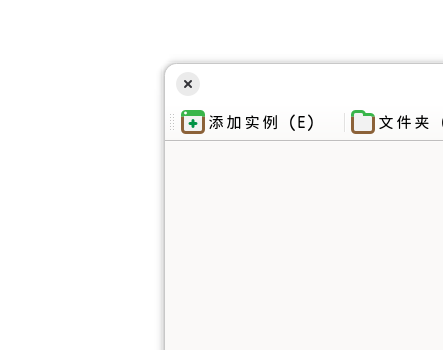

# 在 GNOME 上让 Flatpak 的 Qt 应用也能有阴影

<p class="archive-time">archive time: 2026-08-26</p>

<p class="sp-comment">GNOME，你崛起吧</p>

## 缘起

我目前在使用 GNOME 桌面，
日常使用没有问题，但是总是不可避免地需要使用一些 Qt 应用，
特别是我还喜欢使用 Flatpak 来安装一些图形应用，例如 `org.prismlauncher.PrismLauncher`

```plaintext
                -- /home/kands/ --
                pc ~> 81YN
      /\        with ~> Linux 7.1.9-zen1-2-zen
     /  \       pkgs ~> 16 (flatpak-user), 828 (pacman)
    /    \      sh ~> bash
   /      \     wm ~> Mutter 
  /   ,,   \    term ~> GNOME Console
 /   |  |   \   cpu ~> AMD Ryzen 5 4600U (12) @ 4.00 GHz [327.1 K]
/_-''    ''-_\  gpu ~> Integrated (amdgpu) @ [314.1 K]
                mem ~> 3.20 GiB (24%)
                disk ~> 17.45 GiB [btrfs] (4%)
```

但对于 Flatpak 上的 Qt 应用，由于 GNOME 的种种原因，缺少了阴影，
有些应用甚至还缺少标题栏，不太美观，
所以我在搜索下注意到了
[QAdwaitaDecorations](https://github.com/flathub/org.kde.WaylandDecoration.QAdwaitaDecorations)
这个项目


基于这个
[issue](https://github.com/flathub/org.kde.WaylandDecoration.QAdwaitaDecorations/issues/23)，
这个项目说是已经被 Qt 上游合并了，但实际上应用还是缺少阴影，
所以我在 issue 中又翻找了一下，
最后看到了这个[帖子](https://github.com/FedoraQt/QAdwaitaDecorations/issues/91)

## 解决方法

如这个 [PR](https://github.com/FedoraQt/QAdwaitaDecorations/pull/89) 所言，
现在可以通过 `QT_WAYLAND_DECORATION=qadwaitadecorations`
这个环境变量来获得较好的 GNOME 窗口装饰支持

但可惜的是，Flathub 上的 `org.kde.WaylandDecoration.QAdwaitaDecorations` 停在了 `6.7` 版本，
所以只能手动编译并加载了

### 步骤

#### 安装 KDE Sdk

为了与 Flatpak 应用尽可能使用相同环境，避免奇怪的问题，
这里最好使用 Flatpak 提供的 Sdk 环境来编译，其中第一步自然就是要安装 Sdk，
**具体的 Sdk 版本需要与应用使用的运行时版本对应**，这里我使用的是 `6.10`：

```bash
flatpak install --user flathub org.kde.Sdk//6.10
```

这里的 `--user` 是因为我习惯将 Flatpak 应用分用户安装，如果应用是全局安装，可以去掉

#### 拉取仓库到本地

接下来就要把仓库拉取到本地，
也就是 <https://github.com/FedoraQt/QAdwaitaDecorations>，
这里需要注意检查是否支持对应的 KDE 版本，按需选择 tag，对于 `6.10` 可以直接拉取：

```bash
cd path-to-some-folder
git clone https://github.com/FedoraQt/QAdwaitaDecorations.git
cd QAdwaitaDecorations
```

#### 编译

这一步比较简单，进入到 Flatpak 环境后按照 CMake 的方式编译即可：

```bash
flatpak run --user --command=sh --filesystem="$PWD" org.kde.Sdk//6.10
# in sandbox
mkdir build && cd build
cmake .. -DQT_NO_PRIVATE_MODULE_WARNING=ON -DUSE_QT6=ON -DCMAKE_BUILD_TYPE=Release
make -j$(nproc)
exit
# out sandbox
```

编译好后的结果在 `build/src` 目录下

### 使用 QAdwaitaDecorations

这里最好可以将编译好的结果放到特定目录下，这里我选择放到 `$XDG_DATA_HOME/qt-plugins/$sdk_version` 下：

```bash
mkdir -p "$XDG_DATA_HOME/qt-plugins/6.10/wayland-decoration-client"
cp "build/src/libqadwaitadecorations.so" "$XDG_DATA_HOME/qt-plugins/6.10/wayland-decoration-client"
```

然后设置 Flatpak 来加载：

```bash
flatpak override --user --filesystem=xdg-data/qt-plugins org.prismlauncher.PrismLauncher
flatpak override --user --env=QT_PLUGIN_PATH=$XDG_DATA_HOME/qt-plugins/6.10 org.prismlauncher.PrismLauncher
flatpak override --user --env=QT_WAYLAND_DECORATION=qadwaitadecorations org.prismlauncher.PrismLauncher
```

### 效果演示

正确加载后，就可以看到阴影成功出现了：



对于其他 Qt 应用，只要使用的运行时版本相同，都可以直接使用 `flatpak override` 来加载这个库，
后续如果运行时更新，**还需要重新下载对应版本的 Sdk 重新编译**，否则大概率无法正常工作，需要注意

## 后记

GNOME 究竟在搞什么啊，
GTK 的[字体渲染](https://gitlab.gnome.org/GNOME/gtk/-/work_items/7497)到现在也没修，
GNOME Weather 到现在也还没支持[任意地名获取天气](https://gitlab.gnome.org/GNOME/gnome-weather/-/work_items/395)，
而连基本的显示效果也有各种奇怪的问题，难绷

不过目前所有 DE/WM 我体验下来，只有 KDE 和 GNOME 的体验是相对较好的，
其他的多少有些不太能接受的问题等待 修复/改善，
而 KDE 我虽然之前在 OpenSUSE 的时候有在使用，后续有因为一些事情有了不太好的印象，
所以我目前长时间使用的只有 GNOME

~~希望 Linux 桌面未来能更稳定一些吧~~
