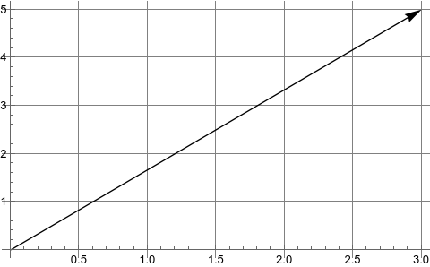
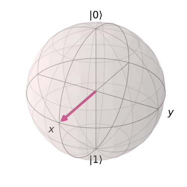
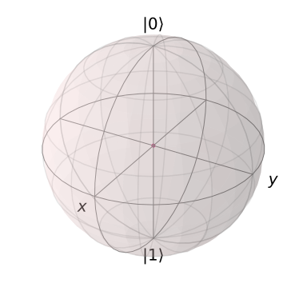
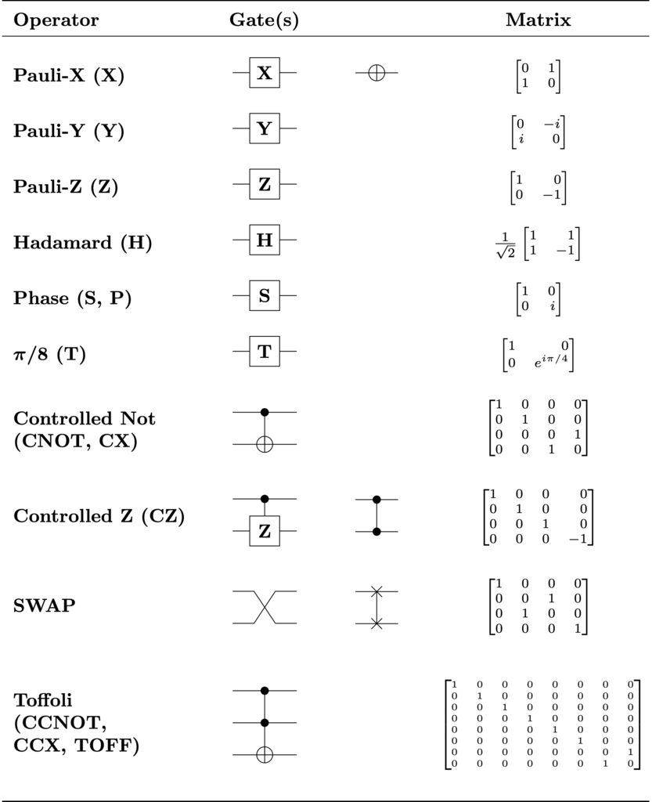

# qiskit 线性代数

archive time: 2022-11-08

这个是 IBM 公司 qiskit 文档的线性代数部分的个人翻译

[[toc]]

最近毕业论文的课题选定了，**量子计算和量子模拟的研究**，不过是偏编程实践的，应该还算可做

老师建议使用 **qiskit** 这个库来实现模拟，所以现在来啃一啃文档，顺便翻译一下

本文是 _IBM_ 公司的 **qiskit**[^1] 工具的文档中，线性代数的内容，
[原文地址](https://qiskit.org/textbook/ch-appendix/linear_algebra.html)

## 线性代数

### 简介

线性代数是表述量子计算的语言，因此，为了能够了解到量子计算中许多惊奇有趣的结构，
建立起一个对于包含线性代数在内的基本数学内容的良好认识是至关重要的

这部分的内容目的是建立起一个线性代数的入门基础，使读者能够理解量子计算中的一些过程

### 向量和向量空间

我们的线性代数入门从介绍一个在量子计算中最重要的数学概念开始，那就是 **_向量_**

形式上，我们将向量定义为 "向量空间的元素"，一个更加直观的，几何的定义是 "向量是一个有方向有大小的量"

例如，考虑一个向量由 $x$ 和 $y$ 构成，例如 $\dbinom{3}{5}$，
那么这个向量就可以可视化为一个从原点指向坐标为 $(3, 5)$ 位置的箭头

注意，向量的尾部，也就是起点，不一定是原点，只要向量的指向是对的即可

在量子计算中，我们经常要处理 **_态向量_**，也就是指向空间中与特定的量子态相对应的点的一种向量

这种态向量可以用布洛赫球面来可视化

例如，一个表示量子系统状态的向量可以表示为一个箭头，包裹在布洛赫球面中

这个球面被称为 "态空间"，由态向量所有可以指向的点组成

这个特定量子态是 $\ket{0}$ 和 $\ket{1}$ 的 _偶数态叠加_，
$\ket{0}$ 在球面顶部，$\ket{1}$ 在球面底部

箭头，即向量，可以指向球面上任意一个点，分别对应着不同的量子态

我们再回过头来看我们对于向量的形式化定义，我们现在要定义什么是 **_向量空间_**

一个基于 $F$ 域的向量空间 $V_F$ 是一个集合，其元素满足

$$
\begin{aligned}
n \ket{v} = \ket{v^{\prime}} &\qquad{} \ket{v}, \ket{v^{\prime}} \in V_F,\quad{} n \in F \\
\ket{a} + \ket{b} = \ket{c} &\qquad{} \ket{a}, \ket{b}, \ket{c} \in V_F
\end{aligned}
$$

也就是满足 **_线性组合_**[^2]

### 矩阵和矩阵操作

让我们看向另一个基本内容 **_矩阵_**

矩阵是一个可以将一个向量变为另一个向量的数学对象

$$
\ket{v} \to \ket{v^{\prime}} = M \ket{v}
$$

一般我们可以将矩阵写成列表形式，例如

$$
M =
\begin{pmatrix}
   1 & -2 & 3 \\
   1 & 5\mathbf{i} & 0 \\
   1 + \mathbf{i} & 7 & -4
\end{pmatrix}
$$

我们可以使用矩阵乘法的方式，将矩阵 "作用" 到我们的向量上

为了进行量子计算，我们需要有一些态向量，并且通过将一些矩阵作用到向量上来完成操作，向量就是一个只有一列的矩阵[^3]

我们在量子计算机上通过一系列的 **_量子逻辑门_** 来操作 _qubit_，每一个量子逻辑门都可以用矩阵表示

例如一个很常见的 _泡利-X 逻辑门_，可以表示为如下形式

$$
\sigma_{x} =
\begin{pmatrix}
   0 & 1 \\
   1 & 0
\end{pmatrix}
$$

这个逻辑门就类似经典逻辑门中的 _非门_，可以 "翻转" 我们的量子态，即 $\ket{0}$ 变成 $\ket{1}$，反之亦然

$$
\begin{aligned}
    \sigma_{x} \ket{0} = \ket{1} \\
    \sigma_{x} \ket{1} = \ket{0}
\end{aligned}
$$

在量子计算中，我们有两种非常重要的矩阵，**_哈密顿矩阵_** 和 **_酉矩阵_**

哈密顿矩阵指的是一个矩阵的 _共轭转置矩阵_ 和原矩阵一致 $M = M^{\dagger}$

所谓共轭转置矩阵，就是将矩阵转置的同时，矩阵元素的值需要变成其共轭值，即虚部要取反

而酉矩阵 (Unitary Matrix) 指的是原矩阵的 _逆_ 等于其共轭转置矩阵
$M^{-1} = M^{\dagger}$，即 $M M^{\dagger} = M^{\dagger} M = \mathcal{I}$

其中 $\mathcal{I}$ 指的是单位矩阵

我们可以发现，_泡利-Y 逻辑门_ 对应的矩阵既是哈密顿矩阵，也是酉矩阵

$$
\sigma_y =
\begin{pmatrix}
    0 & -\mathbf{i} \\
    \mathbf{i} & 0
\end{pmatrix},\quad{}
\sigma_y^{\dagger} =
\begin{pmatrix}
    0 & -\mathbf{i} \\
    \mathbf{i} & 0
\end{pmatrix}
\implies
\sigma_y \sigma_y^{\dagger} = \mathcal{I}
$$

酉矩阵的重要性在于，我们使用酉矩阵操作的时候，可以 "保持" 态向量的大小

### 生成集合，线性相关，基矢量

我们现在要来讨论构造线性空间的了

考虑一个向量空间 $V_F$，如果我们有一些向量 $\vec{v}_n$ 张成了一个向量空间 $V_S$，
其中 $V_S \subset V_F$

那么在这个子向量空间中的任意向量的线性组合的所有结果构成了一个生成集合

对于一组向量 $\vec{v}_n$，如果我们能找到一组不全为 $0$ 的数 $b_n$ 有

$$
b_1 \vec{v}_1 + b_2 \vec{v}_2 + \cdots + b_n \vec{v}_n = \sum_i^n{\vec{v}_i} = \mathbf{0}
$$

那么我们就称这一组向量是线性相关的，上式还可以等价表述为 _该组向量中任一向量可以由该组的其他向量线性组合而成_

$$
\vec{v}_a = \sum_i^n c_i \vec{v}_i,\quad{}i \ne a
$$

于此相对的，我们还有 _非线性相关_ 或 _称线性独立_

一个线性空间的基矢量的集合是一个线性独立的生成集合，而集合的大小或者元素个数，我们称为该线性空间的 **_纬度_**

例如对于 $\mathbb{R}^2$ 我们可以用 $\lbrace (1, 0), (0,1) \rbrace$ 作为其基矢量，这两个矢量的线性组合刚好可以铺满整个 $\mathbb{R}^2$，

所以 $\mathbb{R}^2$ 是这两个矢量的生成空间，这两个矢量是 $\mathbb{R}^2$ 的生成集合，
$\mathbb{R}^2$ 的纬度是 $2$

基集和生成集合很重要，因为它们允许我们 _缩减_ 向量空间，只用几个矢量来表达整个向量空间

我们可以对基矢量得出某些结论，并将其推广到整个向量空间，因为空间中的每个向量都只是基矢量的线性组合

对于量子计算，我们的基矢量就是 $\ket{0}$ 和 $\ket{1}$，例如

$$
\dfrac{\ket{0} + \ket{1}}{\sqrt{2}}
$$

就表明 $\ket{0}$ 和 $\ket{1}$ 的观测概率一样时的叠加态

### 希尔伯特空间，正交规范性，以及内积

希尔伯特空间是量子力学和量子计算中最重要的数学结构之一，希尔伯特空间可以被认为是所有量子态组成的态空间

希尔伯特空间与其他矢量空间的主要区别在于，希尔伯特空间支持内积，两个矢量的内积是一个标量

在量子力学和量子计算中，两个态向量的内积表示前一个向量在后一个向量上的投影的长度

而一个向量在某特定方向上的长度表示为在某一特定量子态的概率幅，基于此，不同量子态的观测概率就可以被计算了

对于 $\ket{a}$ 和 $\ket{b}$，内积被表示为 $\braket{a}{b}$，
其中 $\bra{a}$ 为 $\ket{a}$ 的共轭转置 $\ket{a}^{\dagger}$，即

$$
\braket{a}{b} = \left(a_1^{\dagger}\ a_2^{\dagger}\ \cdots\ a_n^{\dagger}\right)
\begin{pmatrix}
    b_1 \\
    b_2 \\
    \vdots \\
    b_n
\end{pmatrix} = a_1^{\dagger} b_1 + a_2^{\dagger} b_2 + \cdots + a_n^{\dagger} b_n
$$

使用希尔伯特空间来表示量子系统，一个最重要的条件是态向量与其自身的内积等于 $1$，即 $\braket{\psi}{\psi} = 1$

这就是所谓的归一化条件[^4]，其物理意义在于，在某一特定态下的量子系统，观测到自身所在态的概率为 $1$

让我们再来看看布洛赫球面

这个球面连同量子比特态向量之间的内积正是一个希尔伯特空间

并且这个空间还满足归一化条件，因为布洛赫球的半径为 $1$，因此每一个向量长度的平方也一定是 $1$

最后关于希尔伯特空间和内积，我们来说说其与酉矩阵的关系

酉矩阵在量子计算中很重要，因为它们对内积进行了 _保持_

也就是说，你使用一系列酉矩阵来变换一个态向量，其归一化条件仍然成立

$$
\braket{\psi}{\psi} = 1
\implies \ket{\psi} \to U \ket{\psi} = \bra{\psi^{\prime}}
\implies \braket{\psi^{\prime}}{\psi^{\prime}} = (U \ket{\psi})^{\dagger} U \ket{\psi}
= \bra{\psi} U^{\dagger} U \ket{\psi} = \braket{\psi}{\psi} = 1
$$

这表明幺正演化是将一个量子态变为另一个量子态

一个单量子比特的希尔伯特空间使用布洛赫球面来表示，其幺正变换对应旋转某一态向量到球面的其他点，而不影响其长度

### 外积以及张量积

内积不是唯一的向量乘法，某些情况下，我们会交换 _bra_ 和 _ket_ 的顺序，这也就是所谓的外积

外积的结果是一个矩阵

$$
\ket{a} \bra{b} = \begin{pmatrix}
    a_1 \\
    a_2 \\
    \vdots \\
    a_n
\end{pmatrix} (b_1^{\dagger}\ b_2^{\dagger}\ \cdots\ b_n^{\dagger})
 = \begin{pmatrix}
    a_1 b_1^{\dagger} & a_1 b_2^{\dagger} & \cdots & a_1 b_n^{\dagger} \\
    a_2 b_1^{\dagger} & a_2 b_2^{\dagger} & & \vdots \\
    \vdots & & \ddots & \vdots \\
    a_n b_1^{\dagger} & \cdots & \cdots & a_n b_n^{\dagger}
 \end{pmatrix}
$$

外积使得我们可以使用 _bra_ 和 _ket_ 来表示我们的量子逻辑门而不是使用矩阵

例如 **泡利-X 逻辑门** 可以表示为 $ \ket{0} \bra{1} + \ket{1} \bra{0} $

外积其实是张量积的一个特例

更一般来说，我们会经常看见使用张量积来共享多个量子比特的状态

$$
\ket{a} \otimes \ket{b} =  \ket{a\ b} =
\begin{pmatrix}
    a_1 \ket{b} \\
    a_2 \ket{b}
\end{pmatrix} =
\begin{pmatrix}
    a_1 b_1 \\
    a_2 b_2 \\
    \vdots \\
    a_n b_n
\end{pmatrix}
$$

而对于矩阵，张量积可以表示为如下形式，
更多内容可以参考 [这里](https://qiskit.org/textbook/ch-gates/multiple-qubits-entangled-states.html#1.-Representing-Multi-Qubit-States-)

$$
\mathbf{A} \otimes \mathbf{B} = \begin{pmatrix}
    a_{11} \mathbf{B} & \cdots & a_{1n} \mathbf{B} \\
    \vdots & \ddots & \vdots \\
    a_{m1} \mathbf{B} & \cdots & a_{mn} \mathbf{B}
\end{pmatrix}
$$

### 特征向量与特征值

让我们来看看下面这个表达式

$$
\mathbf{A} \ket{v} = \lambda \ket{v}
$$

其中 $\mathbf{A}$ 是一个矩阵，而 $\lambda$ 是一个数

如果给定一个矩阵，我们能找到这样一个向量 $ \ket{v} $ 和数 $\lambda$，那么这个向量被称为特征向量，而这个数被称为特征值

特征值和特征向量在量子力学中有很重要的物理意义，在量子计算中也同样如此

给定矩阵 $\mathbf{A}$ 我们通过等式变换可以得到

$$
\left( \mathbf{A} - \lambda \mathcal{I} \right) \ket{v} = \mathbf{0}
$$

如果 $\mathbf{A} - \lambda \mathcal{I}$ 可逆，那么我们就会得到 $\ket{v} = \mathbf{0}$，这是不可能的

所以我们可以有

$$
\det{\left( \mathbf{A} - \lambda \mathcal{I} \right)} = 0
$$

对于 **泡利-Z 矩阵**，我们可以得到 $\lambda = \pm 1$，其中 **泡利-Z 矩阵** 为

$$
\sigma_z = \begin{pmatrix}
    1 & 0 \\
    0 & -1
\end{pmatrix}
$$

故对于 $\lambda = 1$，特征向量为 $\dbinom{1}{0}$，
而 $\lambda = -1$ 对应着 $\dbinom{0}{1}$

所以，当我们在 _Z 空间_ 中观测量子比特，我们可以转而观测 **泡利-Z 矩阵** 的特征向量

事实上，下列属性在量子计算的门模型中是非常重要的，在这里我们处理的是有限维的向量空间

- 哈密顿矩阵具有线性独立的特征向量，特征向量的数量等于其空间的维数

  此外，当相应的特征值不同时，这些特征向量是正交的，
  当特征值相同时，特征向量不是正交的，但它们仍然是线性独立的，可以被正交化，
  因此，哈密顿矩阵的特征向量构成了向量空间的一个基础

- 因为酉矩阵是正规矩阵，酉矩阵的特征向量可以构成一个向量空间的正交基

上面这些特征都可以用泡利矩阵来验证

### 矩阵幂

矩阵幂的概念是一个非常具体而又极其重要的概念

我们经常看到以下形式的幺正变换

$$
\mathbf{U} = \mathbf{e}^{\mathbf{i} \gamma \mathbf{H}}
$$

其中，$\mathbf{H}$ 是一个哈密顿矩阵，$\gamma$ 是一个实数，易证满足该式所有矩阵都是幺正的

$$
\mathbf{U}^{\dagger} = \mathbf{e}^{- \mathbf{i} \gamma \mathbf{H}^{\dagger}} = \mathbf{e}^{- \mathbf{i} \gamma \mathbf{H}}
$$

故 $\mathbf{U} \mathbf{U}^{\dagger} = \mathcal{I}$

你可能会对于这种指数的形式有所顾忌，但是当我们将式子进行 Taylor 展开后，就会明了许多

$$
\mathbf{e}^{\mathbf{i} \gamma \mathbf{H}} = \sum_{n = 0}^{\infty}{\dfrac{\left( \mathbf{i} \gamma \mathbf{H} \right)^n}{n!}}
$$

如果我们将 $\mathbf{H}$ 换成 $\mathbf{B}$，其中 $\mathbf{B}$ 是对合矩阵，
即 $\mathbf{B}^2 = \mathcal{I}$，则

$$
\sum_{n = 0}^{\infty}{\dfrac{\left( \mathbf{i} \gamma \mathbf{B} \right)^n}{n!}}
= \cos{\left( \gamma \right)} \mathcal{I} + \mathbf{i} \sin{\left( \gamma \right)} \mathbf{B}
$$

我们可以将式子分成实部和虚部两个部分

$$
\sum_{n = 0}^{\infty}{\dfrac{\left( \mathbf{i} \gamma \mathbf{B} \right)^n}{n!}}
= \sum_{n = 0}^{\infty}{\dfrac{(-1)^n \gamma^{2n} \mathbf{B}^{2n}}{\left( 2n \right)!}} +
\mathbf{i} \sum_{n = 0}^{\infty}{\dfrac{(-1)^n \gamma^{2n + 1} \mathbf{B}^{2n + 1}}{\left( 2n + 1 \right)!}}
$$

由于 $\mathbf{B}^2 = \mathcal{I}$，则 $\mathbf{B}^{2n} = \mathcal{I}^n = \mathcal{I}$，
且 $\mathbf{B}^{2n + 1} = \mathbf{B}$

则证得

$$
\cos{\left( \gamma \right)} \mathcal{I} + \mathbf{i} \sin{\left( \gamma \right)} \mathbf{B} =
\sum_{n = 0}^{\infty}{\dfrac{(-1)^n \gamma^{2n} \mathbf{B}^{2n}}{\left( 2n \right)!}} +
\mathbf{i} \sum_{n = 0}^{\infty}{\dfrac{(-1)^n \gamma^{2n + 1} \mathbf{B}^{2n + 1}}{\left( 2n + 1 \right)!}}
$$

注意到，泡利矩阵不仅仅是幺正的，还是哈密顿矩阵，同时也是对合矩阵

这意味着 $\exp{\left( \mathbf{i} \gamma \sigma_k \right)},\ k \in \lbrace x, y, z \rbrace$ 不仅仅可以作为酉矩阵作用在量子态向量上，
还可以使用 $\cos$ 和 $\sin$ 的形式来表示，这在量子计算中是十分有用的

如果对于一个矩阵 $\mathbf{M}$ 有特征值 $\lambda$ 以及对应特征向量 $\ket{v}$，则

$$
\mathbf{e}^{\mathbf{M}} \ket{v} = \mathbf{e}^{\lambda} \ket{v}
$$

这个也是十分有用的，当我们创建量子电路来模拟某个特定的哈密顿量时，特别是变分电路，
我们会经常使用形如 $\exp{\left( \mathbf{i} \gamma \sigma_z \right)}$ 的逻辑门，
由于 $\ket{0}$ 和 $\ket{1}$ 是 $\sigma_z$ 的特征向量，
所以我们可以断定 $\exp{\left( \mathbf{i} \gamma \sigma_z \right)}$ 在 $\ket{0}$ 有 $\mathbf{e}^{\mathbf{i}\gamma}$ 相，
而在 $\ket{1}$ 有 $\mathbf{e}^{-\mathbf{i}\gamma}$ 相

然后，我们可以很轻松的用 **CNOT** 和 **相位/旋转 逻辑门** 来构建这个逻辑门，因为我们知道这个门在每个计算基态上的数学结果

---

最后，这里有一些常用量子逻辑门，可以参考

[^1]: GitHub 地址: [https://github.com/Qiskit/qiskit](https://github.com/Qiskit/qiskit)
[^2]:
    线性组合.Wikipedia \[DB/OL\].
    [https://zh.m.wikipedia.org/zh-cn/线性组合](https://zh.m.wikipedia.org/zh-cn/%E7%BA%BF%E6%80%A7%E7%BB%84%E5%90%88),
    2022-07-01/2022-11-09

[^3]: 默认情况下，向量都指的是列向量
[^4]:
    Orthonormality.Wikipedia \[DB/OL].
    [https://en.wikipedia.org/wiki/Orthonormality](https://en.wikipedia.org/wiki/Orthonormality),
    2022-11-06/2022-11-09
