# qiskit Deutsch-Jozsa 算法

<p class="archive-time">archive time: 2022-11-11</p>

<p class="sp-comment">这个是 IBM 公司 qiskit 文档的 Deutsch Jozsa 算法部分的个人翻译</p>

[[toc]]

今天学校进了一批量子计算相关的实验器材，用的是 **金刚石的 NV 色心** 以及 **激光** 和 **微波**，其中在讲实验原理的时候提到了这个算法，
所以我就顺便把 _IBM_ 公司的 [这篇文章](https://qiskit.org/textbook/ch-algorithms/deutsch-jozsa.html) 翻译一下

## Deutsch-Jozsa 算法

这一小节中，我们将先介绍 Deutsch-Jozsa 问题，之后分别介绍经典方法和量子方法

之后，我们将使用 _qiskit_ 实现这个方法，并使用模拟器来模拟

### 介绍

Deutsch-Jozsa 问题第一次被提出是在 **_Rapid solution of problems by quantum computation_**[^1] 一书中，
同时也是第一个量子算法表现比经典算法要好的例子，这表明量子计算机作为某些特定问题的计算工具是很有优势的

#### Deutsch-Jozsa 问题

我们有一个未知的 _布尔函数_[^2] $f$，它接受一个字符串或者一系列比特值，返回 $0$ 或 $1$，也就是

$$
f\left( \lbrace x_0,\ x_1,\ \dots \rbrace \right) \to \mathcal{B}
$$

其中 $x_i$ 的范围是 $0$ 或 $1$，$\mathcal{B}$ 用 $0$ 或 $1$ 表示

我们这个布尔函数有个特点，那就是他一定是一个常函数或者是一个平衡函数

常函数就是指对于任一输入，都返回同一个值，比如全返回 $0$ 或者 $1$

而平衡函数是指对于所有的输入，对于其中一半的输入返回 $0$，而另一半则返回 $1$

我们的目标是判断这个 $f$ 是常函数还是平衡函数

注意，Deutsch-Jozsa 问题是 Deutsch 问题问题的 $n$ 比特拓展

#### 经典方法

从经典出发，最好情况下，我们只需要向 _预言机_[^3] 查询两次就可以知道我们这个函数是否是平衡函数，
比如第一次输入得到返回值是 $0$，而第二次输入得到返回值是 $1$，我们就可以说这个函数是平衡的

但是在最坏的情况下，如果我们一直得到相同的输出，
那么我们就不得不需要测试一半所有可能的输入加一来确定 $f$ 是否是常函数，
设可能的输入为 $2^n$ 个，即需要 $2^{n-1} + 1$ 次测试

不过从概率学角度来看，这种情况是少见的，
一般我们可以将连续 $k$ 次得到相同结果的函数是常函数的概率用如下式子表述

$$
P_{\mathrm{constant}}\left( k \right) = 1 - \dfrac{1}{2^{k - 1}}
$$

其中 $k$ 的范围是 $1 \lt k \le 2^{n - 1}$

事实上，我们可以给我们的经典方法设置一个置信度，一但概率达到置信度，我们就可以提前得到结论，
不过为了得到 $100\%$ 的准确度，我们仍然需要测试 $2^{n-1} + 1$ 次输入

#### 量子方法

使用量子计算机，我们仅需执行 $f$ 一次即可得到置信度为 $100\%$ 的结果

这里我们将 $f$ 实现为一个 _量子预言机_，
并且将 $\ket{x}\ket{y}$ 状态映射到 $\ket{x}\ket{y \oplus f(x)}$

其中 $\oplus$ 是一个 **模 2 加法**[^4]，下图展示了实现算法的电路


现在让我们看看算法具体是怎样实现的

1. 准备两个量子寄存器

   第一个量子寄存器是一个容纳 $n$ 个 qubit 的寄存器，全部初始化为 $\ket{0}$

   而第二个寄存器是一个 qubit 的寄存器，初始化为 $\ket{1}$

   $$
   \ket{\psi_0} = \ket{0}^{\otimes n} \ket{1}
   $$

2. 将 _Hadamard_ 门[^5] 应用到每一个 qubit 上

   $$
   \ket{\psi_1} = \dfrac{1}{\sqrt{2^{n + 1}}} \sum_{x = 0}^{2^n - 1}\ket{x} \left( \ket{0} - \ket{1} \right)
   $$

3. 应用量子预言机，将 $\ket{x}\ket{y}$ 变成 $\ket{x}\ket{y \oplus f(x)}$

   $$
   \begin{aligned}
   \ket{\psi_2} &= \dfrac{1}{\sqrt{2^{n + 1}}} \sum_{x = 0}^{2^n - 1} \ket{x}
   \left( \ket{f(x)} - \ket{1 \oplus f(x)} \right) \\
   &= \dfrac{1}{\sqrt{2^{n + 1}}} \sum_{x = 0}^{2^n - 1}(-1)^{f(x)}\ket{x}
   \left( \ket{0} - \ket{1} \right)
   \end{aligned}
   $$

4. 在这一步，第二个量子寄存器可以被忽略，则将 Hadamard 门作用在第一个寄存器上

   $$
   \begin{aligned}
       \ket{\psi_3} &= \dfrac{1}{2^n}\sum_{x = 0}^{2^n - 1} (-1)^{f(x)}
       \lbrack \sum_{y = 0}^{2^n - 1} (-1)^{x y} \ket{y} \rbrack \\
       &= \dfrac{1}{2^n}\sum_{y = 0}^{2^n - 1}
       \lbrack \sum_{x = 0}^{2^n - 1} (-1)^{f(x)} (-1)^{x y} \rbrack \ket{y}
   \end{aligned}
   $$

5. 测量第一个寄存器，概率可以表示为

   $$
   \ket{0}^{\otimes n} = \left| \dfrac{1}{2^n} \sum_{x = 0}^{2^n - 1} (-1)^{f(x)} \right|^2
   $$

   如果结果是概率是 $1$，则是常函数，若概率为 $0$，则为平衡函数

#### 为什么可以工作

##### 常函数预言机

如果预言机是常函数，那么它对于输入是不起作用的，查询前后量子态是一样的

由于 Hadamard 门是自逆的，即 $H H = \mathcal{I}$

则经历第 $2$ 步和第 $4$ 步后，如果预言机是常函数，那么最后会得到和原输入，也就是全为 $\ket{0}$

$$
H^{\otimes n} \begin{bmatrix}
    1 \\
    0 \\
    0 \\
    \vdots \\
    0
\end{bmatrix} = \dfrac{1}{\sqrt{2^n}} \begin{bmatrix}
    1 \\
    1 \\
    1 \\
    \vdots \\
    1
\end{bmatrix} \xrightarrow{\mathrm{after}\ U_f} H^{\otimes n}
\dfrac{1}{\sqrt{2^n}} \begin{bmatrix}
    1 \\
    1 \\
    1 \\
    \vdots \\
    1
\end{bmatrix} = \begin{bmatrix}
    1 \\
    0 \\
    0 \\
    \vdots \\
    0
\end{bmatrix}
$$

##### 平衡函数预言机

如果是平衡函数，那么在第 $3$ 步，则

$$
U_f \dfrac{1}{\sqrt{2^n}} \begin{bmatrix}
    1 \\
    1 \\
    1 \\
    \vdots \\
    1
\end{bmatrix} = \dfrac{1}{\sqrt{2^n}} \begin{bmatrix}
    - 1 \\
    1 \\
    - 1 \\
    \vdots \\
    1
\end{bmatrix}
$$

如果是平衡函数，_相回传_[^6] 会依次将这些态中的一半加上一个负相，查询前的态和查询后的态是正交关系

那么在第 $4$ 步后，我们会得到一个与 $\ket{0\ 0\ \cdots\ 0}$ 正交的态

也就是说，我们将不会测量到全为 $0$ 的态

### 示例

让我们来看一个平衡函数的例子

```
f(0, 0) = 0
f(0, 1) = 1
f(1, 0) = 1
f(1, 1) = 0
```

对应的 _相预言机 (phase oracle)_ 是 $U_f \ket{x_1, x_0} = (-1)^{f(x_1, x_0)} \ket{x}$

我们先来检验一下预言机是否正常工作

1. 初始化，我们使用两个 qubit，然后使用一个 qubit 来存储结果

   $$
   \ket{\psi_0} = \ket{0\ 0}_{0 1} \otimes \ket{1}_2
   $$

   其中下标的含义是对应的 qubit 标号

2. 在所有的 qubit 上应用 Hadamard 门

   $$
   \ket{\psi_1} = \dfrac{1}{2}(\ket{00} + \ket{01} + \ket{10} + \ket{11})_{01}
   \otimes \dfrac{1}{\sqrt{2}} (\ket{0} - \ket{1})_2
   $$

3. 这个预言机可以用 $Q_f = \mathbf{CX}_{02} \mathbf{CX}_{12}$ 来实现

   $$
   \begin{aligned}
        \ket{\psi_2} & = \dfrac{1}{2\sqrt{2}}
        \lbrack
            \ket{00}_{01} \otimes (\ket{0 \oplus 0 \oplus 0} - \ket{1 \oplus 0 \oplus 0})_2 \\
            & + \ket{01}_{01} \otimes (\ket{0 \oplus 0 \oplus 1} - \ket{1 \oplus 0 \oplus 1})_2 \\
            & + \ket{10}_{01} \otimes (\ket{0 \oplus 1 \oplus 0} - \ket{1 \oplus 1 \oplus 0})_2 \\
            & + \ket{11}_{01} \otimes (\ket{0 \oplus 1 \oplus 1} - \ket{1 \oplus 1 \oplus 1})_2
        \rbrack \\
        & = \dfrac{1}{2\sqrt{2}}
        \lbrack
            \ket{00}_{01} \otimes (\ket{0} - \ket{1})_2 \\
            & - \ket{01}_{01} \otimes (\ket{0} - \ket{1})_2 \\
            & - \ket{10}_{01} \otimes (\ket{0} - \ket{1})_2 \\
            & + \ket{11}_{01} \otimes (\ket{0} - \ket{1})_2
        \rbrack
    \end{aligned}
   $$

4. 化简上式

   $$
   \begin{aligned}
       \ket{\psi_2} & = \dfrac{1}{2}(\ket{00} - \ket{01} - \ket{10} + \ket{11})_{01}
       \otimes \dfrac{1}{\sqrt{2}}(\ket{0} - \ket{1})_2 \\
       & = \dfrac{1}{\sqrt{2}}(\ket{0} - \ket{1})_0
       \otimes \dfrac{1}{\sqrt{2}}(\ket{0} - \ket{1})_1
       \otimes \dfrac{1}{\sqrt{2}}(\ket{0} - \ket{1})_2
   \end{aligned}
   $$

5. 将 Hadamard 门作用在第 $1$ 个寄存器上

   $$
   \ket{\psi_3} = \ket{1}_0 \otimes \ket{1}_1 \otimes (\ket{0} - \ket{1})_2
   $$

6. 观测第 $1$ 个寄存器，得到 `11` 这个结果，表明这是一个平衡函数

### 创建量子预言机

让我们来看看几种不同的创建量子预言机的方法

对于常函数的做法比较简单

1. 如果 $f(x) = 0$，则应用 I 门到第二个寄存器的 qubit 上
2. 如果 $f(x) = 1$，则应用 X 门到第二个寄存器的 qubit 上

对于一个平衡函数，我们可以创建许多不同的电路

我们保证我们的电路是平衡的其中一个方法是对第一个寄存器中的每个量子比特进行 CNOT，以寄存器 2 中的量子比特为目标

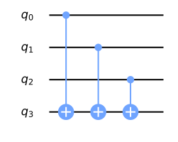

在上图中，最上面的三个量子比特构成了输入寄存器，而最下面的量子比特是输出寄存器

我们可以在下面的表格中看到哪些输入状态会产生哪些输出

| 输出为 0 的输入状态 | 输出为 1 的输入状态 |
| :-----------------: | :-----------------: |
|         000         |         001         |
|         011         |         100         |
|         101         |         010         |
|         110         |         111         |

我们可以在保持平衡的情况下，通过将选定的控件包裹在 X 门中来改变结果

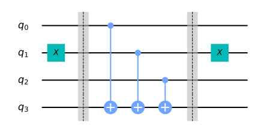

输入输出结果如下

| 输出为 0 的输入状态 | 输出为 1 的输入状态 |
| :-----------------: | :-----------------: |
|         001         |         000         |
|         010         |         011         |
|         100         |         101         |
|         111         |         111         |

### qiskit 实现

现在我们以三比特函数为例实现 Deutsch-Jozsa 算法，同时使用常数和平衡预言机

```python
# initialization
import numpy as np

# importing Qiskit
from qiskit import IBMQ, Aer
from qiskit.providers.ibmq import least_busy
from qiskit import QuantumCircuit, assemble, transpile

# import basic plot tools
from qiskit.visualization import plot_histogram
```

接下来，设定预言机的输入寄存器大小

```python
# set the length of the n-bit input string.
n = 3
```

#### 常函数预言机

让我们从创建常函数预言机开始

在这种情况下，输入对输出没有影响，所以我们只是随机地将输出 qubit 设置为 0 或 1

```python
const_oracle = QuantumCircuit(n + 1)

output = np.random.randint(2)
if output == 1:
    const_oracle.x(n)

const_oracle.draw(output="mpl")
```

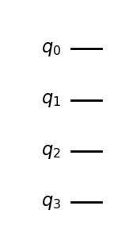

#### 平衡函数预言机

```python
balanced_oracle = QuantumCircuit(n + 1)
```

接下来，我们创建一个平衡函数预言机

正如我们在 [之前](#创建量子预言机) 所看到的，我们可以通过执行 CNOTS 来创建一个平衡函数预言机，
每个输入量子比特作为一个控制，而输出比特作为目标

我们可以通过将一些控制包在 X 门中来改变给出 0 或 1 的输入状态

让我们首先选择一个长度为 n 的比特串，它决定了要包裹哪些控件

```python
b_str = "101"
```

现在我们有了这个字符串，我们可以用它作为提示来放置 X 门

对于电路中的每个 qubit，如果 `b_str` 中的相应数字是 1，我们就放置一个 X 门，如果是 0，则什么也不做

```python
# Place X-gates
for qubit in range(len(b_str)):
    if b_str[qubit] == '1':
        balanced_oracle.x(qubit)
balanced_oracle.draw(output="mpl")
```

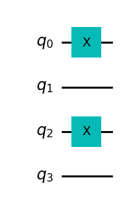

接下来，我们来加上 CNOT 门，使用每个输入 qubit 作为控制，而输出 qubit 作为目标

最后，重复上面的代码，完成对 X 门的控制

```python
# Use barrier as divider
balanced_oracle.barrier()

# Controlled-NOT gates
for qubit in range(n):
    balanced_oracle.cx(qubit, n)

balanced_oracle.barrier()

# Place X-gates
for qubit in range(len(b_str)):
    if b_str[qubit] == '1':
        balanced_oracle.x(qubit)

# Show oracle
balanced_oracle.draw(output="mpl")
```

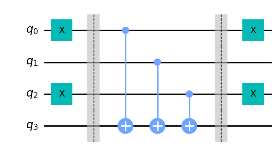

我们刚刚构建了一个平衡函数预言机，剩下的就是看 Deutsch-Jozsa 算法是否能解决它了

#### 完整算法

现在让我们把一切都放在一起

该算法的第一步是将输入的 qubit 初始化为 $\ket{+}$ 状态，输出 qubit 为 $\ket{-}$ 状态

```python
dj_circuit = QuantumCircuit(n + 1, n)

# Apply H-gates
for qubit in range(n):
    dj_circuit.h(qubit)

# Put qubit in state | - >
dj_circuit.x(n)
dj_circuit.h(n)
dj_circuit.draw(output="mpl")
```

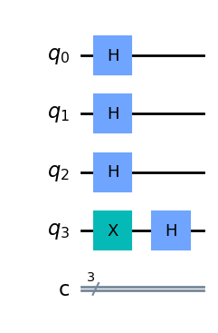

接下来，让我们应用预言机

在这里，我们应用我们在上面创建的 `balanced_oracle`

```python
# Add oracle
dj_circuit = dj_circuit.compose(balanced_oracle)
dj_circuit.draw(output="mpl")
```

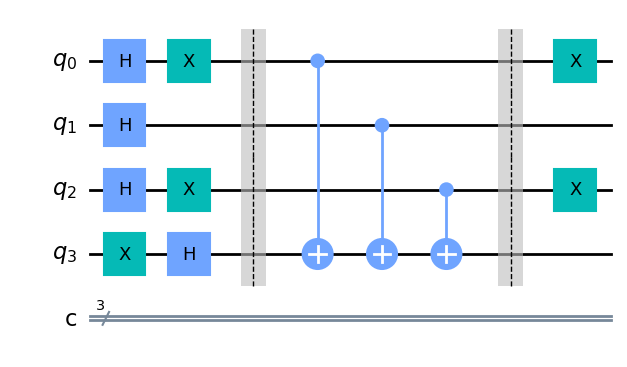

最后，我们对输入的 qubit 都加上 Hadamard 门，并观测我们的输入寄存器

```python
# Repeat H-gates
for qubit in range(n):
    dj_circuit.h(qubit)
dj_circuit.barrier()

# Measure
for i in range(n):
    dj_circuit.measure(i, i)

# Display circuit
dj_circuit.draw(output="mpl")
```

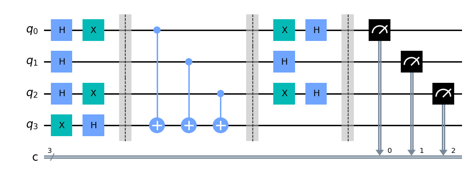

我们来看看我们的输出结果

```python
# use local simulator
aer_sim = Aer.get_backend('aer_simulator')
qobj = assemble(dj_circuit, aer_sim)
results = aer_sim.run(qobj).result()
answer = results.get_counts()

plot_histogram(answer)
```


从上面的结果我们可以看出，我们有 $0\%$ 的机会测量 $\ket{000}$，这正确地预测了函数是平衡的

#### 通用电路

下面，我们提供一个通用的函数，可以创建 Deutsch-Jozsa 预言机，并把它们变成量子门

它接收参数 `case`，其中 `case` 要么是 `"constant"`，要么是 `"balanced"`，以及 `n`，即输入寄存器的大小

```python
def dj_oracle(case, n):
    # We need to make a QuantumCircuit object to return
    # This circuit has n+1 qubits: the size of the input,
    # plus one output qubit
    oracle_qc = QuantumCircuit(n+1)

    # First, let's deal with the case in which oracle is balanced
    if case == "balanced":
        # First generate a random number that tells us which CNOTs to
        # wrap in X-gates:
        b = np.random.randint(1,2**n)
        # Next, format 'b' as a binary string of length 'n', padded with zeros:
        b_str = format(b, '0'+str(n)+'b')
        # Next, we place the first X-gates. Each digit in our binary string
        # corresponds to a qubit, if the digit is 0, we do nothing, if it's 1
        # we apply an X-gate to that qubit:
        for qubit in range(len(b_str)):
            if b_str[qubit] == '1':
                oracle_qc.x(qubit)
        # Do the controlled-NOT gates for each qubit, using the output qubit
        # as the target:
        for qubit in range(n):
            oracle_qc.cx(qubit, n)
        # Next, place the final X-gates
        for qubit in range(len(b_str)):
            if b_str[qubit] == '1':
                oracle_qc.x(qubit)

    # Case in which oracle is constant
    if case == "constant":
        # First decide what the fixed output of the oracle will be
        # (either always 0 or always 1)
        output = np.random.randint(2)
        if output == 1:
            oracle_qc.x(n)

    oracle_gate = oracle_qc.to_gate()
    oracle_gate.name = "Oracle" # To show when we display the circuit
    return oracle_gate
```

让我们也创建一个函数，对这个预言机门进行 Deutsch-Jozsa 算法

```python
def dj_algorithm(oracle, n):
    dj_circuit = QuantumCircuit(n+1, n)
    # Set up the output qubit:
    dj_circuit.x(n)
    dj_circuit.h(n)
    # And set up the input register:
    for qubit in range(n):
        dj_circuit.h(qubit)
    # Let's append the oracle gate to our circuit:
    dj_circuit.append(oracle, range(n+1))
    # Finally, perform the H-gates again and measure:
    for qubit in range(n):
        dj_circuit.h(qubit)

    for i in range(n):
        dj_circuit.measure(i, i)

    return dj_circuit
```

最后，让我们用这些函数来看看整个过程

```python
n = 4
oracle_gate = dj_oracle('balanced', n)
dj_circuit = dj_algorithm(oracle_gate, n)
dj_circuit.draw(output="mpl")
```

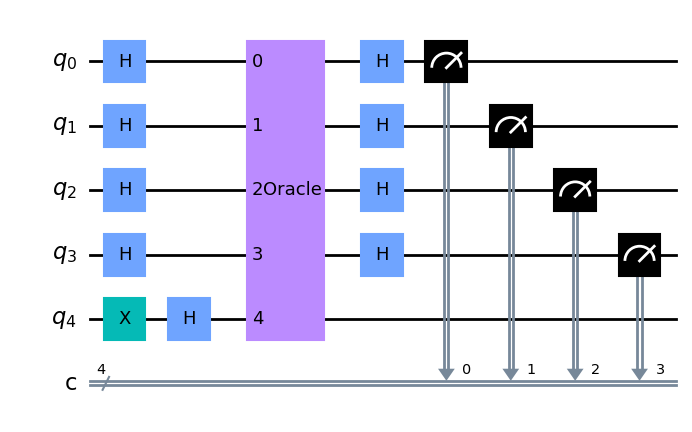

看看这个电路的结果

```python
transpiled_dj_circuit = transpile(dj_circuit, aer_sim)
qobj = assemble(transpiled_dj_circuit)
results = aer_sim.run(qobj).result()
answer = results.get_counts()
plot_histogram(answer)
```

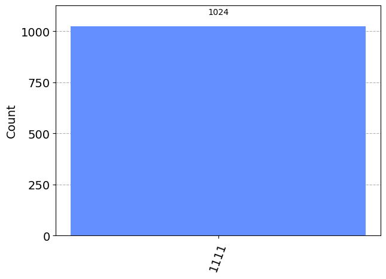

### 在真实设备上实验

我们可以在真实的设备上运行该电路，如下所示，我们首先寻找可以处理我们的电路的最不繁忙的设备

```python
# Load our saved IBMQ accounts and get the least busy backend device with greater than or equal to (n+1) qubits
IBMQ.load_account()
provider = IBMQ.get_provider(hub='ibm-q')
backend = least_busy(provider.backends(filters=lambda x: x.configuration().n_qubits >= (n+1) and
                                   not x.configuration().simulator and x.status().operational==True))
print("least busy backend: ", backend)
```

可以看到类似输出

```
least busy backend:  ibmq_quito
```

可以使用 `job_monitor` 监测运行情况

```python
# Run our circuit on the least busy backend. Monitor the execution of the job in the queue
from qiskit.tools.monitor import job_monitor

transpiled_dj_circuit = transpile(dj_circuit, backend, optimization_level=3)
job = backend.run(transpiled_dj_circuit)
job_monitor(job, interval=2)
```

如果比较繁忙，可能会出现类似如下输出

```
Job Status: job is queued (66)
```

如果任务执行结束，会看到类似如下输出

```
Job Status: job has successfully run
```

此时我们可以看看结果

```python
# Get the results of the computation
results = job.result()
answer = results.get_counts()

plot_histogram(answer)
```

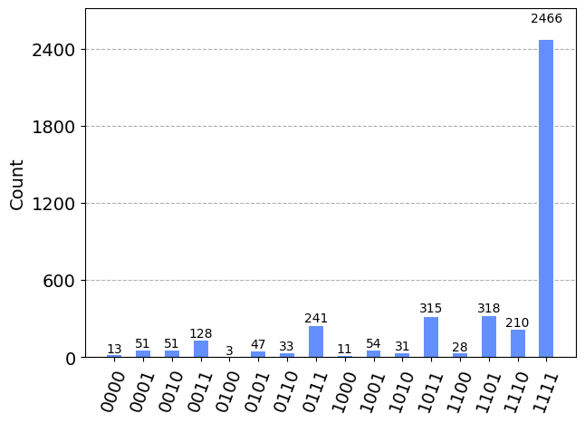

我们可以看到，最可能的结果是 $\ket{1111}$，其他结果是由于量子计算中的错误造成的

---

吐槽一句，**IBM** 这个 API 是真的难等，排队好慢

[^1]:
    David, D., & Richard, J. (1992).
    Rapid solution of problems by quantum computation.
    Proc. R. Soc. London A - Math. Phys. Sci., 439(1907), 553–558.
    [doi:10.1098/rspa.1992.0167](https://doi.org/10.1098/rspa.1992.0167)

[^2]: 也就是返回 `true` 或者 `false` 的函数，这里用比特值代替
[^3]:
    Wikipedia. (2022, November 08). Oracle machine.
    Retrieved from
    [https://en.wikipedia.org/wiki/Oracle_machine](https://en.wikipedia.org/wiki/Oracle_machine)

[^4]: 即 $1 \oplus 0 = 1$ 而 $1 \oplus 1 = 0$
[^5]: 参见 [The Hadamard Gate](https://qiskit.org/textbook/ch-states/single-qubit-gates.html#hgate)
[^6]: 参见 [Phase Kickback](https://qiskit.org/textbook/ch-gates/phase-kickback.html)
