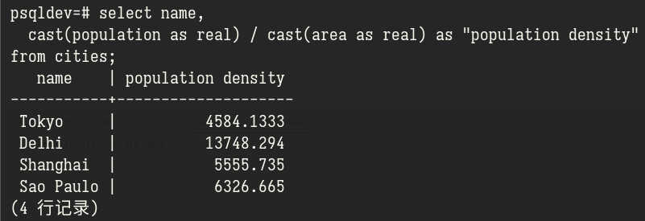

# PostgreSQL 学习 01

<p class="archive-time">archive time: 2023-05-02</p>

<p class="sp-comment">今天来重新学习一下 PostgreSQL</p>

[[toc]]

之前有更新过几次有关 SQL 的学习记录博客，
但是由于没有坚持下来或者没有记录，最后被我删除了

最近我发现了一个视频系列:
**_SQL and PostgreSQL The Complete Developer's Guide_**，
我打算跟着这个视频系列来重新学习一下 PostgreSQL

## 创建数据库

关于 PostgreSQL 数据库的安装和配置我在这里就不再多说，
Linux 上可以参照 [Arch Wiki](https://wiki.archlinux.org/title/PostgreSQL)，
Windows 或者其他平台可以按照 PostgreSQL 的文档来安装

安装好后，还需要创建一个数据库，
这个数据库就是练习 SQL 的地方，可以使用 `createdb` 命令:

```shell
createdb "<database name>"
```

这里的 `"<database name>"` 可以替换为你想要的名字，我这里就是 `psqldev`

创建好后连接数据库，可以使用 `psql` 命令来链接

```shell
psql "<database name>"
```

这里要注意用户是否正确，如果链接不上或者出错，可以检查一下是否是 PostgreSQL 的服务没有启动:

```shell
# 如果使用 systemd 管理
systemctl status postgresql.service
```

如果服务正常，那么要想想是不是没有添加用户名到 PostgreSQL 导致无法链接，具体操作请参照 [Arch Wiki](https://wiki.archlinux.org/title/PostgreSQL)

如果都没有问题，那么恭喜，一个数据库就创建好了

## 创建表格

数据库的结构可以类比于 _Microsoft Excel_，
数据库就是一个 `*.xlsx` 格式的文件，而数据库里的每个表，就是对应于文件中的一张表格，
数据库中的一个数据，就对应于表中的一行内容

要存储数据到数据库中，首先要创建一张存储数据的表，
这里按照视频里的内容，表中要存放城市的信息，包括四个字段

- 城市姓名
- 城市属于哪个国家
- 城市的人口
- 城市的面积

确定好表的内容后，还需要确定每个字段的类型，
PostgreSQL 所支持的类型可以在
[文档](https://www.postgresql.org/docs/current/datatype.html) 中查询

这里，城市姓名和国家选择使用 `character varying(n)` 类型，
其中 `n` 代表最大字符数量，在这里，$64$ 就是个不错的数字，
而人口和面积使用 `integer` 类型

每个表格都需要一个索引用的字段，称为 **主键**，对应关键字就是 `primary key`，
主键要求字段内容唯一，这里可以选择城市的姓名作为主键

综上，创建城市表的代码如下

```pgsql
create table cities (
  name character varying(64) primary key,
  country character varying(64),
  population integer,
  area integer
);
```

`create table` 就是要创建一个表，`cities` 是表的名字，
括号里面是表中的字段，使用逗号分隔，
每个字段的基本格式是 `<column> <type> [primary key]`，一张表只能有一个主键

如此一来，这个城市表就创建好了

## 插入数据

插入数据到某个表中，可以使用 `insert into` 语句来实现

```pgsql
insert into <table name> (..., <cols>)
values (..., <vals>),
  ...
  (..., <vals>)
```

这里 `<table name>` 就是要插入的表的名字，`<cols>` 表示插入数据对应的字段名，
而 `<vals>` 则是插入的数据，数据顺序要和 `<cols>` 中指定的一致，例如:

```pgsql
insert into cities (name, country, population, area)
values ('Tokyo', 'Japan', 37732000, 8231),
  ('Delhi', 'India', 32226000, 2344),
  ('Shanghai', 'China', 24073000, 4333),
  ('Sao Paulo', 'Brazil', 23086000, 3649);
```

这里的数据摘自 Wikipedia，人口和面积均指的是城镇（Urban）人口

## 查询数据

要查看表的内容，可以使用 `select` 语句


其中 `*` 是一个通配符，表示所有的字段，一般 `select` 的语法如下:

```pgsql
select ..., <cols> from <table name>;
```

`<cols>` 就是字段名，可以重复，并且还可以在查询时做一些运算和重命名，例如

```pgsql
select name,
  cast(population as real) / cast(area as real) as "population density"
from cities;
```

查询结果如下:



其中，在 PostgreSQL 中，单引号表示字符串字面值，
而双引号可以用来表示字段名这种特殊的 _名称_，
`cast(<col> as <type>)` 是一种类型转换，表示把某一个字段转变为 `<type>` 类型，
这里由于要做除法运算，所以从 `integer` 类型转为了 `real` 类型，
而整个运算的结果使用 `as` 起了一个字段别名 `population density`

常见数学运算:

|      运算      |   符号或函数   |
| :------------: | :------------: |
|      加法      |      `+`       |
|      减法      |      `-`       |
|      乘法      |      `*`       |
|      除法      |      `/`       |
|      取余      |      `%`       |
|      乘方      |      `^`       |
| 平方根，立方根 | `\|/`，`\|\|/` |
|     绝对值     |      `@`       |
|    位与或非    | `&`，`\|`，`~` |
|     位异或     |      `#`       |
|   位左移右移   |   `<<`，`>>`   |

对于字符串，或者文本值，也有一套操作符或函数可以使用:

| 字符串运算 |      符号或函数      |
| :--------: | :------------------: |
|    拼接    |        `\|\|`        |
|  转为大写  |      `upper()`       |
|  转为小写  |      `lower()`       |
|  字符长度  | `character_length()` |
|   位长度   |    `bit_length()`    |
|  字节长度  |   `octet_length()`   |

## 筛选数据

在查询时，还可以添加一些条件作为筛选（filter）

一般逻辑关系可以有:

|    关系或操作    |          符号           |
| :--------------: | :---------------------: |
|      与或非      |   `and`，`or`，`not`    |
|  大于，大于等于  |        `>`，`>=`        |
|  小于，小于等于  |        `<`，`<=`        |
|       等于       |           `=`           |
|       不等       |      `<>` 或 `!=`       |
|   在一个范围内   |        `between`        |
|   在一个列表内   |          `in`           |
| 不再范围或列表内 | `not between`，`not in` |
|      有别于      |   `is distinct from`    |
|     是 NULL      |        `is null`        |

其中一些语句的示例


而筛选则使用 `where` 语句，例如:

```pgsql
select name,
  area
from cities
where area > 4000;
```

查询结果如下


在 `where` 中同样可以使用数学运算和一些函数

---

今天就暂时把一些基础内容过了一遍，
后续还有 `update` 和 `delete` 什么的，那就留到下次把
