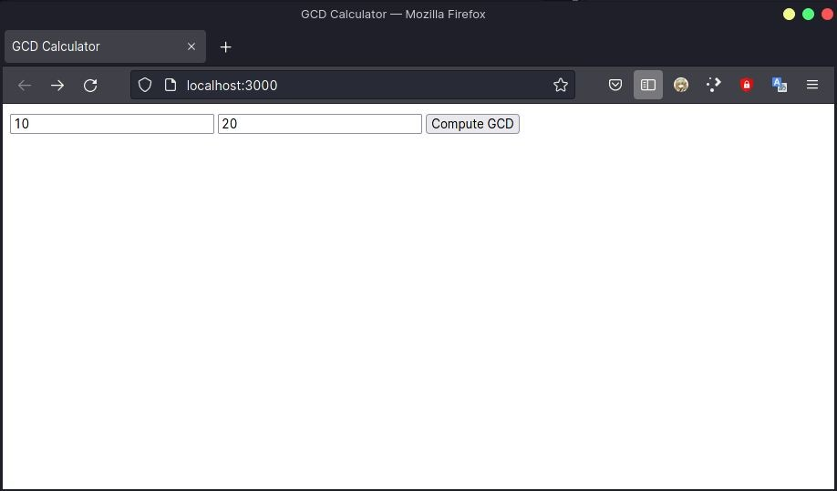
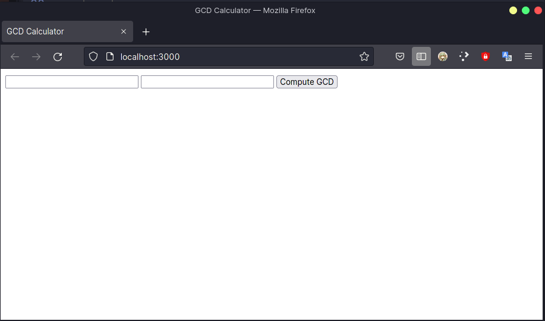
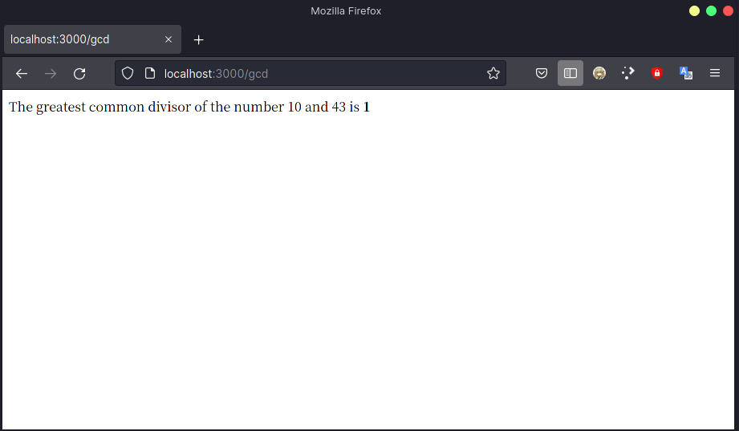
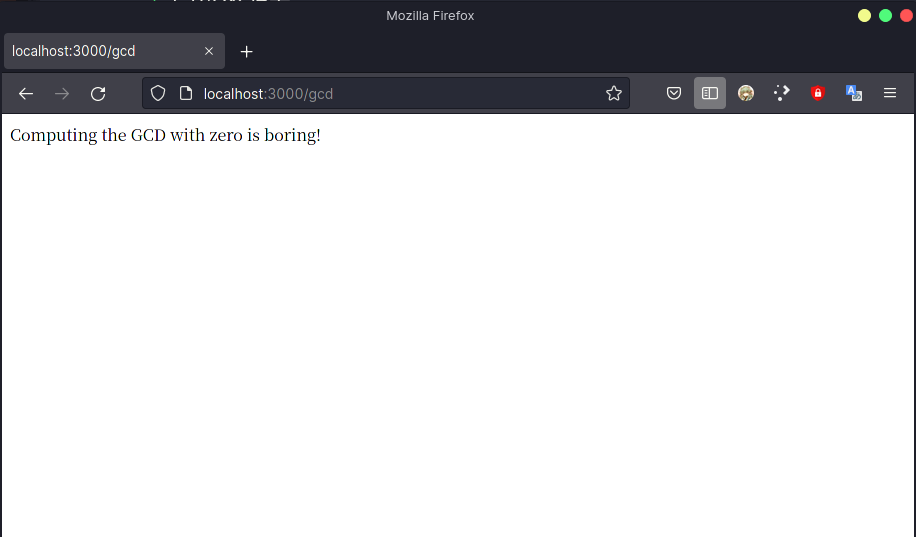
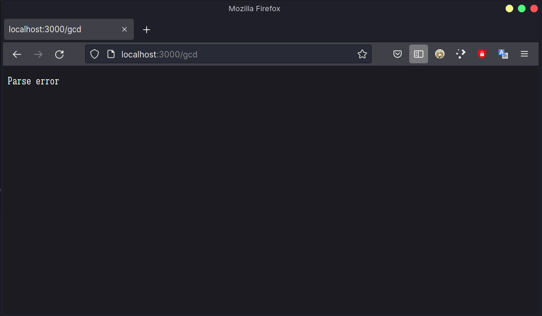

# Rust 学习 04

<p class="archive-time">archive time: 2021-12-16</p>

<p class="sp-comment">还是决定看书, 因为进度可以自己掌控...</p>

[[toc]]

## 呈现网页

之前刚讲完 _函数_, 现在就直接来写一个小样例吧

使用 `cargo` 来新建项目

```bash
cargo new [--bin] actix-gcd
```

> 这里 方括号 `[]` 括起来的部分是可选部分, 默认创建的就是应用项目, 故不需要特别指定

创建好后的目录结构是这样的

```
actix-gcd/
├── Cargo.toml
└── src
    └── main.rs
```

由于要显示网页, 我们从头写起是不太现实的, 可以选择使用别人写好的库，但是在使用之前, 我们需要在 `Cargo.toml` 里指定好，
这个 `Cargo.toml` 就是管理我们整个项目的 _配置文件_, 而我们的代码都组织在 `src` 文件夹下

### `Cargo.toml`

刚创建好的 Rust 项目里, `Cargo.toml` 的内容大致如下

```toml
[package]
name = "actix-gcd"
version = "0.1.0"
edition = "2021"

# See more keys and their definitions at https://doc.rust-lang.org/cargo/reference/manifest.html

[dependencies]
```

而我们要使用别人写好的库, 也就是需要**依赖**别人的库, 所以需要在 `[dependencies]` 这一项底下写好你需要的库 _以及版本_

这里, 我们会用到哦 `actix-web` 和 `serde` 这两个库, 写好后内容如下

```toml
# 上面部分不变
[dependencies]
actix-web = "3.3.2"
serde = { version = "1.0", features = ["derive"] }
```

至于版本和库, 可以在 [Docs.rs](https://docs.rs) 这个网站上查询到

写好 `Cargo.toml` 后, 我们在项目的根目录下 (`actix-gcd/`) 使用

```bash
cargo build
```

这个指令, 来预先下载一下所需要的库, 这样 _cargo_ 就会去 _crates.io_ 这个网站去下载所需要的库以及库所需要的依赖

### `main.rs`

处理好所需要的库之后, 我们可以开始写我们的代码了

如上文所言, 我们的代码都组织在 `src/` 目录下, 而主要的文件就是 `main.rs`

```rust
use actix_web::{web, App, HttpResponse, HttpServer};

#[actix_web::main]
async fn main() -> std::io::Result<()> {
    let server = HttpServer::new(|| App::new().route("/", web::get().to(get_index)));
    println!("Serving on http://localhost:3000...");
    server.bind("127.0.0.1:3000")?.run().await
}

fn get_index() -> HttpResponse {
    HttpResponse::Ok().content_type("text/html").body(
        r#"
            <title>GCD Calculator</title>
            <form action="/gcd" method="post">
            <input type="text" name="n">
            <input type="text" name="m">
            <button type="submit">Compute GCD</button>
            </form>
            "#,
    )
}
```

处理好后, 我们在 `localhost:3000` 就可以看见这个页面



可以看见, 我们这个 `main` 函数有点不一样

通常的 `main` 函数就是直接一个 `fn main() { ... }`, 而这个却是 `async fn main() -> std::io::Result<()> { ... }`

这个返回值类型 `std::io::Result` 还是可以理解的, 就是一个枚举类, 没问题就返回值本身, 有错误就返回错误,
而这里的 `<()>` 则是泛型的写法, 表示这个返回值是一个 io 操作的 `Result`

而且这个 `main` 函数上还有个 `#[actix_web::main]`, 这个是一种 _宏 (macro)_,
对应的是 _属性宏 (Attribute-like macros)_, 这个宏使得我们的 `main` 函数可以是 `async` 的

`main` 函数里第一句 `let` 声明了一个不可变的变量, 他是 `HttpServer` 类型的, 就相当于我们用于处理响应的服务器了

`HttpServer::new()` 一句使用 `new` 这一个函数返回了一个 `HttpServer` 类型的对象(?不知这个说法对不对)，
这里的 _new()_ 算是约定, 并不像其他语言的 `new` 关键字, 是规定好的, 你可以选择其他名字如 `init()` 来实现这个功能

`new()` 里面传递了一个 _闭包 (Closure)_ 作为参数

闭包的基本格式是

```rust
| ... | {
    ...
}
```

`||` 里表示被捕获的变量, 后面的 `{}` 里表示相关操作

这里我们没有捕获任何变量, 直接执行 `{}` 里的内容, 即使用 `App::new()` 来生成一个 `actix_web::App` 类型的对象，
使用 `App` 里的 `route` 函数配置路由

这个函数的类型是

```rust
pub fn route(self, path: &str, route: Route) -> Self
```

可见需要我们传递两个参数, 第一个参数是一个字符串引用, 即对应路径, 第二个参数就是 `route`, 即需要配置的路由

这里我们要把一个路由配置到网站根目录 (`/`), 而路由是由 `get_index` 函数配合 `web::get().to()` 得到

之后是一段提示性质的输出, 下面, 我们使用创建好的这个 `HttpServer` 使用 `bind()` 函数来说明要绑定的 _套接字 (socket)_ 地址，
后面的 `?` 这个符号表示 `Error propagation` 即将 `bind` 返回得到的错误传递给调用的函数, 而不是在当前位置就处理，
算是一种偷懒的方式, 这也是我们返回的 `Result<()>`

绑定好地址后就可以启动服务器了, `run()` 函数启动服务器, 返回一个 `Server` 类型的值，
而 `.await` 说明这个 `Server` 是以 `await` 的方式执行的

### `get_index`

在 `get_index` 函数里, 我们通过 `HttpResponse::Ok()` 来返回一个 `HttpResponse` 并以此来返回需要的 `route`，
而随后的 `content_type()`等内容就是纯属 _HTML_ 的内容了

## GCD 部分

完成上述操作只能够显示一个网页, 而我们点 _Compute GCD_ 按钮是不会得到正确反应的, 我们还需要继续完善

在 `src/main.rs` 文件的头部使用 `use serde::Deserialize;` 导入 `serde` 库里我们需要的部分

之后, 我们需要定义我们按下按钮后返回的类型, 以便我们解析, 这里我们使用 `struct`

```rust
#[derive(Deserialize)]
struct GcdParameters {
    n: u64,
    m: u64,
}
```

将 `#[derive(Deserialize)]` 属性放在类型定义上方告诉 `serde` 在编译程序时检查类型，
并自动生成代码以从 HTML 表单用于 POST 请求的格式的数据中解析此类型的值,
也就是会自动将返回的值表示为我们定义的这个类型的形式

我们还需要定义相关响应

```rust
fn post_gcd(form: web::Form<GcdParameters>) -> HttpResponse {
    if form.n == 0 || form.n == 0 {
        return HttpResponse::BadRequest()
            .content_type("text/html")
            .body("Computing the GCD with zero is boring!");
    }
    let response = format!(
        "The greatest common divisor of the number {} and {} is <b>{}</b>\n",
        form.n,
        form.m,
        gcd(form.n, form.m)
    );

    HttpResponse::Ok().content_type("text/html").body(response)
}
```

这里就是从表单中得到 `GcdParameters` 类型, 返回一个响应, 先对输入进行检查,
如果输入含有 `0` 则显示 _Computing the GCD with zero is boring!_ 这句话, 否则就计算 `gcd` 并返回

而计算 `gcd` 的方法就是常用的辗转相除法

```rust
fn gcd(mut m: u64, mut n: u64) -> u64 {
    assert!(m != 0 && n != 0);
    while m != 0 {
        if m < n {
            let t = m;
            m = n;
            n = t;
        }
        m = m % n;
    }
    n
}
```

之后, 我们还需要修改路由的配置, 将对 `/gcd` 的响应配置好, 将原来的 `server` 定义修改为:

```rust
let server = HttpServer::new(|| {
    App::new()
        .route("/", web::get().to(get_index))
        .route("/gcd", web::post().to(post_gcd))
});
```

这样我们就可以正常使用了

## 结果展示

`cargo run` 后, 我们访问 [http://localhost:3000](http://localhost:3000), 就可以得到一个这样的界面



分别测试一下, 先是正常输入



然后是含有 `0` 的输入



最后是含有非整数的输入



想要结束我们的这个服务器, 直接使用 `Ctrl+C` 即可

---

这个例子是比较难且比较贴近实际的例子, 值得好好看看

书里的库使用的是 `1.x` 的版本, 而我使用的是 `3.3.2` 版本, 部分写法和书上不一致, 需要注意
