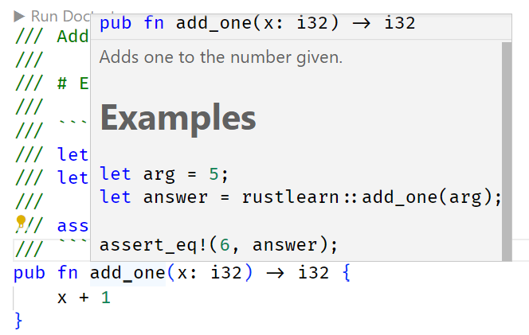
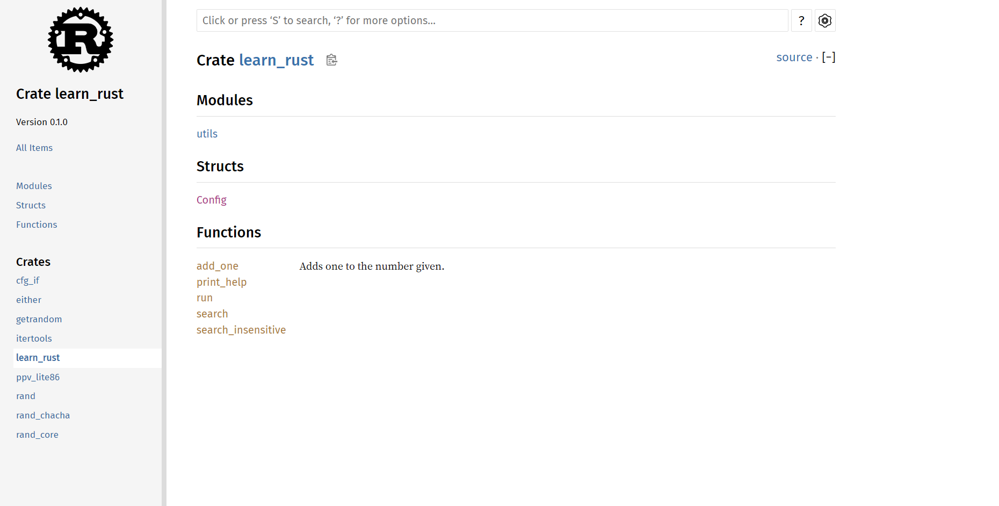
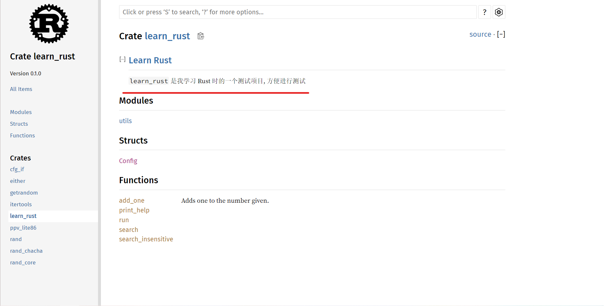
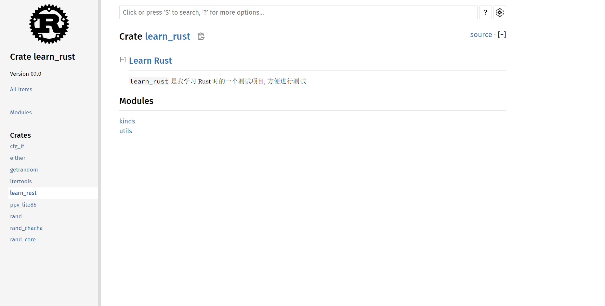
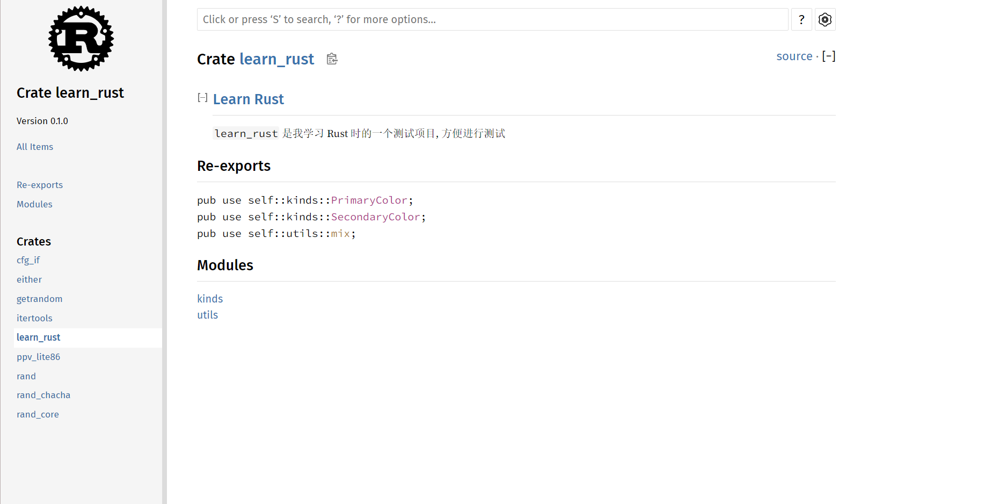
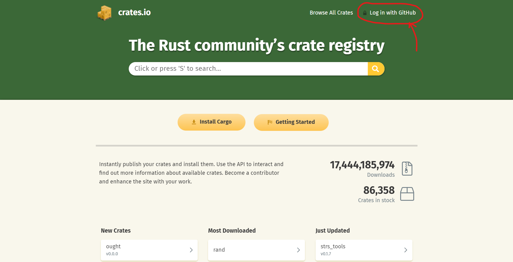
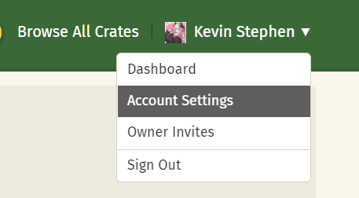
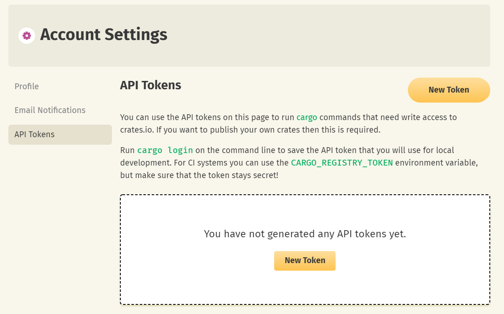

# Rust 学习 12

<p class="archive-time">archive time: 2022-06-23</p>

<p class="sp-comment">这回来看看 cargo 打包</p>

[[toc]]

Rust 有一个很大的优势就是它有一个完整的完善的工具链, cargo

通过 cargo, 我们可以很轻松的完成编译, 测试, 打包这几个步骤

不过关于 cargo 打包, 有一些内容还是需要主要

## release profile

profile 是预先定义好的相关的配置, 对应的有 release 和 dev 两种

每个 profile 都是可以自行配制的, 就是在 `Cargo.toml` 里设置

```toml
# Cargo.toml
# ...
[profile.dev]
opt-level = 0

[profile.release]
opt-level = 3
```

这样我们就可以覆盖默认的 profile 里的 `opt-level` 设置了

至于有哪些选项, 可以参考文档[^1]

## 发布 Crate

我们除了可以下载 crate, 我们还可以上传我们的 crate

### 文档注释

在 crate 里, 文档是很重要的, 在 Rust 里, 专门有种注释来生产文档, 那就是 _文档注释_

文档注释 用于生成 HTML 文档, 显式公共 API 的注释还可以说明如何使用 API

甚至在 Rust 还可以进行文档测试, 即在文档里测试代码, 以保证文档和代码同步以及代码或文档的正确性

文档注释使用 `///` 来实现, 支持一定的 **Markdown** 语法

````rust
/// Adds one to the number given.
///
/// # Examples
///
/// ```
/// let arg = 5;
/// let answer = learn_rust::add_one(arg);
///
/// assert_eq!(6, answer);
/// ```
pub fn add_one(x: i32) -> i32 {
    x + 1
}
````

效果如下图



我们可以使用 `cargo doc` 来生成文档

注意到在项目目录下的 `target/` 目录下有了一个 `doc/` 目录, 里面就是生成的文档

```text
(base) PS projRoot> dir .\target\doc\


    目录: projRoot\target\doc


Mode                 LastWriteTime         Length Name
----                 -------------         ------ ----
d-----         2022/6/23     14:14                cfg_if
d-----         2022/6/23     14:14                either
d-----         2022/6/23     14:14                getrandom
d-----         2022/6/23     14:14                implementors
d-----         2022/6/23     14:14                itertools
d-----         2022/6/23     14:14                learn_rust
d-----         2022/6/23     14:14                ppv_lite86
d-----         2022/6/23     14:14                rand
d-----         2022/6/23     14:14                rand_chacha
d-----         2022/6/23     14:14                rand_core
d-----         2022/6/23     14:14                src
-a----         2022/6/23     14:14              0 .lock
-a----         2022/6/23     14:14          12235 ayu.css
-a----         2022/6/23     14:14            576 clipboard.svg
-a----         2022/6/23     14:14           1791 COPYRIGHT.txt
-a----         2022/6/23     14:14            123 crates.js
-a----         2022/6/23     14:14          10683 dark.css
-a----         2022/6/23     14:14            510 down-arrow.svg
-a----         2022/6/23     14:14            715 favicon-16x16.png
-a----         2022/6/23     14:14           1125 favicon-32x32.png
-a----         2022/6/23     14:14           4298 favicon.svg
-a----         2022/6/23     14:14           4419 FiraSans-LICENSE.txt
-a----         2022/6/23     14:14         132780 FiraSans-Medium.woff2
-a----         2022/6/23     14:14         129188 FiraSans-Regular.woff2
-a----         2022/6/23     14:14          10847 LICENSE-APACHE.txt
-a----         2022/6/23     14:14           1023 LICENSE-MIT.txt
-a----         2022/6/23     14:14          10287 light.css
-a----         2022/6/23     14:14          19656 main.js
-a----         2022/6/23     14:14           4745 NanumBarunGothic-LICENSE.txt
-a----         2022/6/23     14:14         399468 NanumBarunGothic.ttf.woff2
-a----         2022/6/23     14:14           1853 normalize.css
-a----         2022/6/23     14:14             97 noscript.css
-a----         2022/6/23     14:14           3297 rust-logo.svg
-a----         2022/6/23     14:14          28317 rustdoc.css
-a----         2022/6/23     14:14         164833 search-index.js
-a----         2022/6/23     14:14          34753 search.js
-a----         2022/6/23     14:14           1425 settings.css
-a----         2022/6/23     14:14           3792 settings.html
-a----         2022/6/23     14:14           6064 settings.js
-a----         2022/6/23     14:14           2019 source-files.js
-a----         2022/6/23     14:14           4403 source-script.js
-a----         2022/6/23     14:14          44896 SourceCodePro-It.ttf.woff2
-a----         2022/6/23     14:14           4528 SourceCodePro-LICENSE.txt
-a----         2022/6/23     14:14          52228 SourceCodePro-Regular.ttf.woff2
-a----         2022/6/23     14:14          52348 SourceCodePro-Semibold.ttf.woff2
-a----         2022/6/23     14:14          81320 SourceSerif4-Bold.ttf.woff2
-a----         2022/6/23     14:14          59860 SourceSerif4-It.ttf.woff2
-a----         2022/6/23     14:14           4485 SourceSerif4-LICENSE.md
-a----         2022/6/23     14:14          76180 SourceSerif4-Regular.ttf.woff2
-a----         2022/6/23     14:14           3556 storage.js
-a----         2022/6/23     14:14            174 toggle-minus.svg
-a----         2022/6/23     14:14            191 toggle-plus.svg
-a----         2022/6/23     14:14           3764 wheel.svg
```

在 `<projRoot>/target/doc/<projName>/index.html` 就是文档的主页面了

打开后可以看到类似这样的页面, 一个很标准的 Rust 文档界面



当然, 除了手动打开, 我们可以使用 `cargo doc --open` 来打开页面, 效果是一样的

在文档注释里面一般有几个固定的区域

- Examples: 示例, 说明函数或代码的用法
- Panics: 可能发生 panic 的场景
- Errors: 返回 Result 或 Option 时的错误类型或者产生错误的条件
- Safty: 如果函数是 _unsafe_ 的, 说明原因, 以及使用前提

#### 文档测试

我们在文档里写的例子可以进行文档测试, 使用 `cargo test --doc` 即可

```text
(base) PS projRoot> cargo test --doc
    Finished test [optimized + debuginfo] target(s) in 0.03s
   Doc-tests learn_rust

running 1 test
test src\lib.rs - add_one (line 122) ... ok

test result: ok. 1 passed; 0 failed; 0 ignored; 0 measured; 0 filtered out; finished in 0.21s
```

#### 注释文档

除了为文档下的代码进行注释, 我们还可以对整个文件或者 crate 或者 模块 进行注释, 使用符号 `//!`

```rust
// src/lib.rs

//! # Learn Rust
//!
//! `learn_rust` 是我学习 Rust 时的一个测试项目, 方便进行测试

// ....
```

在 `src/lib.rs` 里添加了这么一些注释后, 我们再打开文档, 发现文档内容也发生了变化



### pub use

有时候我们需要为方便调用来导出一些公共 API, 这样就可以使用 `pub use` 关键字

`pub use` 作用是 _重新导出_, 创建了一个与内部私有结构不同的对外公共结构

假设我们有这么一个文件 `src/lib.rs`

```rust
//! # Learn Rust
//!
//! `learn_rust` 是我学习 Rust 时的一个测试项目, 方便进行测试

pub mod kinds {
    /// The primary colors according to the RYB color model
    pub enum PrimaryColor {
        Red,
        Yellow,
        Blue,
    }

    /// The secondary colors according to the RYB color model
    pub enum SecondaryColor {
        Orange,
        Green,
        Purple,
    }
}

pub mod utils {
    use crate::kinds::*;

    /// Combines two primary colors in equal amounts to create
    /// a secondary color
    pub fn mix(color1: PrimaryColor, color2: PrimaryColor) -> SecondaryColor {
        SecondaryColor::Green
    }
}
```

在文档里表现出来是这样的



不是很直观, 也不清楚每个模块里的的东西

如果我们在文件里加上这几行

```rust
// src/lib.rs

pub use self::kinds::PrimaryColor;
pub use self::kinds::SecondaryColor;
pub use self::utils::mix;

// ...
```

再看一眼文档, 会出现一个 `Re-exports` 栏目, 里面摆上了我们重新导出的内容, 就很直观了



在使用时, 我们也只需要 `<projName>::<itemName>` 即可, `itemName` 是你导出的内容的名字

### 创建 crates.io 账号

前面部分我们知道了如何写文档注释和生成文档, 现在来正式看看如何发布

再发布之前我们还需要有一个 [crates.io](https://crates.io/) 的账号, 这是自然的

注意看 crates.io 的主界面 (2022 年 06 月 23 日), 我们可以看到这么一个选项



注册好账号后, 我们就有了一个 crates.io 的 API Token

点击 **Account Settings**, 我们就可以看到一个 _API Tokens_ 的地方



然后我们就可以生成一个新的 token 供我们使用了



有了 token, 我们就可以在 cargo 使用 `cargo login` 来进行登录操作

```text
(base) PS projRoot> cargo login <API Token>
       Login token for `crates.io` saved
```

API Token 会被存放在 `<cargo-home>/credentials` 里面

不过在发布前还是需要在我们的 crate 里的 `[package]` 添加对应元数据

- name: crate 的唯一标识
- description: 对 crate 的简单描述
- license: 许可证的标识值[^2], 多个许可使用 `OR` 隔开
- version: 版本
- authors: 作者, 一个列表, 可以放多个名字

例如对于 `learn_rust` 我们可以这样

```toml
[package]
name = "learn_rust"
version = "0.1.0"
edition = "2021"
license = "MIT"
authors = ["kands-code"]
```

确保一切准备妥当, 我们就可以使用 `cargo publish` 来发布 crate 了

### 发布之后

发布 crate 之后, 我们是 **_不能够_** 删除 crate 的, 不过我们可以 **撤回(yank)** 一个 crate 版本

yank 可以防止新项目依赖于该版本, 但是无法阻止继续使用其作为依赖

yank 了就意味着

- 所有产生 `Cargo.lock` 的项目都不会中断
- 任何将来生成的 `Cargo.lock` 文件都不会使用被 yank 的版本

```text
cargo yank --vers <version>
```

我们还可以取消 yank

```text
cargo yank --vers <version> --undo
```

## Cargo 工作空间

有些时候, 为了模块化项目, 我们需要将项目拆成多个 crate

而工作空间就是一套共享 `Cargo.lock` 和 输出文件夹 的包

对于作为工作空间的目录, 我们需要准备一个 `Cargo.toml` 文件, 里面设置工作空间

```toml
[workspace]
members = ["adder", "add-one"]
```

然后在目录下使用 `cargo new adder` 和 `cargo new add-one --lib` 来创建这两个成员

我们使用 `cargo build` 发现, 在 `adder/` 和 `add-one/` 目录下都没有 `target/` 目录, 而是在工作空间目录有一个统一的 `target/`

```text
(base) PS ws> dir .

    Directory: ws

Mode                 LastWriteTime         Length Name
----                 -------------         ------ ----
d----           2022/6/23    16:17                add-one
d----           2022/6/23    16:15                adder
d----           2022/6/23    16:14                target
-a---           2022/6/23    16:14              8 .gitignore
-a---           2022/6/23    16:18            197 Cargo.lock
-a---           2022/6/23    16:18             45 Cargo.toml
```

如果需要说明这两个 crate 相互依赖, 需要在对应的 crate 里说明

```toml
# adder/Cargo.toml
[package]
name = "adder"
version = "0.1.0"
edition = "2021"

[dependencies]
add-one = { path = "../add-one" }
```

我们如果要执行工作空间中某一特定 crate, 则需要 `cargo run -p <crate-name>`

```rust
(base) PS ws> cargo run -p adder
    Finished dev [unoptimized + debuginfo] target(s) in 0.01s
     Running `target\debug\adder.exe`
31
```

工作空间的一个很重要的意义就是同步版本, 因为一个工作空间内的 crate 都共用一个 `Cargo.lock`, 保证了使用的库的版本统一

这样一来, 一个工作空间内的 crate 都是相互兼容的

## 安装二进制 crate

我们可以从 crates.io 中安装二进制 crate, 使用 `cargo install <crate-name>` 即可

这个就无需演示了

### 扩展 cargo

如果二进制名称为 `cargo-xxx`, 则我们可以使用 `cargo xxx` 来执行这个二进制名字, ~~看起来就是扩展了 cargo 的功能~~

---

好, cargo 就算学得差不多了, 开摸!

[^1]:
    相关文档 [Cargo.toml](https://doc.rust-lang.org/stable/cargo/reference/manifest.html),
    [Profiles](https://doc.rust-lang.org/stable/cargo/reference/profiles.html)

[^2]: 可以在 [这里](https://spdx.org/licenses/) 查找, 对应 **identifier** 一栏
