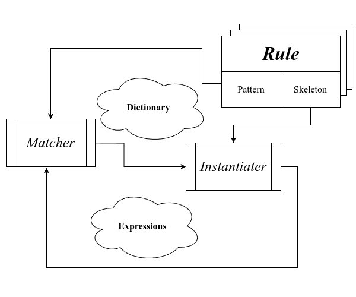

# SICP 笔记 - 0x04

<p class="archive-time">archive time: 2025-03-16</p>

<p class="sp-comment">说好的周更还是变成了月更，而且还不稳定，嘛，更新了就好</p>

## Lecture 4A

在上一节的 [符号微分](./20250225-sicp-notes-0x03.md#符号微分)，
我们实现了一个利用模式匹配来完成的基本的微分工具，
那么现在让我们再来仔细看看这些模式有什么规律

### 模式

通常的模式由两部分构成，一部分用于和要匹配的内容比较，另一部分则用于替换匹配内容

\\[
\begin{CD}
\langle\textnormal{Pattern}\rangle @>Rule>> \langle\textnormal{Skeleton}\rangle \\\\
@V\textnormal{Match}VV @V\textnormal{Instantiation}VV \\\\
\langle\textnormal{Source}\rangle @>>> \langle\textnormal{Target}\rangle
\end{CD}
\\]

通过这种 “比较\\( \textnormal{--} \\)替换” 循环，我们可以将内容变换成我们想要的形式

### 匹配

按照上一节的实现方式，我们如果想要给我们的工具添加一种新的匹配规则，例如让这个工具支持三角函数，
那么我们就不得不修改所有模式的定义以及匹配的分支，这违反了所谓的开闭原则[^1]

那么我们要怎样做才能让我们的工具拥有拓展性呢？

一个比较好的方法就是类似 [有理数系统](./20241105-sicp-notes-0x02.md#有理数系统)，
我们定义一些共有的开放接口，然后对于每一种模式，我们都实现对应的接口即可

在这里，我们可以使用一个 `simplifier`，这个过程接受一个模式列表，
然后可以根据这个列表来进行一系列的化简，也就是匹配过程

```scheme
(define dsimp
  (simplifier deriv-rules))
```

其中这个 `deriv-rules` 就包含了我们之前定义的求导规则，
得到的这个 `dsimp` 就可以完成我们之前的求导工具的所有工作，

<details>

<summary>Rust 具体实现</summary>

对于求导我们实现如下：

```rust
#[derive(Clone, Debug)]
enum ExpressionElement {
    Constant(f64),
    Variable(u8),
    Neg(Box<ExpressionElement>),
    Add(Box<ExpressionElement>, Box<ExpressionElement>),
    Sub(Box<ExpressionElement>, Box<ExpressionElement>),
    Mul(Box<ExpressionElement>, Box<ExpressionElement>),
    Div(Box<ExpressionElement>, Box<ExpressionElement>),
    Pow(Box<ExpressionElement>, f64),
}

impl ExpressionElement {
    pub fn make_neg(e: ExpressionElement) -> ExpressionElement {
        ExpressionElement::Neg(Box::new(e))
    }

    pub fn make_add(e1: ExpressionElement, e2: ExpressionElement) -> ExpressionElement {
        ExpressionElement::Add(Box::new(e1), Box::new(e2))
    }

    pub fn make_sub(e1: ExpressionElement, e2: ExpressionElement) -> ExpressionElement {
        ExpressionElement::Sub(Box::new(e1), Box::new(e2))
    }

    pub fn make_mul(e1: ExpressionElement, e2: ExpressionElement) -> ExpressionElement {
        ExpressionElement::Mul(Box::new(e1), Box::new(e2))
    }

    pub fn make_div(e1: ExpressionElement, e2: ExpressionElement) -> ExpressionElement {
        ExpressionElement::Div(Box::new(e1), Box::new(e2))
    }

    pub fn make_pow(e: ExpressionElement, p: f64) -> ExpressionElement {
        ExpressionElement::Pow(Box::new(e), p)
    }
}

impl std::fmt::Display for ExpressionElement {
    fn fmt(&self, f: &mut std::fmt::Formatter<'_>) -> std::fmt::Result {
        match self {
            ExpressionElement::Constant(p) => write!(f, "{}", p),
            ExpressionElement::Variable(idx) => write!(f, "x{}", idx),
            ExpressionElement::Neg(e) => write!(f, "-({})", e),
            ExpressionElement::Add(e1, e2) => write!(f, "({}) + ({})", e1, e2),
            ExpressionElement::Sub(e1, e2) => write!(f, "({}) - ({})", e1, e2),
            ExpressionElement::Mul(e1, e2) => write!(f, "({}) * ({})", e1, e2),
            ExpressionElement::Div(e1, e2) => write!(f, "({}) / ({})", e1, e2),
            ExpressionElement::Pow(e, p) => write!(f, "({})^{}", e, p),
        }
    }
}

trait Simplifier<P> {
    fn simplify(e: ExpressionElement) -> ExpressionElement;
}

struct DiffRules<const ID: u8>;

impl<const ID: u8> Simplifier<DiffRules<ID>> for ExpressionElement {
    fn simplify(e: ExpressionElement) -> ExpressionElement {
        let simpliler = <ExpressionElement as Simplifier<DiffRules<ID>>>::simplify;
        match e {
            ExpressionElement::Constant(_) => ExpressionElement::Constant(0.0f64),
            ExpressionElement::Variable(p) => {
                if p == ID {
                    ExpressionElement::Constant(1.0f64)
                } else {
                    ExpressionElement::Constant(0.0f64)
                }
            }
            ExpressionElement::Neg(e) => ExpressionElement::make_neg(simpliler(*e)),
            ExpressionElement::Add(e1, e2) => {
                ExpressionElement::make_add(simpliler(*e1), simpliler(*e2))
            }
            ExpressionElement::Sub(e1, e2) => {
                ExpressionElement::make_sub(simpliler(*e1), simpliler(*e2))
            }
            ExpressionElement::Mul(e1, e2) => ExpressionElement::make_add(
                ExpressionElement::make_mul(simpliler(*e1.clone()), *e2.clone()),
                ExpressionElement::make_mul(*e1, simpliler(*e2)),
            ),
            ExpressionElement::Div(e1, e2) => ExpressionElement::make_div(
                ExpressionElement::make_sub(
                    ExpressionElement::make_mul(simpliler(*e1.clone()), *e2.clone()),
                    ExpressionElement::make_mul(*e1, simpliler(*e2.clone())),
                ),
                ExpressionElement::make_pow(*e2, 2.0f64),
            ),
            ExpressionElement::Pow(e, p) => ExpressionElement::make_mul(
                ExpressionElement::Constant(p),
                ExpressionElement::make_mul(
                    ExpressionElement::make_div(
                        ExpressionElement::make_pow(*e.clone(), p),
                        *e.clone(),
                    ),
                    simpliler(*e),
                ),
            ),
        }
    }
}
```

其中 `impl<const ID: u8> Simplifier<DiffRules<ID>> for ExpressionElement` 中的实现就可以视作 `deriv-rules`

</details>

例如我们想要对于多项式中的 `x2` 求导，那么可以使用如下方式获取求导函数 \\( \mathrm{d} / \mathrm{d}x\_2 \\)：

```rust
let dfdx2 = <ExpressionElement as Simplifier<DiffRules<2>>>::simplify;
```

例如对于 \\( x\_1 + x\_2 \\)，我们对于 \\( x\_2 \\) 求导，那么可以表示为如下形式：

```rust
fn main() {
    let exp = ExpressionElement::make_add(
        ExpressionElement::Variable(1),
        ExpressionElement::Variable(2),
    );
    println!("exp = {}", exp);
    // => exp = (x1) + (x2)
    let dfdx2 = <ExpressionElement as Simplifier<DiffRules<2>>>::simplify;
    let dexpdx2 = dfdx2(exp);
    println!("diff = {}", dexpdx2);
    // => diff = (0) + (1)
}
```

### 代数化简

有了上述方法，我们可以很轻易的扩展我们的化简工具，例如增加一个代数化简：

```scheme
(define asimp
  (simplifier algebra-rules))
```

<details>

<summary>Rust 具体实现</summary>

```rust
struct AlgebraRules;

fn is_zero(x: &f64) -> bool {
    x.abs() <= core::f64::EPSILON.sqrt()
}

impl Simplifier<AlgebraRules> for ExpressionElement {
    fn simplify(e: ExpressionElement) -> ExpressionElement {
        let simpliler = <ExpressionElement as Simplifier<AlgebraRules>>::simplify;
        match e {
            ExpressionElement::Neg(e) => {
                if let ExpressionElement::Neg(inner) = *e {
                    // -(-e) = e
                    *inner
                } else if let ExpressionElement::Constant(p) = *e {
                    // -(p) = -e
                    ExpressionElement::Constant(-p)
                } else {
                    // -e = -(e)
                    ExpressionElement::make_neg(simpliler(*e))
                }
            }
            ExpressionElement::Add(e1, e2) => {
                if let ExpressionElement::Constant(p1) = *e1 {
                    if let ExpressionElement::Constant(p2) = *e2 {
                        // p1 + p2 = (p1 + p2)
                        ExpressionElement::Constant(p1 + p2)
                    } else if is_zero(&p1) {
                        // 0 + e2 = (e2)
                        simpliler(*e2)
                    } else {
                        // p1 + e2 = p1 + (e2)
                        ExpressionElement::make_add(*e1, simpliler(*e2))
                    }
                } else if let ExpressionElement::Constant(p2) = *e2 {
                    if is_zero(&p2) {
                        // e1 + 0 = (e1)
                        simpliler(*e1)
                    } else {
                        // e1 + p2 = p2 + (e1)
                        ExpressionElement::make_add(*e2, simpliler(*e1))
                    }
                } else {
                    // e1 + e2 = (e1) + (e2)
                    ExpressionElement::make_add(simpliler(*e1), simpliler(*e2))
                }
            }
            ExpressionElement::Sub(e1, e2) => {
                if let ExpressionElement::Constant(p1) = *e1 {
                    if let ExpressionElement::Constant(p2) = *e2 {
                        // p1 - p2 = (p1 - p2)
                        ExpressionElement::Constant(p1 - p2)
                    } else if is_zero(&p1) {
                        // 0 - e2 = -(e2)
                        ExpressionElement::make_neg(simpliler(*e2))
                    } else {
                        // p1 + e2 = p1 + (e2)
                        ExpressionElement::make_sub(*e1, simpliler(*e2))
                    }
                } else if let ExpressionElement::Constant(p2) = *e2 {
                    if is_zero(&p2) {
                        // e1 - 0 = (e1)
                        simpliler(*e1)
                    } else {
                        // e1 - p2 = (e1) - p2
                        ExpressionElement::make_sub(simpliler(*e1), *e2)
                    }
                } else if let ExpressionElement::Neg(inner_e2) = *e2 {
                    // e1 - (-e2) = (e1) + (e2)
                    ExpressionElement::make_sub(simpliler(*e1), simpliler(*inner_e2))
                } else {
                    // e1 - e2 = (e1) - (e2)
                    ExpressionElement::make_sub(simpliler(*e1), simpliler(*e2))
                }
            }
            ExpressionElement::Mul(e1, e2) => {
                if let ExpressionElement::Constant(p1) = *e1 {
                    if let ExpressionElement::Constant(p2) = *e2 {
                        // p1 * p2 = (p1 * p2)
                        ExpressionElement::Constant(p1 * p2)
                    } else if is_zero(&p1) {
                        // 0 * e2 = 0
                        ExpressionElement::Constant(0.0f64)
                    } else if is_zero(&(p1 - 1.0f64)) {
                        // 1 * e2 = (e2)
                        simpliler(*e2)
                    } else {
                        // p1 * e2 = p1 * (e2)
                        ExpressionElement::make_mul(*e1, simpliler(*e2))
                    }
                } else if let ExpressionElement::Constant(p2) = *e2 {
                    if is_zero(&p2) {
                        // e1 * 0 = 0
                        ExpressionElement::Constant(0.0f64)
                    } else if is_zero(&(p2 - 1.0f64)) {
                        // e1 * 1 = (e1)
                        simpliler(*e1)
                    } else {
                        // e1 * p2 = p2 * (e1)
                        ExpressionElement::make_mul(*e2, simpliler(*e1))
                    }
                } else {
                    // e1 * e2 = (e1) * (e2)
                    ExpressionElement::make_mul(simpliler(*e1), simpliler(*e2))
                }
            }
            ExpressionElement::Div(e1, e2) => {
                if let ExpressionElement::Constant(p2) = *e2 {
                    if let ExpressionElement::Constant(p1) = *e1 {
                        // p1 / p2 = (p1 / p2)
                        ExpressionElement::Constant(p1 / p2)
                    } else if is_zero(&(p2 - 1.0f64)) {
                        // e1 / 1 = (e1)
                        simpliler(*e1)
                    } else {
                        // e1 / p2 = (e1) / p2
                        ExpressionElement::make_div(simpliler(*e1), *e2)
                    }
                } else {
                    if let ExpressionElement::Pow(inner_e1, p1) = *e1 {
                        if let ExpressionElement::Pow(inner_e2, p2) = *e2 {
                            // (e)^n / (e)^m = (e)^(n - m)
                            let simp_e1 = simpliler(*inner_e1);
                            let simp_e2 = simpliler(*inner_e2);
                            if simp_e1 == simp_e2 {
                                ExpressionElement::make_pow(simp_e1, p1 - p2)
                            } else {
                                // e1^n / e2^m = (e1)^n / (e2)^m
                                ExpressionElement::make_div(
                                    ExpressionElement::make_pow(simp_e1, p1),
                                    ExpressionElement::make_pow(simp_e2, p2),
                                )
                            }
                        } else {
                            // e1^n / e2 = (e1)^n / (e2)
                            ExpressionElement::make_div(
                                ExpressionElement::make_pow(simpliler(*inner_e1), p1),
                                simpliler(*e2),
                            )
                        }
                    } else {
                        // e1 / e2 = (e1) / (e2)
                        ExpressionElement::make_div(simpliler(*e1), simpliler(*e2))
                    }
                }
            }
            _ => e,
        }
    }
}
```

这里只是一些常见的化简策略，可以进一步化简

</details>

例如对于 \\( \mathrm{d} (x\_1 + x\_2) / \mathrm{d} x\_2 \\)，我们可以得到：

```rust
fn main() {
    let exp = ExpressionElement::make_add(
        ExpressionElement::Variable(1),
        ExpressionElement::Variable(2),
    );
    println!("exp = {}", exp);
    // => exp = (x1) + (x2)
    let dfdx2 = <ExpressionElement as Simplifier<DiffRules<2>>>::simplify;
    let dexpdx2 = dfdx2(exp);
    // algebra simplify
    let asimp = <ExpressionElement as Simplifier<AlgebraRules>>::simplify;
    println!("diff = {}", asimp(dexpdx2));
    // => diff = 1
}
```

### 实现细节

这里，我们可以将每一个匹配模式认为是字典中的一个条目，
而化简的过程就是电脑查阅我们而的模式组成的字典的过程，
匹配到某种模式即查阅到某个单词，替换成对应模板则可以类比于将单词替换为释义，
即：

<div class="center-box">
  
</div>

### 匹配器

一个模式匹配器，或者说 **Matcher**，其作用是将字典，表达式 以及模式作为输入，
然后将表达式输出为新的字典的过程，而这个输出的字典就是表达式中匹配到的部分

其中难点在于，匹配器需要同时处理表达式和模式两个部分，
在表达式中寻找符合模式的部分然后添加到字典中

```scheme
(define (match pat exp dict)
  (cond ((eq? dict 'failed) 'failed)
        ;; other check branch
        (else
          (match (cdr pat)
                 (cdr exp)
                 (match (car pat)
                        (car exp)
                        dict)))))
```

除了特殊情况，最一般的匹配中，会匹配 `pat` 的头部与 `exp` 的头部，
如果一致，那么就会产生新的字典作为新的匹配输入，
否则就会返回 `'failed`，表示匹配失败

在遍历和匹配的过程中，如果某个模式在字典中与遍历到的值不一致，就会匹配失败，
例如：

```plaintext
pattern    => (+ (* (? x) (? y)) (? y))
expression => (+ (* 3 'X) 'X)
```

这个例子中，\\( x = 3 \\)，\\( y = \mathrm{X} \\)，没有例外，所以匹配成功，但是如果稍作修改：

```plaintext
pattern    => (+ (* (? x) (? y)) (? y))
expression => (+ (* 3 'X) 4)
```

在这里，\\( y = \mathrm{X} \\) 且 \\( y = 4 \\)，矛盾，所以匹配失败

> 用 Rust 可以使用类似的栈模式来类比写出匹配器，这里就不再演示

### 实例化器

实例化器使用匹配器得到的字典以及规则中的 “骨架” 作为输入，得到新的表达式：

```scheme
(define (instantiater skeleton dict)
  (define (loop s)
    (cond ((atom? s) s)
          ((skeleton-evaluation? s)
           (evaluate (eval-exp s) dict))
          (else (cons (loop (car s))
                      (loop (cdr s))))))
  (loop skeleton))
```

这个过程就是一个不断查表，然后替换原表达式结构的过程

> 这部分同样没有 Rust 演示代码，因为 Rust 不需要这样实现

### 简化器

简化器就是真正将我们的规则应用到表达式的过程

```scheme
(define (simplifier the-rules)
  (define (simplify-exp exp)
    (try-rules (if (compound? exp)
                   (simplify-parts exp)
                   exp)))
  (define (simplify-parts exp)
    (if (null? exp)
        '()
        (cons (simplify-exp (car exp))
        (simplify-parts (cdr exp)))))
  (define (try-rules exp)
    (define (scan rules)
      (if (null? rules)
          exp
          (let ((dict
                (match (pattern (car rules))
                       exp
                       (empty-dictionary))))
            (if (eq? dict 'failed)
                (scan (cdr rules))
                (simplify-exp
                  (instantiater
                    (skeleton (car rules))
                    dict))))))
    (scan the-rules))
  simplify-exp)
```

可以看到这个 `simplifier` 就是利用 `the-rules` 然后返回一个闭包过程，即 `simplify-exp`

其中 `simplify-exp` 会使用 `simplify-parts` 来分析表达式中各个子部分，
而在每个子部分中都会 `try-rules` 来尝试匹配和应用规则

尽管在 LISP 中的的模式匹配细节非常复杂，但是基本架构还是很清晰的，
即扫描模式与表达式生成字典，然后通过 “骨架” 来替换匹配部分从而生成新的表达式

## Lecture 4B

这一节主要研究数据抽象，即如何表示和处理各种 “形状” 的数据

### 复数与有理数

在之前提到复合数据类型的时候，我们实现了一个有理数系统，
当中提到了我们可以通过各种方式实现有理数系统，
只需要保持对外接口一致，用户是基本无感知的，这点非常重要

通常的数据结构的实现包含了 `selector`，`constructor` 和 `method` 三个部分，
其中 `selector` 包含了我们能够从结构中获取的各种数据，
`constructor` 包括了我们如何构建一个数据的方法，
而 `method` 则是我们对于数据的各种操作，例如有理数的加减

通常的复数实现有两种方式，即直角坐标和极坐标，
直角坐标可以很轻松的获取实部和虚部，
而极坐标可以很轻松的获取辐角和模长，但是反过来就比较麻烦了

所以如果想要操作各种数据，其中的关键就是 `selector`，
要是一个 **通用运算符**，即对于不同的实现，我们都可以获取到对应的数据

### 标记数据

通常来说，在 LISP 中，数据是没有类型（标记）的，
但是在某些场合，我们可能需要区分某些数据，
所以我们可以通过给数据加上标签的形式来区分

这个加上 类型/标签 的过程和构建一个复合数据没有区别，即加上一个部分用于表示类型

```scheme
(define (add-type type data)
  (cons type data))
(define (get-type typed-data)
  (car typed-data))
(define (get-data typed-data)
  (cdr typed-data))
```

### 通用运算符

在这个前提下，要区分直角坐标和极坐标实现的复数，
我们只需要在创建数据的时候加上类型，在使用的时候判断即可

```scheme
(define (make-im-rect real imag)
  (add-type 'rect (cons real imag)))
(define (make-im-polar magnitude angle)
  (add-type 'polar (cons magnitude angle)))
```

而对于不同实现的操作，
我们可以通过添加一个判断来构建一个通用运算符，来支持两种实现

```scheme
(define (real-part z)
  (if (eq? (get-type z) 'rect)
      (real-part-rect (get-data z))
      (real-part-polar (get-data z))))
```

这也是一种模式匹配，对应到 Rust 中就是使用 `enum` 和 `match`

```rust
enum Complex {
    Rect(f64, f64),
    Polar(f64, f64),
}

impl Complex {
    pub fn make_rect(real: f64, imag: f64) -> Complex {
        Complex::Rect(real, imag)
    }

    pub fn make_polar(magnitude: f64, angle: f64) -> Complex {
        Complex::Polar(magnitude, angle)
    }

    pub fn real_part(&self) -> f64 {
        match self {
            Complex::Rect(real, _) => *real,
            Complex::Polar(m, a) => m * a.cos(),
        }
    }
}
```

### 基于类型的分派

这种设计模式下，整个系统会分成几个部分，而每个部分有自己独特的类型标识，
对于不同类型的数据，我们可以通过类型将数据来分配给合适的部分进行处理

但是这也有不足，即如果想要添加新的类型，我们还需要修改现有的代码，
即扩充 `enum` 的定义以及每个通用运算符的分支处理，显得不太灵活

### 数据导向编程

除了使用 `match` 或者 `if` 来判断类型，我们可以用另外一种类似但更加高效的方式来处理，
那就是建立一张表格，这个表格中对应的行可以是对应的类型，
列可以是该表格对应的整体类型，例如复数，可以进行的各种操作，
不用我们去手动匹配，我们可以主动去表格中寻找合适的操作来处理数据，
这种方式也被称为 **数据导向编程**[^2]，而这个表格则在现在的编程语言中称为虚表[^3]

```rust
trait Complex {
    fn make_rect(real: f64, imag: f64) -> Self;
    fn make_polar(magnitude: f64, angle: f64) -> Self;
    fn real_part(&self) -> f64;
}

struct ComplexRect(f64, f64);

impl Complex for ComplexRect {
    fn make_rect(real: f64, imag: f64) -> Self {
        ComplexRect(real, imag)
    }

    fn make_polar(magnitude: f64, angle: f64) -> Self {
        ComplexRect(magnitude * angle.cos(), magnitude * angle.sin())
    }

    fn real_part(&self) -> f64 {
        self.0
    }
}

struct ComplexPolar(f64, f64);

impl Complex for ComplexPolar {
    fn make_rect(real: f64, imag: f64) -> Self {
        ComplexPolar((real.powi(2) + imag.powi(2)).sqrt(), imag.atan2(real))
    }

    fn make_polar(magnitude: f64, angle: f64) -> Self {
        ComplexPolar(magnitude, angle)
    }

    fn real_part(&self) -> f64 {
        self.0 * self.1.cos()
    }
}

fn main() {
    let c = <ComplexPolar as Complex>::make_rect(2.0, 3.0);
    let r = c.real_part();
    println!("real part = {}", r);
    // => real part = 2
}
```

这些数据自身就包含如何操作自己的信息，即通过查表

### 数字系统

我们有复数，有理数，以及语言自身的整数和实数计算，
现在可以开始构建一个数字系统

数字之间的通常操作包括加减乘除，为了让各种数字类型兼容，
我们需要像复数那样，添加上类型，然后将对应的操作添加进我们数字系统的表格中，
即 `+rat` 放入 `'rational` 和 `'add` 这个位置，
`+complex` 放入 `'complex` 和 `'add` 这个位置

> 在 Rust 中，对应 `std::ops::Add`

通过这个表格，我们就可以统一各种数字类型的操作，不过此时复数的类型就多了一些，
例如对于使用直角坐标系定义的复数加法，我们有如下标记：

```plaintext
('add . ('complex . ('rect . +complex)))
```

抽象层级越高，其基本操作上的类型就会越多

### 多项式运算

有了前面的铺垫，现在可以定义多项式的运算，
这里多项式使用 \\( (\textnormal{Var}, [(\textnormal{order}, c)]) \\) 来表示，
分别对应变量名，阶数以及系数

例如 \\( x^{15} + 7 x^4 + 8 \\)，
可以表示为 \\( \left(x, \left[(15, 1), (4, 7), (0, 8)\right]\right) \\)

```rust
use std::collections::HashMap;

struct Poly(char, HashMap<i32, f64>);

impl Poly {
    pub fn poly_add(p1: Poly, p2: Poly) -> Poly {
        if p1.0 != p2.0 {
            panic!("[poly_add]: var not match")
        } else {
            let eq = p1.1.iter().chain(p2.1.iter()).fold(
                HashMap::with_capacity(p1.1.len().max(p2.1.len())),
                |mut acc: HashMap<i32, f64>, e| {
                    let value = acc.get(e.0).unwrap_or(&0.0f64);
                    let _ = acc.insert(*e.0, value + e.1);
                    acc
                },
            );
            Poly(p1.0, eq)
        }
    }
}

impl std::fmt::Display for Poly {
    fn fmt(&self, f: &mut std::fmt::Formatter<'_>) -> std::fmt::Result {
        write!(
            f,
            "{}",
            self.1
                .iter()
                .map(|e| if e.0 == &0 {
                    format!("{}", e.1)
                } else {
                    format!("{} {}^{}", e.1, self.0, e.0)
                })
                .collect::<Vec<String>>()
                .join(" + ")
        )
    }
}

impl std::ops::Add for Poly {
    type Output = Self;

    fn add(self, rhs: Self) -> Self::Output {
        Self::poly_add(self, rhs)
    }
}

fn main() {
    let p1 = Poly('x', HashMap::from([(15, 1.0), (4, 7.0), (0, 8.0)]));
    let p2 = Poly(
        'x',
        HashMap::from([(13, 2.0), (4, -5.0), (2, 2.0), (0, 2.0)]),
    );
    let p = p1 + p2;
    println!("{}", p);
    // => 2 x^2 + 2 x^4 + 1 x^15 + 10 + 2 x^13
}
```

在这里，由于多项式被定义为了系数和阶数的数对，所以实际上系数可以是任何数字类型，
只要实现了 `std::ops::Add` 都可以，甚至多项式本身也可以，这种扩展性就是数据导向编程带给我们的

---

数据导向的编程，或者说基于接口的编程使得我们可以轻易地兼容整个系统的运行，
这也是为什么接口，或者说 API 的定义越来越重要

在下一节中我们会看到更多有关函数式编程的内容，包括副作用以及状态

[^1]:
    开闭原则.Wikipedia \[DB/OL\].(2024-05-23)\[2025-03-16\].
    <https://en.wikipedia.org/wiki/Open-closed_principle>

[^2]:
    数据导向编程.Wikipedia \[DB/OL\].(2024-07-29)\[2025-03-16\].
    <https://en.wikipedia.org/wiki/Data-driven_programming>

[^3]:
    虚表.Wikipedia \[DB/OL\].(2024-04-23)\[2025-03-16\].
    <https://en.wikipedia.org/wiki/Virtual_method_table>
