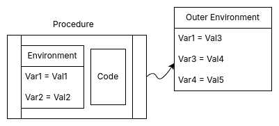

# SICP 笔记 - 0x05

<p class="archive-time">archive time: 2025-03-17</p>

<p class="sp-comment">趁热打铁，今天继续来看第五课</p>

[[toc]]

## Lecture 5A

这一节开始，我们要学习更多有关函数式编程和 $\lambda$-表达式相关的内容，
包括赋值，环境，以及副作用

### 赋值

在 LISP 中，有个非常 “邪恶” 的操作，那就是 `set!`，
这个操作可以改变某个已经定义的变量的值，也就是我们现在说的赋值

```scheme
(define (println x)
  (display x)
  (newline))

(define x 10)
(println x)
(set! x 20)
(println x)
```

分别输出为：

```plaintext
1> 10
2> 20
```

为什么说这个操作非常邪恶呢？因为赋值会破坏我们函数的纯粹性，
随着时间和运行次数的变化，我们函数的返回结果会不同，这也就是所谓的 **副作用**

### 绑定

赋值操作的引入也破坏了之前解释我们计算过程的 [替换模型](./20241102-sicp-notes-0x01.md#lecture-1b)，
因为在不同的时候，我们代码中的每个变量的值并非唯一确定的，而是变化的，
为了解释现有的计算，我们需要引入新的模型，或者说为替换模型打一个补丁，即引入 **环境** 的概念

**环境（Environment）**，又被称为 **上下文（Context）**，我们可以在这里找到一些变量对应的值

不过在正式介绍环境前，还需要区分现有的变量类型，即 “**绑定变量（Bound Variable）**” 与 “**自由变量（Free Variable）**”

在当前表达式中，对于某个变量，如果替换这个变量的名称不会改变这个表达式的语义，那么这个变量就是绑定变量，
对应于 $\lambda$-表达式 中的 $\alpha$-约归[^1]，反之则被称为自由变量

> Rust 规定使用 `static mut` 是 `unsafe` 的

```rust
static mut A: i32 = 10;

fn demo(n: i32) -> i32 {
    unsafe { A += 1 };
    n + unsafe { A }
}

fn main() {
    println!("{}", demo(3));
    // => 14
    println!("{}", demo(3));
    // => 15
}
```

在上面这个例子中 `demo()` 函数的 `n` 变量就是绑定变量，换成其他名称也是一样的效果，
而 `A` 就是一个自由变量

而变量被定义的区域称为 **作用域（Scope）**[^2]，
例如函数 `demo()` 中的 `n` 作用域就是函数内部，
一旦出了函数范围，`n` 就不再有效，
而 `A` 的作用域就是当前模块内部

> If `x` is a bound variable in `E`, then there is a $\lambda$-expression where it is bound.
>
> 如果 `x` 在 `E` 上是绑定变量，那么 `x` 一定绑定于某一个 $\lambda$-表达式

在 $\lambda$-表达式中，变量的绑定发生在表达式的参数中，$\lambda x$ 又被称为一个 **binder**，
所以每一个绑定变量一定对应于某一个表达式，
我们现在所谓的函数形参列表又被成为绑定变量列表

### 环境

正如之前所说，在环境中，我们可以找到变量的值

不同的运行情况，我们会有不同的环境，
环境之间最接近当前作用域的环境的定义会覆盖其他环境中相同变量名称的定义，
而最近环境中找不到的变量则会向外寻找，如果所有可以访问的环境都没有找到，
这个变量就被称为 **未定义变量**

```rust
fn main() {
    let x = 10;
    let y = 20;
    {
        let x = 30;
        // use x inside
        println!("x = {}", x);
        // find y outside
        println!("y = {}", y);
        // println!("z = {}", z); // z is undefined
    }
}
// =>
// 30
// 20
```

不同层级的环境我们也可以视为一张表格，或者是一个 **框架/栈帧（Frame）**[^3]，
以有序对的形式将我们的变量与其定义对应，
所以一个大概的 **过程对象（Procedure Object）** 可以用下图表示：

<div class="center-box">
  
</div>

### 调用规则

在引入环境后，要执行我们的过程，我们有如下两条规则：

1. 一个过程对象被应用到一系列参数时会在内部构建一个栈帧，
   用于存储形式参数（绑定变量）与实际参数的绑定（`=`），
   而过程运行的环境由内部栈帧与外部环境邻接而成
2. 定义一个 $\lambda$-表达式时，表达式会将表达式本身与所在环境一同捕获

第一条规则说明了代码执行时变量的值的参考是由内而外的，
第二条规则说明 $\lambda$-表达式 中自由变量的值与当前环境有关，例如：

```rust
fn main() {
    let proc = |y: i32| -> i32 { (|x: i32| x * y)(3) };
    println!("{}", proc(4));
    // => 12
}
```

这里 `proc` 和 `|x: i32| x * y` 都是 $\lambda$-表达式，
其中在 `|x: i32| x * y` 中 `y` 是自由变量，
在运行的时候会捕获环境中的 `y`，即与 `proc` 的形式参数 `y` 绑定

### 赋值的意义

既然赋值会破坏替换模型，并且还会让程序纯粹性被破坏，我们为什么还需要赋值呢？

这里有一个关于计数器的例子：

```rust
fn make_counter(mut n: u8) -> impl FnMut() -> u8 {
    move || {
        n += 1;
        n
    }
}

fn main() {
    let mut c0 = make_counter(0);
    println!("{}", c0());
    // => 1
    println!("{}", c0());
    // => 2
    let mut c10 = make_counter(10);
    println!("{}", c10());
    // => 11
    println!("{}", c10());
    // => 12
}
```

可以看到这个 `make_counter()` 是一个函数，其中这个函数会返回一个可变函数对象，
这个可变函数对象捕获了变量 `n`，并且让 `n` 的值在每次调用时加一

每次创建计数器的时候，会根据传入的参数构建不同的内部环境，其中包含不同的 `n` 的值，
例如 `c0` 就是 `n = 0`，而 `c10` 则会创建一个环境，其中 `n = 10`

由于在调用的时候 `n` 并非同一个，所以即便修改 `c0` 中的 `n` 也不会影响 `c10` 的运行

相互独立，互不影响，这是一个非常美好的状态，
但是现实世界并非如此，世界上所有物体之间必有一定的联系，
所以共享某些 **状态（State）** 就非常重要了，这就是我们需要赋值的原因，
这是我们对于现实世界的一种抽象

#### 行为与同一性

有一件事在我们处理对象的时候非常重要，那就是如何判断我们处理的对象是否是同一个

为此，我们需要引入一些方式来区分对象，那就是 **行为（Actions）**

> 一个行为 _A_ 能够对对象 _X_ 产生影响，如果这个 _A_ 对于对象 _Y_ 也产生了相同的影响，
> 即某些特征发生了相同的变化，那么就可以称：对于动作 _A_，_X_ 和 _Y_ 是同一个对象

#### 蒙特卡洛法

允许修改和不同状态，这使得我们能够计算随机数，
我们就可以使用蒙特卡洛法来模拟和计算，
包括各种事件的概率，以及某些积分问题

```rust
fn estimate_pi(n: u64) -> f64 {
    (monte_carlo(n, cesaro) / 6.0).sqrt()
}

fn cesaro() -> bool {
    gcd(
        rand::random_range(1..u64::MAX),
        rand::random_range(1..u64::MAX),
    ) == 1u64
}

fn gcd(n1: u64, n2: u64) -> u64 {
    if n2 == 0 { n1 } else { gcd(n2, n1 % n2) }
}

fn monte_carlo(trials: u64, experiment: impl Fn() -> bool) -> f64 {
    (0..trials).map(|_| experiment()).filter(|&p| p).count() as f64 / trials as f64
}

fn main() {
    println!("{}", estimate_pi(1024));
    // => 0.3140586131600278
}
```

其中 `random_range` 内部使用了内部状态和赋值，
如果不允许赋值，那么获取一个随机数将变得无比麻烦，
我们可能需要显示传递一些东西来表示状态的变化

## Lecture 5B

我们想要用计算机程序模拟现实世界，
由于计算机和编程语言的局限性，我们必然会对现实世界的对象抽象分类，
这使得我们的程序具有了模块化的特征，即 **面向对象编程（OOP）**

### 模拟电路

我们现在需要设计一门 DSL，
其中基本元素是 电线（wire），与门（and—gate），
非门（not-gate）和 或门（or-gate），
我们可以类似如下伪代码的形式组合对象：

```rust
let mut wire_a = make_wire();
let mut wire_b = make_wire();
let mut wire_c = make_wire();
or_gate(a, b, c);

fn half_adder(in_a: Wire, in_b: Wire, out_c: Wire, out_s: Wire) {
    let d = make_wire();
    let e = make_wire();
    or_gate(in_a, in_b, d);
    and_gate(in_a, in_b, out_c);
    not_gate(out_c, e);
    and_gate(d, e, out_s);
}
```

<details>

<summary>一个大概的实现</summary>

```rust
type RWire = std::rc::Rc<std::cell::RefCell<Wire>>;
type Signal = std::rc::Rc<std::cell::RefCell<bool>>;
type Action = std::rc::Rc<dyn Fn() -> bool>;

struct Wire {
    signal: Signal,
    actions: Vec<(RWire, Action)>,
}

impl std::fmt::Display for Wire {
    fn fmt(&self, f: &mut std::fmt::Formatter<'_>) -> std::fmt::Result {
        write!(f, "{}", if *self.get_signal().borrow() { 1 } else { 0 })
    }
}

impl Wire {
    pub fn make_wire() -> RWire {
        std::rc::Rc::new(std::cell::RefCell::new(Wire {
            signal: std::rc::Rc::new(std::cell::RefCell::new(false)),
            actions: Vec::new(),
        }))
    }

    pub fn get_signal(&self) -> Signal {
        self.signal.clone()
    }
    pub fn set_signal(&mut self, new_signal: bool) {
        *self.signal.borrow_mut() = new_signal;
        self.actions
            .iter()
            .for_each(|(wire, action)| wire.borrow_mut().set_signal(action()));
    }

    pub fn add_action(&mut self, out_wire: RWire, action: Action) {
        self.actions.push((out_wire, action));
    }
}

fn not_gate(delay: u64, in_wire: RWire, out_wire: RWire) {
    let in_wire_signal = in_wire.borrow().get_signal();
    let action = std::rc::Rc::new(move || -> bool {
        std::thread::sleep(std::time::Duration::from_millis(delay));
        !*in_wire_signal.borrow()
    });
    in_wire.borrow_mut().add_action(out_wire, action);
}

fn and_gate(delay: u64, in_a: RWire, in_b: RWire, out_wire: RWire) {
    let in_a_signal = in_a.borrow().get_signal();
    let in_b_signal = in_b.borrow().get_signal();
    let action = std::rc::Rc::new(move || -> bool {
        std::thread::sleep(std::time::Duration::from_millis(delay));
        *in_a_signal.borrow() && *in_b_signal.borrow()
    });
    in_a.borrow_mut()
        .add_action(out_wire.clone(), action.clone());
    in_b.borrow_mut().add_action(out_wire, action);
}

fn or_gate(delay: u64, in_a: RWire, in_b: RWire, out_wire: RWire) {
    let in_a_signal = in_a.borrow().get_signal();
    let in_b_signal = in_b.borrow().get_signal();
    let action = std::rc::Rc::new(move || -> bool {
        std::thread::sleep(std::time::Duration::from_millis(delay));
        *in_a_signal.borrow() || *in_b_signal.borrow()
    });
    in_a.borrow_mut()
        .add_action(out_wire.clone(), action.clone());
    in_b.borrow_mut().add_action(out_wire, action);
}

fn half_adder(delay: u64, in_a: RWire, in_b: RWire, out_c: RWire, out_s: RWire) {
    let d = Wire::make_wire();
    let e = Wire::make_wire();
    or_gate(delay, in_a.clone(), in_b.clone(), d.clone());
    and_gate(delay, in_a, in_b, out_c.clone());
    not_gate(delay, out_c, e.clone());
    and_gate(delay, d.clone(), e.clone(), out_s);
}

fn main() {
    let wire_a = Wire::make_wire();
    let wire_b = Wire::make_wire();
    let wire_c = Wire::make_wire();
    let wire_s = Wire::make_wire();
    half_adder(
        100,
        wire_a.clone(),
        wire_b.clone(),
        wire_c.clone(),
        wire_s.clone(),
    );
    wire_a.borrow_mut().set_signal(true);
    wire_b.borrow_mut().set_signal(true);
    println!("{}", wire_c.borrow());
    // => 1
    println!("{}", wire_s.borrow());
    // => 0
    wire_b.borrow_mut().set_signal(true);
    println!("{}", wire_c.borrow());
    // => 0
    println!("{}", wire_s.borrow());
    // => 1
}
```

> 除了订阅 `action` 来实现消息传递，我们还可以使用 `tokio` 和 `channel` 来通信

其中 `delay` 用于模拟现实世界元件的信号延迟，
各个元件的信号通过导线的可变引用来传递

</details>

在这里，我们将各个元器件看成单独的对象，各个对象之间通过信号的方式来传递消息，
前一个元件信号改变就会通知后一个元件，后一个元件会查询前一个元件的信号来调整自身信号

对象内部也有消息传递，实际上我们在调用方法的时候，例如 `wire_a.borrow_mut().set_signal(true)`，
就是在向这个对象传递一个消息，请求一个 过程/方法，在这里请求的就是 `set_signal`，
只有合理的消息会得到响应，类似于：

```rust
struct Obj {
    methods: Vec<Box<dyn Fn()>>,
}

impl Obj {
    pub fn new() -> Obj {
        let print = || {
            println!("call print");
        };
        let greet = || {
            println!("call greet");
        };
        Obj {
            methods: vec![Box::new(print), Box::new(greet)],
        }
    }

    pub fn dispatch(&self, msg: &str) -> &Box<dyn Fn()> {
        match msg {
            "print" => &self.methods[0],
            "greet" => &self.methods[1],
            _ => panic!("no method {}", msg),
        }
    }
}

fn main() {
    let o = Obj::new();
    o.dispatch("print")();
    // => call print
    o.dispatch("greet")();
    // => call greet
    // o.dispatch("other")(); // panic
}
```

不过使用 `thread::sleep` 来实现 `delay` 是一个取巧的行为，
如果自己实现实际上是非常麻烦的，对应 LISP 的实现如下：

```scheme
(define (after-delay delay action)
  (add-to-agenda!
    (+ delay (current-time the-agenda))
    action
    the-agenda))
```

其中 `the-agenda` 是一个表，其中存放了时间与其对应要执行的行为，
基于这个表格，我们可以依次记录数值从而得到对应的时序图

### Agenda

上述的系统就是一个事件驱动的模拟器，其中的事件就对应着我们的元件，
而元件之间通过 **_Gate_** 相互联系，通过信号来传递消息，
而这些事件发发生的顺序则被记录在 **_Agenda_** 上

Agenda 是一个时间和行为队列的有序对构成的列表，类似：

```plaintext
[
    (1, [do1, do2, do3]),
    (2, [do4, do5]),
    (3, [do6, do7, do8]),
    ...
]
```

每一个队列都对应着这个时间点要完成的所有行为，
队列和 Agenda 的实现还是比较容易的，
难点在于维护一个唯一的表，要避免冲突以及及时增减

> 队列可以用一个元组和一个链表实现，
> 其中元组的 CAR 指向对应链表的头部，而元组的 CDR 指向链表的尾部，
> Agenda 就是一个链表

### 可赋值的有序对

[之前](./20241105-sicp-notes-0x02.md#cons-car-cdr) 定义的有序对并不太适合引入了赋值后的系统，
所以这里需要重新定义一种 `cons`，使其有能力使用 `set-car!` 和 `set-cdr!`

一种实现是使用多参数 $\lambda$-表达式，即：

```scheme
(define (cons x y)
  (lambda (m)
    (m x
       y
       (lambda (n) (set! x n))
       (lambda (n) (set! y n)))))

(define (car x)
  (x (lambda (a d sa sd) a)))

(define (cdr x)
  (x (lambda (a d sa sd) d)))

(define (set-car! x n)
  (x (lambda (a d sa sd) (sa n))))

(define (set-cdr! x n)
  (x (lambda (a d sa sd) (sd n))))
```

其中 `cons` 是一个 $\lambda$-表达式，这个表达式接受一个过程，
这个过程有四个参数，第一个参数就是 `car`，第二个参数则是 `cdr`，
第三个参数就是对于 `car` 的赋值，第四个则是对 `cdr` 的赋值

<details>

<summary>Rust 实现</summary>

```rust
enum ConsReturn<A, B> {
    Car(A),
    Cdr(B),
    Nothing,
}

type ConsApply<A, B> = Box<
    dyn Fn(
        std::rc::Rc<std::cell::RefCell<A>>,
        std::rc::Rc<std::cell::RefCell<B>>,
        Box<dyn Fn(&A) -> ConsReturn<A, B>>,
        Box<dyn Fn(&B) -> ConsReturn<A, B>>,
    ) -> ConsReturn<A, B>,
>;

type Cons<A, B> = std::rc::Rc<dyn Fn(ConsApply<A, B>) -> ConsReturn<A, B>>;

fn cons<A: Clone + 'static, B: Clone + 'static>(x: A, y: B) -> Cons<A, B> {
    let ref_x = std::rc::Rc::new(std::cell::RefCell::new(x.clone()));
    let ref_y = std::rc::Rc::new(std::cell::RefCell::new(y.clone()));
    std::rc::Rc::new(move |m: ConsApply<A, B>| {
        m(
            ref_x.clone(),
            ref_y.clone(),
            Box::new({
                let x = ref_x.clone();
                move |n: &A| {
                    *x.borrow_mut() = n.clone();
                    ConsReturn::Nothing
                }
            }),
            Box::new({
                let y = ref_y.clone();
                move |n: &B| {
                    *y.borrow_mut() = n.clone();
                    ConsReturn::Nothing
                }
            }),
        )
    })
}

fn car<A: Clone, B>(cons: Cons<A, B>) -> A {
    match cons(Box::new(|a, _d, _sa, _sd| {
        ConsReturn::Car(a.borrow().clone())
    })) {
        ConsReturn::Car(a) => a,
        _ => panic!("cannot access car"),
    }
}

fn cdr<A, B: Clone>(cons: Cons<A, B>) -> B {
    match cons(Box::new(|_a, d, _sa, _sd| {
        ConsReturn::Cdr(d.borrow().clone())
    })) {
        ConsReturn::Cdr(d) => d,
        _ => panic!("cannot access cdr"),
    }
}

fn print_cons<A, B>(cons: &Cons<A, B>)
where
    A: Clone + std::fmt::Display + 'static,
    B: Clone + std::fmt::Display + 'static,
{
    let a = car(cons.clone());
    let d = cdr(cons.clone());
    println!("({}. {})", a, d);
}

fn set_car<A: Clone + 'static, B>(cons: Cons<A, B>, n: &A) {
    let n_clone = n.clone();
    match cons(Box::new(move |_a, _d, sa, _sd| sa(&n_clone))) {
        ConsReturn::Nothing => (),
        _ => panic!("set car failed"),
    }
}

fn set_cdr<A, B: Clone + 'static>(cons: Cons<A, B>, n: &B) {
    let n_clone = n.clone();
    match cons(Box::new(move |_a, _d, _sa, sd| sd(&n_clone))) {
        ConsReturn::Nothing => (),
        _ => panic!("set cdr failed"),
    }
}

fn main() {
    let c = cons(10, 20);
    print_cons(&c);
    // => (10 . 20)
    set_car(c.clone(), &20);
    print_cons(&c);
    // => (20 . 20)
    set_cdr(c.clone(), &90);
    print_cons(&c);
    // => (20 . 90)
}
```

</details>

---

这节课很好的展示了副作用的使用，
副作用虽然会引起各种错误，但也为我们提供了一种能力来模拟实现世界，
下一节会介绍并行计算的技巧，即流操作

[^1]:
    $\alpha$-约归.Wikipedia \[DB/OL\].(2025-02-27)\[2025-03-17\].
    <https://en.wikipedia.org/wiki/Lambda_calculus#α-conversion>

[^2]:
    作用域.Wikipedia \[DB/OL\].(2025-2-13)\[2025-03-17\].
    <https://en.wikipedia.org/wiki/Scope_(computer_science)>

[^3]:
    栈帧.Wikipedia \[DB/OL\].(2024-10-02)\[2025-03-17\].
    <https://en.wikipedia.org/wiki/Call_stack#Stack_and_frame_pointers>
