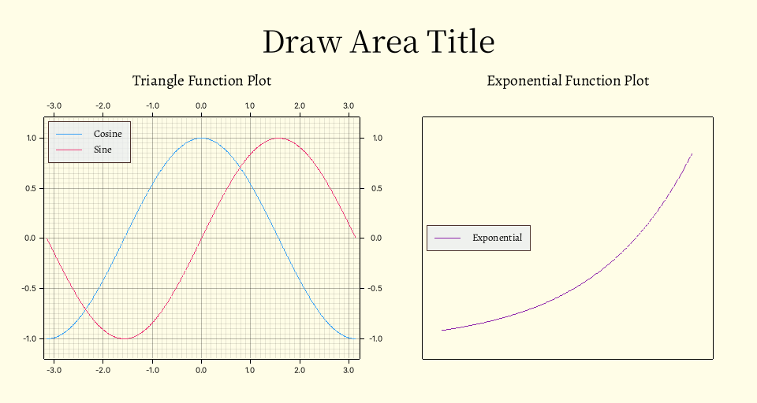

# Phyrs - 0x01

<p class="archive-time">archive time: 2025-07-10</p>

<p class="sp-comment">科学计算好复杂啊</p>

[[toc]]

## 缘起

这又是一个练习 Rust 的博客，
主要内容是来自 [_Learn Physics With Functional Programming_](https://www.lpfp.io/) 这本书，
但是我不会仔细讲解 Rust 的语法和其他库的使用，所以在内容会集中在如何用代码实现上

代码必须使用的依赖是 **rmatrix_ks** 库，用于向量和矩阵运算以及描述数字

## 描述运动

最基本，也是最简单的运动形式就是一维运动，
通过分解，再复杂的运动也可以分解成几个一维运动的合成

### 位移

要描述运动，首先需要描述自身的位置

通常我们可以通过设置坐标系来表示位置，
例如 $(1, 2)$ 表示在 x 轴正方向上距离原点 1 个单位长度，
在 y 轴正方向上距离原点 2 个单位长度

相对于原点的位置通常使用字母 $x$ 表示，其中 $x(t)$ 表示 $t$ 时刻物体的位置，或者称为 **位移**

### 速度

有了位移，我们就可以描述物体的速度了

速度描述了物体位移变化的快慢，是一个向量，而速率是速度的大小，是一个标量

在一维情况下，速度可以用一个带符号的标量表示，
其中符号表示速度方向与给定正方向是否一致，而绝对值就是对应的速率

在一段时间内的平均速度可以使用这一段时间内位移的变化量与时间间隔的比值表示，即：

$$
\overline{v}_{\left[t_0,\,t_1\right]} = \dfrac{x(t_1) - x(t_0)}{t_1 - t_0}
$$

如果时间间隔无限趋近于 0，此时平均速度就可以表示物体运动的瞬时速度，即：

$$
v_{t_0} = \lim_{t_1 \to t_0} \dfrac{x(t_1) - x(t_0)}{t_1 - t_0}
$$

或者使用 $\Delta t$ 表示间隔，可以得到：

$$
v_{t} = \lim_{\Delta t \to 0} \dfrac{x(t + \Delta t / 2) - x(t - \Delta t / 2)}{\Delta t}
$$

或者我们可以称：“**速度是位移相对于时间的导数**”，记为：

$$
v = \dfrac{\mathrm{d} x}{\mathrm{d} t}
$$

### Rust 中的导数

导数在 Rust 中可以用如下方式实现：

```rust
pub fn derivative_real<'a, R: RealFloat + 'a>(
    f: Rc<dyn Fn(R) -> R>,
    dx: R,
) -> Rc<dyn Fn(R) -> R + 'a> {
    Rc::new(move |x: R| -> R {
        let hdx = dx.clone() * R::half();
        (f(x.clone() + hdx.clone()) - f(x - hdx)) / dx.clone()
    })
}
```

其中 `RealFloat` 来自 **rmatrix_ks** 库，使用 `Rc` 是为了避免闭包的所有权问题，
可以参考 [函数和闭包](./20240727-rust-fuction-and-clousure.md#函数和闭包)

### 一维运动示例

现在假设有一辆汽车，其位移与时间的关系为：

$$
x_\textnormal{Car} = \cos{t}
$$

通过上述的 `derivative_real` 函数，我们可以找到这个汽车对应的速度与时间的关系：

```rust
let car_position = Rc::new(|t: Double| -> Double { t.cosine() });
let car_velocity = derivative_real(car_position.clone(), double_eps.clone());
```

理论上，汽车的速度函数应该是：

$$
v_\textnormal{Car} = \dfrac{\mathrm{d} x_\textnormal{Car}}{\mathrm{d} t} = - \sin{t}
$$

我们可以验证得到的速度函数与理论一致：

```rust
let test_time = Double::of(3.2);
let car_velocity_analytic = Rc::new(|t: Double| -> Double { -t.sine() });
assert_eq!(
    car_velocity(test_time.clone()),
    car_velocity_analytic(test_time)
);
```

### 加速度

与速度类似，加速度描述了速度变化的快慢，即：

$$
a = \dfrac{\mathrm{d} v}{\mathrm{d} t}
  = \lim_{\Delta t \to 0} \dfrac{v(t + \Delta t / 2) - v(t - \Delta t / 2)}{\Delta t}
$$

除了使用位移得到速度或者使用速度得到加速度，我们可以从速度得到位移，从加速度得到速度

求导的逆过程称为积分，即：

$$
f = \dfrac{\mathrm{d} F}{\mathrm{d} x},\quad F + C = \int{f} \mathrm{d}x
$$

其中 $C$ 表示任意常数，给定合适的初始值，可以得到确定的 $F$

## 数值积分

数值积分一个最简单的实现就是将积分区间划分成非常多的间隔，使用矩形或梯形去近似函数面积：

$$
\int_a^b f(x) \mathrm{d}x
  = \lim_{N \to \infty} \sum_{n = 0}^{N / 2 - 1}
    \left[2 (\dfrac{b - a}{N}) f(a + (2 n + 1) \dfrac{b - a}{N})\right]
$$

其中 $2 (b - a) / N$ 是间隔宽度，选取间隔中点的函数值来减小误差

使用 Rust 实现，我们可以选择传入间隔宽度而不是间隔数量，即：

```rust
pub fn integral_real<'a, R: RealFloat + 'a>(
    f: Rc<dyn Fn(R) -> R>,
    dx: R,
) -> Rc<dyn Fn(R, R) -> R + 'a> {
    Rc::new(move |lb: R, ub: R| -> R {
        let hdx = dx.clone() * R::half();
        let value = dx.clone();
        Iterate::of(Rc::new(move |x| x + value.clone()), lb + hdx.clone())
            .take_while(|x| x <= &(ub.clone() - hdx.clone()))
            .map(|x| f(x) * dx.clone())
            .fold(R::zero(), |acc, x| acc + x)
    })
}
```

可以测试一下积分结果是否正确：

```rust
assert_eq!(
    integral_real( // 对 x^2 从 0 到 1 积分
        Rc::new(|x: Double| x.power(Double::of(2.0))),
        double_eps.clone()
    )(Double::zero(), Double::one()),
    Double::one() / Double::of(3.0)
);
```

要得到一个函数而不是具体积分结果，可以使用反导数，即传入初始值：

$$
F(x) = F_\textnormal{init} + \int_0^x f(t) \mathrm{d} t
$$

对应 Rust 代码为：

```rust
pub fn anti_derivative_real<'a, R: RealFloat + 'a>(
    f: Rc<dyn Fn(R) -> R>,
    dx: R,
    init: R,
) -> Rc<dyn Fn(R) -> R + 'a> {
    Rc::new(move |x: R| -> R {
        init.clone() + integral_real(f.clone(), dx.clone())(R::zero(), x.clone())
    })
}
```

## 绘制图像

计算得到了一系列数据，我们还需要通过图像来展示数据，同时可以从图像中发现数据之间的关系

在 Rust 中，绘图可以使用 **plotters** 库

下面是一个绘图的例子和注释：

```rust
use plotters::{
    chart::{ChartBuilder, SeriesLabelPosition},
    prelude::{BitMapBackend, IntoDrawingArea, PathElement},
    series::LineSeries,
    style::{
        Color,
        full_palette::{BLUE_400, BLUEGREY_50, BROWN_800, PINK_400, PURPLE_600, YELLOW_50},
    },
};

fn main() {
    run().unwrap();
}

fn run() -> Option<()> {
    let mut draw_area = BitMapBackend::new(
        "result/draw.png", //设置图片保存路径
        (960, 512),        // 设置图片大小
    )
    .into_drawing_area(); // 构造绘图区域
    draw_area.fill(&YELLOW_50).ok()?; // 填充绘图背景色
    draw_area = draw_area // 设置绘图区域标题
        .margin(32, 16, 16, 16)
        .titled("Draw Area Title", ("Source Han Serif CN", 48))
        .ok()?;
    // 分割绘图区域为左右两边
    let (left, right) = draw_area.split_horizontally(480);
    let mut lchart = ChartBuilder::on(&left) // 设置绘图区域
        .margin(8) //设置边距
        .set_all_label_area_size(32) // 设置所有标签区域大小
        .caption(
            "Triangle Function Plot",                    // 标签内容
            ("Zhuque Fangsong (technical preview)", 24), // 标签样式
        )
        .build_cartesian_2d(-3.2..3.2, -1.2..1.2) // 绘制二维直角坐标图表
        .ok()?;
    lchart.configure_mesh().draw().ok()?; // 启用网格
    // 绘制 cosine
    lchart
        .draw_series(LineSeries::new(
            // 构造 cosine 点集
            (-314..314).map(|x| {
                let x = x as f64 / 100.0;
                (x, x.cos())
            }),
            // 线条颜色
            &BLUE_400,
        ))
        .ok()?
        .label("Cosine") // 设置图例内容和样式
        .legend(|(x, y)| PathElement::new(vec![(x, y), (x + 32, y)], BLUE_400));
    // 绘制 sine
    lchart
        .draw_series(LineSeries::new(
            // 构造 sine 点集
            (-314..314).map(|x| {
                let x = x as f64 / 100.0;
                (x, x.sin())
            }),
            // 线条颜色
            &PINK_400,
        ))
        .ok()?
        .label("Sine") // 设置图例内容和样式
        .legend(|(x, y)| PathElement::new(vec![(x, y), (x + 32, y)], PINK_400));
    // 绘制图例框
    lchart
        .configure_series_labels()
        .border_style(BROWN_800)
        .label_font(("Zhuque Fangsong (technical preview)", 16))
        .legend_area_size(48)
        .background_style(BLUEGREY_50.mix(0.8))
        .position(SeriesLabelPosition::UpperLeft)
        .draw()
        .ok()?;
    let mut rchart = ChartBuilder::on(&right) // 设置绘图区域
        .margin(8) //设置边距
        .set_all_label_area_size(32) // 设置所有标签区域大小
        .caption(
            "Exponential Function Plot",                 // 标签内容
            ("Zhuque Fangsong (technical preview)", 24), // 标签样式
        )
        .build_cartesian_2d(-1.8..1.2, -0.2..3.2) // 绘制二维直角坐标图表
        .ok()?;
    // 设置网格
    rchart
        .configure_mesh()
        .disable_mesh() // 禁用网格
        .x_labels(0) // 不显示 x 轴刻度
        .y_labels(0) // 不显示 y 轴刻度
        .draw()
        .ok()?;
    // 绘制 exp
    rchart
        .draw_series(LineSeries::new(
            // 构造 exp 点集
            (-160..100).map(|x| {
                let x = x as f64 / 100.0;
                (x, x.exp())
            }),
            // 线条颜色
            &PURPLE_600,
        ))
        .ok()?
        .label("Exponential") // 设置图例内容和样式
        .legend(|(x, y)| PathElement::new(vec![(x, y), (x + 32, y)], PURPLE_600));
    // 绘制图例框
    rchart
        .configure_series_labels()
        .border_style(BROWN_800)
        .label_font(("Zhuque Fangsong (technical preview)", 16))
        .legend_area_size(48)
        .background_style(BLUEGREY_50.mix(0.8))
        .position(SeriesLabelPosition::MiddleLeft)
        .draw()
        .ok()?;
    // 显示图片所有内容
    draw_area.present().ok()?;
    Some(())
}
```

绘图效果为：

<div style="text-align: center;">
  
</div>

其中单位默认是 px，更具体的绘图示例可以参考 [对应文档](https://plotters-rs.github.io/book/)

## 另一种积分实现

我们还可以把累加的部分提取出来，将积分的过程变成一个迭代的过程：

```rust
pub fn integral_real_iter<'a, R: RealFloat + 'a>(
    f: Rc<dyn Fn(R) -> R>,
    dx: R,
) -> Rc<dyn Fn(R, R) -> R + 'a> {
    fn one_step<'a, R: RealFloat + 'a>(dx: R, f: Rc<dyn Fn(R) -> R>, (x, acc): (R, R)) -> (R, R) {
        (x.clone() + dx.clone(), acc + f(x) * dx)
    }

    Rc::new(move |lb: R, ub: R| -> R {
        let value = dx.clone();
        let fvalue = f.clone();
        Iterate::of(
            Rc::new(move |state: (R, R)| -> (R, R) {
                one_step(value.clone(), fvalue.clone(), state)
            }),
            (lb + dx.clone(), R::zero()),
        )
        .find(|(x, _)| x > &ub)
        .expect(concat!(
            "Error[integral_real_iter]: ",
            "Failed to get iterate state."
        ))
        .1
    })
}
```

其中 `one_step` 接受当前累加状态，返回下一次累加的状态

`Iterate` 是一个迭代器，将返回 $\left(f(x_0), f(f(x_0)), f(f(f(x_0))), \cdots \right)$，
其具体定义如下：

```rust
#[derive(Clone)]
pub struct Iterate<'a, T> {
    f: Rc<dyn Fn(T) -> T + 'a>,
    state: T,
}

impl<'a, T> Iterate<'a, T> {
    pub fn of(f: Rc<dyn Fn(T) -> T + 'a>, init: T) -> Self {
        Iterate { f, state: init }
    }
}

impl<'a, T> Iterator for Iterate<'a, T>
where
    T: Clone,
{
    type Item = T;

    fn next(&mut self) -> Option<Self::Item> {
        let next_state = self.state.clone();
        self.state = (self.f)(self.state.clone());
        Some(next_state)
    }
}
```

---

这篇博客算是个开头，尽量将使用 Rust 模拟物理运动的重点都实现一遍
