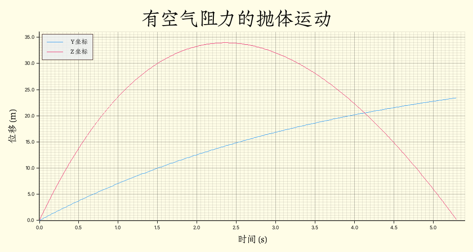
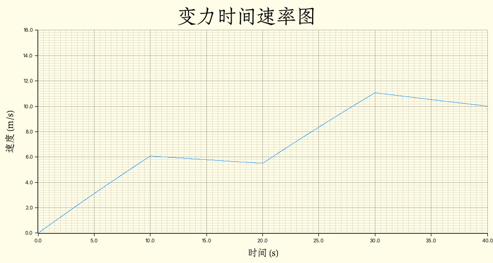

# Phyrs - 0x02

<p class="archive-time">archive time: 2025-07-11</p>

<p class="sp-comment">RMatrix 真好用</p>

[[toc]]

虽然很多情况下，我们会把问题限制在一个平面内，甚至限制到一维情况，
但更多的运动发生在三维空间，所以还是需要引入向量和矩阵

## 描述三维运动

类似一维运动，三维运动也有位移，速度以及加速度，只是从一个标量变成了向量形式：

$$
\begin{gathered}
\vec{r} = \left(x, y, z\right) = x \hat{i} + y \hat{j} + z \hat{k} \\\\
\vec{v} = \left(v_x, v_y, v_z\right),\quad\vec{a} = \left(a_x, a_y, a_z\right)
\end{gathered}
$$

其中 $\hat{i}$，$\hat{j}$ 和 $\hat{k}$ 分别为 x 轴，y 轴 和 z 轴对应的单位向量，
并且对于 $\vec{r}$ 和 $\vec{v}$，有：

$$
\vec{v} = \dfrac{\mathrm{d} \vec{r}}{\mathrm{d} t}
  = \left(\dfrac{\mathrm{d} x}{\mathrm{d} t},
    \dfrac{\mathrm{d} y}{\mathrm{d} t},
    \dfrac{\mathrm{d} z}{\mathrm{d} t}\right)
  = \left(v_x, v_y, v_z\right)
$$

$\vec{v}$ 与 $\vec{a}$ 同理，我们可以写出对应的向量求导方法：

```rust
pub fn derivative_vec<'a, R: RealFloat + 'a, const E: usize>(
    f: Rc<dyn Fn(R) -> VectorC<R, E>>,
    dx: R,
) -> Rc<dyn Fn(R) -> VectorC<R, E> + 'a> {
    Rc::new(move |x: R| -> VectorC<R, E> {
        let hdx = dx.clone() * R::half();
        (f(x.clone() + hdx.clone()) - f(x - hdx)) / dx.clone()
    })
}
```

> 注意，我使用的是 **rmatrix_ks** 的 `1.x` 版本

### 加速度分量

在研究运动的时候还需要考虑加速度和速度的方向问题，一般可以将加速度分成两个分量，
即法向加速度 $\vec{a}_\bot$ 和切向加速度 $\vec{a}_\parallel$：

$$
\begin{gathered}
  \vec{a} = \vec{a}_\bot + \vec{a}_\parallel \\\\
  \vec{a}_\bot \cdot \vec{a}_\parallel = 0,
    \quad\hat{a}_\parallel = \hat{v} \\\\
  \vec{a}_\parallel = \operatorname{Proj}_{\hat{v}} \vec{a},
    \quad\vec{a}_\bot = \vec{a} - \vec{a}_\parallel
\end{gathered}
$$

其中 $\hat{v}$ 表示 $\vec{v}$ 方向上的单位向量，$\operatorname{Proj}$ 表示向量投影操作，即：

$$
\operatorname{Proj}_{\vec{\alpha}} \vec{\beta}
  = \left(\vec{\beta} \cdot \hat{\alpha}\right) \hat{\alpha},
    \quad\hat{\alpha} = \dfrac{\vec{\alpha}}{\lVert\vec{\alpha}\rVert}
$$

在 Rust 中可以使用如下方式实现：

```rust
pub fn parallel_acceleration<R: RealFloat, const E: usize>(
    acceleration: VectorC<R, E>,
    velocity: VectorC<R, E>,
) -> VectorC<R, E> {
    project_to(&acceleration, &velocity)
}

pub fn perpendicular_acceleration<R: RealFloat, const E: usize>(
    acceleration: VectorC<R, E>,
    velocity: VectorC<R, E>,
) -> VectorC<R, E> {
    acceleration.clone() - parallel_acceleration(acceleration, velocity)
}
```

切向加速度表示速度大小变化快慢，法向加速度表示速度方向的变化：

$$
\begin{aligned}
\dfrac{\mathrm{d} v}{\mathrm{d} t}
  &= \dfrac{\mathrm{d}}{\mathrm{d} t} \sqrt{\vec{v} \cdot \vec{v}}
    = \dfrac{1}{2} \left(\vec{v} \cdot \vec{v}\right)^{-1/2}
      \dfrac{\mathrm{d}}{\mathrm{d} t}\left(\vec{v} \cdot \vec{v}\right) \\
  &= \dfrac{1}{2 v} \dfrac{\mathrm{d}}{\mathrm{d} t}\left(v_x^2 + v_y^2 + v_z^2\right) \\
  &= \dfrac{1}{2 v}\left(2 v_x a_x + 2 v_y a_y + 2 v_z a_z \right) \\
  &= \vec{a} \cdot \dfrac{\vec{v}}{v} = \vec{a} \cdot \hat{v} = a_\parallel
\end{aligned}
$$

其中 $v = \lVert\vec{v}\rVert$，$a_\parallel = \lVert\vec{a}_\parallel\rVert$

### 曲率半径

如果物体的法向加速度 $\vec{a}_\bot \neq \vec{0}$，那么物体将做曲线运动，
其每一时刻的运动轨迹会有一个圆与之对应，这个圆的半径被称为曲率半径，
可以用如下公式表示：

$$
\begin{gathered}
(v \Delta t)^2 + (R - \dfrac{1}{2} a_\bot \Delta t^2)^2 = R^2 \\\\
R = \lim_{\Delta t \to 0} \dfrac{v^2 \Delta t^2 - \dfrac{1}{4} a_\bot^2 \Delta t^4}{a_\bot \Delta t^2}
  = \dfrac{v^2}{a_\bot}
\end{gathered}
$$

使用 Rust 可以表示为：

```rust
pub fn radius_of_curvature<R: RealFloat, const E: usize>(
    velocity: &VectorC<R, E>,
    acceleration: &VectorC<R, E>,
) -> R {
    euclidean_norm(velocity).power(R::one() + R::one()) // R 不能直接获取 2.0
        / euclidean_norm(&perpendicular_acceleration(velocity, acceleration))
}
```

## 抛体运动

抛体运动是一种常见的运动形式，按照抛出物体的角度，可以分为平抛，斜抛以及上抛

这里假设重力加速度 $g = \pi^2$，重力一般表示为 $G = m g$，其中 $m$ 是物体质量

其实重力是地球对于地表物体的引力以及离心力[^1]的合力，但大部分情况下可以忽略离心力

一般而言，对于抛体运动，物体只考虑重力以及空气阻力：

$$
\begin{gathered}
  \vec{F}_{\textnormal{total}} = \vec{G} + \vec{f} \\
  \vec{G} = m \vec{g},\quad\vec{f} = -\alpha v \hat{v}
\end{gathered}
$$

其中 $\vec{f}$ 是通常低速的空气阻力的表达式，
$\alpha$ 表示空气阻力系数，$\alpha \gt 0$

所以抛体运动中物体随时间的位移函数为：

$$
\vec{r} = \vec{r}_0 + \vec{v}_0 t + \dfrac{1}{2} \dfrac{\vec{F}_{\textnormal{total}}}{m} t^2
$$

如果忽略空气阻力，则有：

$$
\begin{gathered}
\vec{r} = \vec{r}_0 + \vec{v}_0 t + \dfrac{1}{2} \vec{g} t^2 \\\\
\vec{v} = \vec{v}_0 + \vec{g} t,\quad\vec{a} = \vec{g}
\end{gathered}
$$

以物体起点为原点建立直角坐标系，z 轴对应物体高度，y 轴对应物体抛出水平距离，
假设抛出速度大小为 $v_x = 0$，$v_y = 8$，$v_z = 32$，单位均为 $\mathrm{m / s}$，
设空气阻力系数 $\alpha = 0.5$，则物体的运动轨迹图为：

<div style="text-align: center;">
  
</div>

## 牛顿定律

牛顿定律[^2]虽然在高速宏观或微观下有缺陷，但是足以解决日常生活中的一些问题

牛顿第一定律描述了物体运动和受力的关系，即如果没有外力，物体将保持原有的运动状态

这说明力的作用对于物体而言就是改变运动状态，
或者说如果一个物体的运动状态有所改变，那么这个物体一定受力

### 牛顿第二定律

牛顿第二定律定量描述了物体运动改变与受力的关系，是牛顿三定律中最为重要的定律

牛顿第二定律使用公式可以表示为：

$$
\vec{F}_{\textnormal{total}} = \dfrac{\mathrm{d}\vec{p}}{\mathrm{d} t},
  \quad\vec{p} = m \vec{v}
$$

其中 $\vec{p}$ 是物体的动量，或者可以写为 $\vec{F} = m \vec{a}$

根据合外力的依赖，我们需要选择不同的方法去求解方程：

|    合外力的依赖    |   求解方法   |
| :----------------: | :----------: |
|         无         |   简单代数   |
|        时间        |     积分     |
|        速度        | 一阶微分方程 |
|     时间和速度     | 一阶微分方程 |
| 时间、位置以及速度 | 二阶微分方程 |

对于恒力，即力不依赖于任何其他变量，
物体的速度可以简单表示为 $\vec{v} = \vec{v}_0 + \vec{F} t / m$，
如果力依赖于时间，那么加速度也将依赖于时间，
此时速度不能简单地使用 $\vec{v} = \vec{v}_0 + \vec{a} t$ 表示，而是：

$$
\vec{v} = \vec{v}_0 + \int{\vec{a}} \mathrm{d} t
  = \vec{v}_0 + \dfrac{1}{m} \int{\vec{F}} \mathrm{d} t
$$

例如，对于一个自行车，人和车总重 $50\,\mathrm{kg}$，忽略其他阻力，其受力可以表示为：

$$
F(t) = \begin{cases}
  32\,\mathrm{N} &(20\,\mathrm{s}) n \le t \lt (20\,\mathrm{s}) n + 10\,\mathrm{s},
    \,n\in \mathbb{N} \\
  0\,\mathrm{N} &\textnormal{otherwise}
\end{cases}
$$

那么使用 Rust 可以表示为：

```rust
use std::rc::Rc;

use plotters::{
    chart::ChartBuilder,
    prelude::{BitMapBackend, IntoDrawingArea},
    series::LineSeries,
    style::full_palette::{BLUE_400, YELLOW_50},
};
use rmatrix_ks::number::{
    instances::{double::Double, int::Int},
    traits::{integral::Integral, realfrac::RealFrac, zero::Zero},
};

fn main() {
    run().unwrap()
}

#[derive(Clone)]
struct State {
    pub mass: Double,
    pub pos: Double,
    pub vel: Double,
    pub time: Double,
}

fn run() -> Option<()> {
    let force = Rc::new(|t: Double| -> Double {
        if (t / Double::of(10.0))
            .truncate::<Int>()
            .modulus(Int::of(2))
            .is_zero()
        {
            Double::of(32.0)
        } else {
            Double::zero()
        }
    });
    // 初始状态
    let mut current_s = State {
        mass: Double::of(50.0),
        pos: Double::zero(),
        vel: Double::zero(),
        time: Double::zero(),
    };
    // 状态变更
    let one_step = Rc::new(|s: State, dt: Double| {
        let acc = force(s.time.clone()) / s.mass.clone();
        let new_vel = s.vel + acc.clone() * dt.clone();
        let new_pos = s.pos + new_vel.clone() * dt.clone();
        State {
            mass: s.mass,
            pos: new_pos,
            vel: new_vel,
            time: s.time + dt,
        }
    });
    let mut states = Vec::new();
    let time_duration = Double::of(0.015625);
    // 模拟运动
    while current_s.time < Double::of(40.0) {
        states.push(current_s.clone());
        current_s = one_step(current_s, time_duration.clone());
    }
    // 绘图
    let draw_area = BitMapBackend::new("result/draw_car.png", (960, 512)).into_drawing_area();
    draw_area.fill(&YELLOW_50).ok()?;
    let mut chart = ChartBuilder::on(&draw_area)
        .margin(16)
        .caption(
            "变力时间位移图",
            ("Zhuque Fangsong (technical preview)", 48),
        )
        .x_label_area_size(48)
        .y_label_area_size(64)
        .build_cartesian_2d(0.0..40.0, 0.0..360.0)
        .ok()?;
    chart
        .configure_mesh()
        .axis_desc_style(("Zhuque Fangsong (technical preview)", 24))
        .x_desc("时间 (s)")
        .y_desc("位移 (m)")
        .draw()
        .ok()?;
    chart
        .draw_series(LineSeries::new(
            states.iter().map(|s| (s.time.raw(), s.pos.raw())),
            &BLUE_400,
        ))
        .ok()?;
    draw_area.present().ok()?;

    Some(())
}
```

可以得到前 $40\,\mathrm{s}$ 的运动图像：

<div style="text-align: center;">
  
</div>

注意到这里并没有使用积分去获取对应的位移函数，而是使用状态的方法去记录运动变化

如果通过位移函数计算，由于这里要绘制图像而不是计算某一时刻的位移，
在 `integral_real` 部分会有大量的重复计算，而使用状态可以缓存计算结果，减少计算次数

### 空气阻力

在 [抛体运动](#抛体运动) 中，我们见到了依赖速度的力，即空气阻力

对于这种力，我们同样可以使用状态的方法来计算对应时间的物体状态：

```rust
let mut p3d = Particle {
    mass: Double::of(2.0),
    position: VectorC::of(&[0.0, 0.0, 0.0].map(Double::of))?,
    velocity: VectorC::of(&[0.0, 8.0, 32.0].map(Double::of))?,
};
// f_a = - a v + m g
let total_force = move |a: Double| {
    |p: Particle<Double, 3>, dt: Double| -> Particle<Double, 3> {
        let current_f = p.velocity.clone() * (-a);
        let current_a = current_f / p.mass.clone()
            + VectorC::<Double, 3>::of(&[
                Double::zero(),
                Double::zero(),
                -Double::PI.power(Double::of(2.0)),
            ])
            .expect("Error[f]: cannot construct gravity acceleration");
        let current_v = p.velocity + current_a * dt.clone();
        let current_p = p.position + current_v.clone() * dt;
        Particle {
            mass: p.mass,
            position: current_p,
            velocity: current_v,
        }
    }
};
let mut states = Vec::new();
let mut current_time = Double::of(0.0);
let time_duration = Double::of(0.015625);
let a = 0.5;
while p3d.position[(3, 1)] >= Double::of(0.0) {
    states.push((current_time.clone(), p3d.clone()));
    p3d = total_force(Double::of(a))(p3d, time_duration.clone());
    current_time = current_time + time_duration.clone();
}
```

其中 `Particle` 的定义如下：

```rust
#[derive(Clone)]
pub struct Particle<R: RealFloat, const E: usize> {
    pub mass: R,
    pub position: VectorC<R, E>,
    pub velocity: VectorC<R, E>,
}
```

这种使用状态迭代的方法称为欧拉法[^3]，是一种常用的求解微分方程的方法

## 物理系统的状态

使用欧拉法需要对当前的物理系统的状态进行建模，即 `State` 或 `Particle`

对系统的状态描述具体需要哪些物理量是由研究的问题决定的

具体而言，确定系统状态可以分为以下三步：

1. 粗略判断需要哪些物理量
2. 观察系统中有哪些物理量随时间变化
3. 这些物理量的初始状态是什么

第一步结合第二步就可以确定我们的状态要包含哪些物理量，
第三步则是为欧拉法做准备

### 随时间和速度变化的力

基于 [牛顿第二定律](#牛顿第二定律) 的例子，如果开始考虑空气阻力，
那么此时的合力就是一个随时间和速度变化的力，可以使用欧拉法分析

$$
F_{\textnormal{total}} = F(t) + f
$$

对应 Rust 实现如下：

```rust
// 状态变更
let one_step = Rc::new(|s: State, dt: Double| {
    // acc = (F + f) / m = (F - 0.5 v) / m
    let acc = (force(s.time.clone()) - s.vel.clone() * Double::of(0.5)) / s.mass.clone();
    let new_vel = s.vel + acc.clone() * dt.clone();
    let new_pos = s.pos + new_vel.clone() * dt.clone();
    State {
        mass: s.mass,
        pos: new_pos,
        vel: new_vel,
        time: s.time + dt,
    }
});
```

最后得到的速率随时间变化的图像为：

<div style="text-align: center;">
  
</div>

---

可以看到，根据研究问题的不同，所要使用的方法和细节也不一样，根据需要灵活挑选合适的方法

[^1]:
    Centrifugal force.Wikipedia \[DB/OL\].(2025-07-10)\[2025-07-11\].
    <https://en.wikipedia.org/wiki/Centrifugal_force>

[^2]:
    Newton's laws of motion.Wikipedia \[DB/OL\].(2025-07-07)\[2025-07-11\].
    <https://en.wikipedia.org/wiki/Newton's_laws_of_motion>

[^3]:
    Euler method.Wikipedia \[DB/OL\].(2025-06-04)\[2025-07-11\].
    <https://en.wikipedia.org/wiki/Euler_method>
