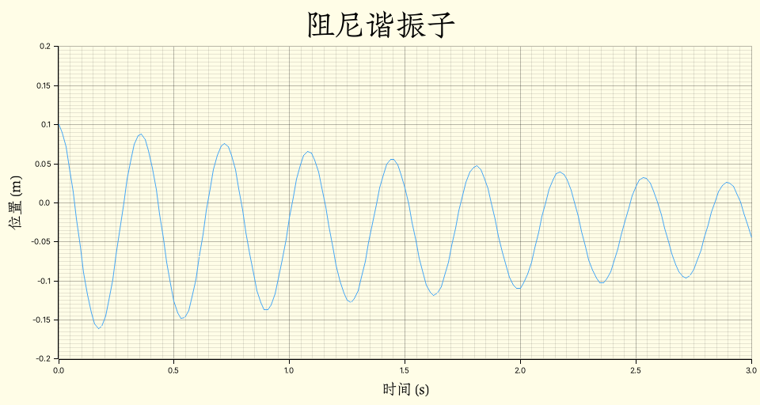
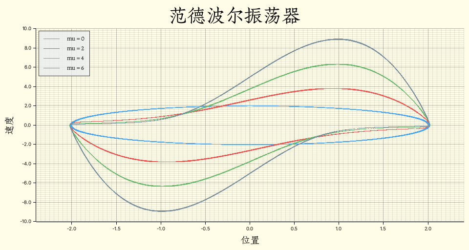

# Phyrs - 0x03

<p class="archive-time">archive time: 2025-07-12</p>

<p class="sp-comment">模块与函数的组织是一门技术</p>

前面两节大体介绍了动力学的相关概念，并且通过例子说明分析流程

这一节将介绍如何让之前的代码通用

## 随时间、位置和速度变化的力

之前提到了可以通过欧拉法来分析系统状态变化，
对于一个基本的三维物体，状态可以由质量、位置、速度以及时间来描述：

```rust
#[derive(Clone)]
pub struct Particle<R: RealFloat, const E: usize> {
    pub mass: R,
    pub charge: R,
    pub position: VectorC<R, E>,
    pub velocity: VectorC<R, E>,
    pub time: R,
}
```

此时牛顿第二定律可以表示为：

```math
\begin{gathered}
  \vec{F}\left(t, \vec{r}(t), \dfrac{\mathrm{d} \vec{r}(t)}{\mathrm{d} t}\right)
    = m \dfrac{\mathrm{d}^2 \vec{r}(t)}{\mathrm{d} t^2} \\\\
  \dfrac{\mathrm{d} \vec{r}(t)}{\mathrm{d} t} = \vec{v}(t),
    \quad\dfrac{\mathrm{d}^2 \vec{r}(t)}{\mathrm{d} t^2} = \vec{a}(t)
\end{gathered}
```

此时状态转移方程可以表示为：

```math
\begin{gathered}
  \vec{a}_n = \dfrac{\vec{F}_n\left(t_n, \vec{r}_n, \vec{v}_n\right)}{m},
    \quad\vec{v}_{n + 1} = \vec{v}_n + \vec{a}_n \Delta t \\
  \vec{r}_{n + 1} = \vec{r}_n + \vec{v}_{n + 1} \Delta t,
    \quad t_{n + 1} = t_n + \Delta t
\end{gathered}
```

基于这个状态转移方程，我们可以得到一系列的状态：

```math
\left(m, \vec{r}_0, \vec{v}_0, t_0\right) \to \left(m, \vec{r}_1, \vec{v}_1, t_1\right)
  \to\cdots\to\left(m, \vec{r}_n, \vec{v}_n, t_n\right)
```

根据研究的问题判断迭代终止条件，最后的状态就是我们要的结果

使用 Rust 实现可以得到：

```rust
impl<'a, R: RealFloat + 'a, const E: usize> Particle<R, E> {
    pub fn default_transition(
        acceleration: Rc<dyn Fn(Self) -> VectorC<R, E>>,
        dt: R,
    ) -> Rc<dyn Fn(Self) -> Self + 'a> {
        Rc::new(move |p: Self| -> Self {
            let velocity = p.velocity.clone() + acceleration(p.clone()) * dt.clone();
            let position = p.position.clone() + velocity.clone() * dt.clone();
            Self {
                mass: p.mass,
                charge: p.charge,
                velocity,
                position,
                time: p.time.clone() + dt.clone(),
            }
        })
    }

    pub fn simulate(self, transition: Rc<dyn Fn(Self) -> Self>) -> Iterate<'a, Self> {
        Iterate::of(transition, self)
    }
}
```

### 阻尼谐振子

作为受力随位置和速度相关的例子，可以考虑有一个阻尼谐振子，
即一个竖直悬挂的弹簧，末端有一个小球

假设向上为正方向，并且零点选择在弹簧平衡时的末端位置，
小球质量为 `$2.7 \,\mathrm{g}$`，半径为 `$2 \,\mathrm{cm}$`

假设空气阻力系数为 `$C = 2$`，空气密度为 `$\rho = 1.2 \,\mathrm{kg/m^3}$`，
重力加速度为 `$g = \pi^2 \,\mathrm{m/s^2}$`，则此时系统受力为：

```math
\begin{gathered}
  \vec{F}_\textnormal{total} = \vec{G} + \vec{F}_k + \vec{f} \\\\
  \vec{f} = - \dfrac{1}{2} C \rho A \lVert\vec{v}\rVert \vec{v} \\\\
  \vec{G} = m \vec{g},\quad\vec{F}_k = -k \Delta\vec{r}
\end{gathered}
```

其中 `$\Delta\vec{r}$` 表示弹簧距离平衡点的相对位移

若劲度系数 `$k = 0.8 \,\mathrm{kg/s^2}$`，初始位置为 `$10 \,\mathrm{cm}$`，初速度为 `$\vec{v} = \vec{0}$`，则：

```rust
use std::rc::Rc;

use phyrs::newton::particle::Particle;
use plotters::{
    chart::ChartBuilder,
    prelude::{BitMapBackend, IntoDrawingArea},
    series::LineSeries,
    style::full_palette::{BLUE_400, YELLOW_50},
};
use rmatrix_ks::{
    matrix::vector::{VectorC, basis_vector},
    number::{
        instances::double::Double,
        traits::{floating::Floating, fractional::Fractional, zero::Zero},
    },
};

fn main() {
    run().unwrap()
}

fn run() -> Option<()> {
    // 初始状态
    let state = Particle::<Double, 1>::without_charge(
        Double::of(2.7e-3),
        VectorC::of(&[0.1].map(Double::of))?,
        VectorC::default(),
        Double::zero(),
    );
    // 加速度
    let total_acc = Rc::new(|s: Particle<Double, 1>| -> VectorC<Double, 1> {
        let g = -basis_vector(1) * Double::PI.power(Double::of(2.0));
        g   // 重力
            - (s.position * Double::of(0.8) // 弹力
            + s.velocity // 空气阻力
                * Double::of(2.0) // 空气阻力系数
                * Double::of(1.2) // 空气密度
                * Double::PI
                * Double::of(2e-2).power(Double::of(2.0)) // A = pi r^2
                * Double::half()) / s.mass
    });
    // 模拟计算
    let one_step = Particle::default_transition(total_acc, Double::of(0.001));
    // 计算 0 到 3 秒内的运动轨迹
    let states = state
        .simulate(one_step)
        .take_while(|s| s.time <= Double::of(3.0));
    // 绘图
    let draw_area = BitMapBackend::new("result/draw_damp.png", (960, 512)).into_drawing_area();
    draw_area.fill(&YELLOW_50).ok()?;
    let mut chart = ChartBuilder::on(&draw_area)
        .margin(10)
        .caption("阻尼谐振子", ("Zhuque Fangsong (technical preview)", 48))
        .x_label_area_size(48)
        .y_label_area_size(64)
        .build_cartesian_2d(0.0..3.0, -0.2..0.2)
        .ok()?;
    chart
        .configure_mesh()
        .axis_desc_style(("Zhuque Fangsong (technical preview)", 24))
        .x_desc("时间 (s)")
        .y_desc("位置 (m)")
        .draw()
        .ok()?;
    chart
        .draw_series(LineSeries::new(
            states.map(|s| (s.time.raw(), s.position[(1, 1)].raw())),
            &BLUE_400,
        ))
        .ok()?;
    draw_area.present().ok()?;

    Some(())
}
```

得到的图像为：

<div class="center-box">
  
</div>

可以看到，由于小球的重力，系统的平衡点并不是最初的 `$0 \,\mathrm{m}$`，
而是 `$z_0 = m g / k \approx 0.033 \,\mathrm{m}$`

### 欧拉-克罗默方法

实际上，我们使用的方法是**欧拉-克罗默**方法[^1]

通常的欧拉法使用的是上一个状态的速度来计算下一个状态的位移，
而欧拉-克罗默方法则是使用下一个状态的速度来计算下一个状态的位移，即：

```math
\begin{cases}
  \vec{r}_{n + 1} = \vec{r}_n + \vec{v}_{\textcolor{red}{n}}\Delta t
    &\textnormal{Euler method} \\\\
  \vec{r}_{n + 1} = \vec{r}_n + \vec{v}_{\textcolor{green}{n + 1}}\Delta t
    &\textnormal{Euler–Cromer}
\end{cases}
```

欧拉-克罗默方法的结果比欧拉法更符合能量守恒，精度和稳定性也比欧拉法高

## 求解微分方程

大部分动力学问题都可以转化为一个求解微分方程的问题

但是大部分微分方程很难得到一个精确解，所以求解微分方程更多的还是使用数值方法，例如欧拉法

由于数值方法多种多样，所以在 `Particle` 中，
`simulate` 接受 `transition` 而不是合力，这是为了将模拟过程与数值方法解耦

比如我们还可以使用**龙格-库塔**方法[^2]：

```rust
// Self: Particle<R, E>
pub fn rk4_transition(
    acceleration: Rc<dyn Fn(Self) -> VectorC<R, E>>,
    dt: R,
) -> Rc<dyn Fn(Self) -> Self + 'a> {
    Rc::new(move |p: Self| -> Self {
        // k1
        let mut pk = p.clone();
        let k1_v = acceleration(pk.clone());
        let k1_r = pk.velocity.clone();
        // k2
        pk = Self {
            time: p.time.clone() + R::half() * dt.clone(),
            position: p.position.clone() + k1_r.clone() * R::half() * dt.clone(),
            velocity: p.velocity.clone() + k1_v.clone() * R::half() * dt.clone(),
            ..pk
        };
        let k2_v = acceleration(pk.clone());
        let k2_r = pk.velocity.clone();
        // k3
        pk = Self {
            time: p.time.clone() + R::half() * dt.clone(),
            position: p.position.clone() + k2_r.clone() * R::half() * dt.clone(),
            velocity: p.velocity.clone() + k2_v.clone() * R::half() * dt.clone(),
            ..pk
        };
        let k3_v = acceleration(pk.clone());
        let k3_r = pk.velocity.clone();
        // k4
        pk = Self {
            time: p.time.clone() + dt.clone(),
            position: p.position.clone() + k3_r.clone() * dt.clone(),
            velocity: p.velocity.clone() + k3_v.clone() * dt.clone(),
            ..pk
        };
        let k4_v = acceleration(pk.clone());
        let k4_r = pk.velocity.clone();
        // result
        let velocity = p.velocity
            + (k1_v + k2_v * Self::u(2) + k3_v * Self::u(2) + k4_v) * dt.clone() / Self::u(6);
        let position = p.position
            + (k1_r + k2_r * Self::u(2) + k3_r * Self::u(2) + k4_r) * dt.clone() / Self::u(6);
        Self {
            time: p.time + dt.clone(),
            position,
            velocity,
            ..p
        }
    })
}

pub fn dormand_prince_transition(
    acceleration: Rc<dyn Fn(Self) -> VectorC<R, E>>,
    dt: R,
) -> Rc<dyn Fn(Self) -> Self + 'a> {
    Rc::new(move |p: Self| -> Self {
        // k1
        let mut pk = p.clone();
        let k1_v = acceleration(pk.clone());
        let k1_r = pk.velocity.clone();
        // k2
        pk = Self {
            time: p.time.clone() + dt.clone() / Self::u(5),
            position: p.position.clone() + k1_r.clone() * dt.clone() / Self::u(5),
            velocity: p.velocity.clone() + k1_v.clone() * dt.clone() / Self::u(5),
            ..pk
        };
        let k2_v = acceleration(pk.clone());
        let k2_r = pk.velocity.clone();
        // k3
        pk = Self {
            time: p.time.clone() + Self::u(3) * dt.clone() / Self::u(10),
            position: p.position.clone()
                + (k1_r.clone() * Self::u(3) + k2_r.clone() * Self::u(9)) * dt.clone()
                    / Self::u(40),
            velocity: p.velocity.clone()
                + (k1_v.clone() * Self::u(3) + k2_v.clone() * Self::u(9)) * dt.clone()
                    / Self::u(40),
            ..pk
        };
        let k3_v = acceleration(pk.clone());
        let k3_r = pk.velocity.clone();
        // k4
        pk = Self {
            time: p.time.clone() + Self::u(4) * dt.clone() / Self::u(5),
            position: p.position.clone()
                + (k1_r.clone() * Self::u(44) - k2_r.clone() * Self::u(168)
                    + k3_r.clone() * Self::u(160))
                    * dt.clone()
                    / Self::u(45),
            velocity: p.velocity.clone()
                + (k1_v.clone() * Self::u(44) - k2_v.clone() * Self::u(168)
                    + k3_v.clone() * Self::u(160))
                    * dt.clone()
                    / Self::u(45),
            ..pk
        };
        let k4_v = acceleration(pk.clone());
        let k4_r = pk.velocity.clone();
        // k5
        pk = Self {
            time: p.time.clone() + Self::u(8) * dt.clone() / Self::u(9),
            position: p.position.clone()
                + (k1_r.clone() * Self::u(19372) / Self::u(6561)
                    - k2_r.clone() * Self::u(25360) / Self::u(2187)
                    + k3_r.clone() * Self::u(64448) / Self::u(6561)
                    - k4_r.clone() * Self::u(212) / Self::u(729))
                    * dt.clone(),
            velocity: p.velocity.clone()
                + (k1_v.clone() * Self::u(19372) / Self::u(6561)
                    - k2_v.clone() * Self::u(25360) / Self::u(2187)
                    + k3_v.clone() * Self::u(64448) / Self::u(6561)
                    - k4_v.clone() * Self::u(212) / Self::u(729))
                    * dt.clone(),
            ..pk
        };
        let k5_v = acceleration(pk.clone());
        let k5_r = pk.velocity.clone();
        // k6
        pk = Self {
            time: p.time.clone() + dt.clone(),
            position: p.position.clone()
                + (k1_r.clone() * Self::u(9017) / Self::u(3168)
                    - k2_r * Self::u(355) / Self::u(33)
                    + k3_r.clone() * Self::u(46732) / Self::u(5247)
                    + k4_r.clone() * Self::u(49) / Self::u(176)
                    - k5_r.clone() * Self::u(5103) / Self::u(18656))
                    * dt.clone(),
            velocity: p.velocity.clone()
                + (k1_v.clone() * Self::u(9017) / Self::u(3168)
                    - k2_v * Self::u(355) / Self::u(33)
                    + k3_v.clone() * Self::u(46732) / Self::u(5247)
                    + k4_v.clone() * Self::u(49) / Self::u(176)
                    - k5_v.clone() * Self::u(5103) / Self::u(18656))
                    * dt.clone(),
            ..pk
        };
        let k6_v = acceleration(pk.clone());
        let k6_r = pk.velocity.clone();
        // result
        let velocity = p.velocity
            + (k1_v * Self::u(35) / Self::u(384)
                + k3_v * Self::u(500) / Self::u(1113)
                + k4_v * Self::u(125) / Self::u(192)
                - k5_v * Self::u(2187) / Self::u(6784)
                + k6_v * Self::u(11) / Self::u(84))
                * dt.clone();
        let position = p.position
            + (k1_r * Self::u(35) / Self::u(384)
                + k3_r * Self::u(500) / Self::u(1113)
                + k4_r * Self::u(125) / Self::u(192)
                - k5_r * Self::u(2187) / Self::u(6784)
                + k6_r * Self::u(11) / Self::u(84))
                * dt.clone();
        Self {
            time: p.time + dt.clone(),
            position,
            velocity,
            ..p
        }
    })
}
```

这里使用 `$f(t) = e^t$` 在 `$t = 8$` 处的值为例子：

| 步长  |   参考值   | 欧拉-克罗默 | 四阶龙格-库塔 | Dormand Prince |
| :---: | :--------: | :---------: | :-----------: | :------------: |
|  0.1  | 2980.95799 | 2834.44297  |  2980.95809   |   2980.95799   |
| 0.01  | 2980.95799 | 2966.08303  |  2980.95799   |   2980.95799   |
| 0.001 | 2980.95799 | 2976.49028  |  2977.97852   |   2977.97852   |

对应相对误差为：

| 步长  |                 欧拉-克罗默                  |                 四阶龙格-库塔                 |                Dormand Prince                 |
| :---: | :------------------------------------------: | :-------------------------------------------: | :-------------------------------------------: |
|  0.1  |               `$4.915\\%$`               | `$\left(3.470 \times 10^{-6}\right)\\%$`  | `$\left(1.456 \times 10^{-9}\right)\\%$`  |
| 0.01  | `$\left(4.990 \times 10^{-1}\right)\\%$` | `$\left(3.366 \times 10^{-10}\right)\\%$` | `$\left(1.048 \times 10^{-11}\right)\\%$` |
| 0.001 | `$\left(1.499 \times 10^{-1}\right)\\%$` | `$\left(9.995 \times 10^{-2}\right)\\%$`  | `$\left(9.995 \times 10^{-2}\right)\\%$`  |

可以看到，在 `$\mathrm{d}t = 0.001$` 的时候，四阶龙格-库塔方法和 Dormand Prince 方法都出现了误差增大的现象，
这是因为此时计算的误差主要是舍入误差而不是截断误差，这导致了步长变小，误差反而增大

一般情况下，欧拉-克罗默方法就足够使用了

### 范德波尔振荡器

这里再展示一个求解微分方程的例子，即范德波尔振荡器：

```math
\dfrac{\mathrm{d}^2 x}{\mathrm{d} t^2}
  - \mu\left(1 - x^2\right) \dfrac{\mathrm{d} x}{\mathrm{d} t} + x = 0
```

类比牛顿第二定律，假设质量和劲度系数都为 `$1$`，此时合力可以看成：

```math
\begin{gathered}
  F_\textnormal{total} = F_k + F_\textnormal{damp} \\\\
  F_k = -x,\quad F_\textnormal{damp} = \mu (1 - x^2) v
\end{gathered}
```

则对于 `$\mu = 0$`、`$\mu = 2$`、`$\mu = 4$` 和 `$\mu = 6$` 有如下代码：

```rust
use std::rc::Rc;

use phyrs::newton::particle::Particle;
use plotters::{
    chart::{ChartBuilder, SeriesLabelPosition},
    prelude::{BitMapBackend, IntoDrawingArea, PathElement},
    series::LineSeries,
    style::{
        Color,
        full_palette::{
            BLUE_400, BLUEGREY_50, BLUEGREY_400, BROWN_800, GREEN_400, RED_400, YELLOW_50,
        },
    },
};
use rmatrix_ks::{
    matrix::vector::{VectorC, basis_vector},
    number::{
        instances::double::Double,
        traits::{floating::Floating, one::One, zero::Zero},
    },
};

fn main() {
    run().unwrap()
}

fn run() -> Option<()> {
    // 初始状态
    let state = Particle::<Double, 1>::without_charge(
        Double::one(),
        VectorC::of(&[Double::of(2.0)])?,
        VectorC::default(),
        Double::zero(),
    );
    // 加速度
    let total_acc = |mu: f64| -> Rc<dyn Fn(Particle<Double, 1>) -> VectorC<Double, 1>> {
        Rc::new(move |s: Particle<Double, 1>| -> VectorC<Double, 1> {
            (basis_vector(1)
                * Double::of(mu)
                * (Double::one() - s.position[(1, 1)].clone().power(Double::of(2.0)))
                * s.velocity[(1, 1)].clone()
                - s.position)
                / s.mass
        })
    };
    // 模拟计算
    let states0 = state
        .clone()
        .simulate(Particle::rk4_transition(
            total_acc(0.0),
            Double::of(0.015625),
        ))
        .take_while(|s| s.time <= Double::of(512.0));
    let states2 = state
        .clone()
        .simulate(Particle::rk4_transition(
            total_acc(2.0),
            Double::of(0.015625),
        ))
        .take_while(|s| s.time <= Double::of(512.0));
    let states4 = state
        .clone()
        .simulate(Particle::rk4_transition(
            total_acc(4.0),
            Double::of(0.015625),
        ))
        .take_while(|s| s.time <= Double::of(512.0));
    let states6 = state
        .simulate(Particle::rk4_transition(
            total_acc(6.0),
            Double::of(0.015625),
        ))
        .take_while(|s| s.time <= Double::of(512.0));
    // 绘图
    let draw_area = BitMapBackend::new("result/draw_vanderpol.png", (960, 512)).into_drawing_area();
    draw_area.fill(&YELLOW_50).ok()?;
    let mut chart = ChartBuilder::on(&draw_area)
        .margin(10)
        .caption(
            "范德波尔振荡器",
            ("Zhuque Fangsong (technical preview)", 48),
        )
        .x_label_area_size(48)
        .y_label_area_size(64)
        .build_cartesian_2d(-2.4..2.4, -10.0..10.0)
        .ok()?;
    chart
        .configure_mesh()
        .axis_desc_style(("Zhuque Fangsong (technical preview)", 24))
        .x_desc("位置")
        .y_desc("速度")
        .draw()
        .ok()?;
    chart
        .draw_series(LineSeries::new(
            states0.map(|s| (s.position[(1, 1)].raw(), s.velocity[(1, 1)].raw())),
            &BLUE_400,
        ))
        .ok()?
        .label("mu = 0")
        .legend(|(x, y)| PathElement::new(vec![(x, y), (x + 32, y)], BLUE_400));

    chart
        .draw_series(LineSeries::new(
            states2.map(|s| (s.position[(1, 1)].raw(), s.velocity[(1, 1)].raw())),
            &RED_400,
        ))
        .ok()?
        .label("mu = 2")
        .legend(|(x, y)| PathElement::new(vec![(x, y), (x + 32, y)], RED_400));

    chart
        .draw_series(LineSeries::new(
            states4.map(|s| (s.position[(1, 1)].raw(), s.velocity[(1, 1)].raw())),
            &GREEN_400,
        ))
        .ok()?
        .label("mu = 4")
        .legend(|(x, y)| PathElement::new(vec![(x, y), (x + 32, y)], GREEN_400));

    chart
        .draw_series(LineSeries::new(
            states6.map(|s| (s.position[(1, 1)].raw(), s.velocity[(1, 1)].raw())),
            &BLUEGREY_400,
        ))
        .ok()?
        .label("mu = 6")
        .legend(|(x, y)| PathElement::new(vec![(x, y), (x + 32, y)], BLUEGREY_400));

    chart
        .configure_series_labels()
        .border_style(BROWN_800)
        .label_font(("Zhuque Fangsong (technical preview)", 16))
        .legend_area_size(48)
        .background_style(BLUEGREY_50.mix(0.8))
        .position(SeriesLabelPosition::UpperLeft)
        .draw()
        .ok()?;

    draw_area.present().ok()?;

    Some(())
}
```

对应位置和速度的相图如下：

<div class="center-box">
  
</div>

---

有了龙格-库塔方法，大部分的常微分方程都可以尝试求解了

不过更重要的是知道如何转化物理问题到微分方程，包括如何确定状态转移函数

[^1]:
    Semi-implicit Euler method.Wikipedia \[DB/OL\].(2025-04-15)\[2025-07-12\].
    <https://en.wikipedia.org/wiki/Semi-implicit_Euler_method>

[^2]:
    Runge–Kutta methods.Wikipedia \[DB/OL\].(2025-07-07)\[2025-07-12\].
    <https://en.wikipedia.org/wiki/Runge–Kutta_methods>
