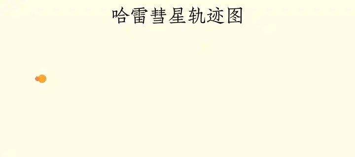
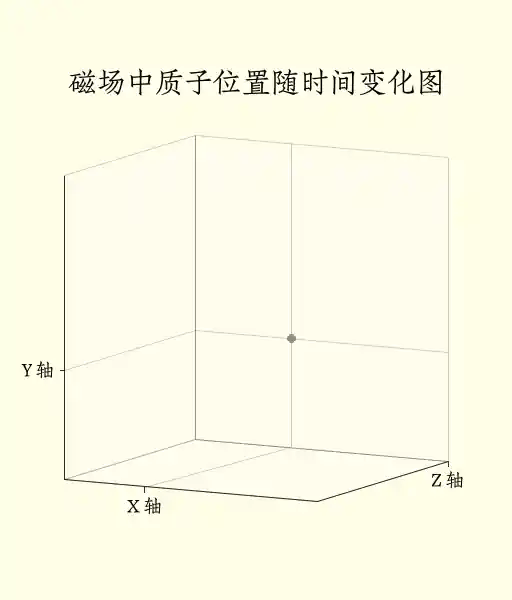
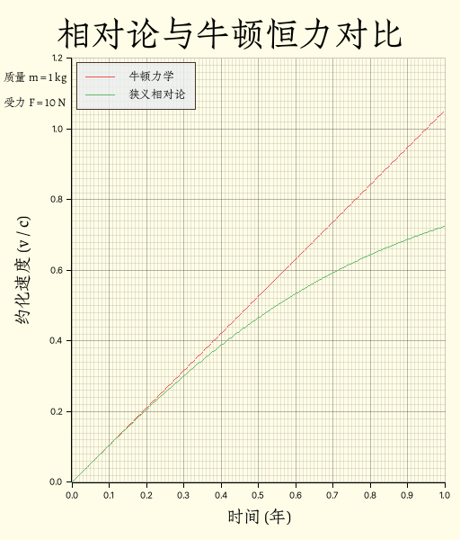
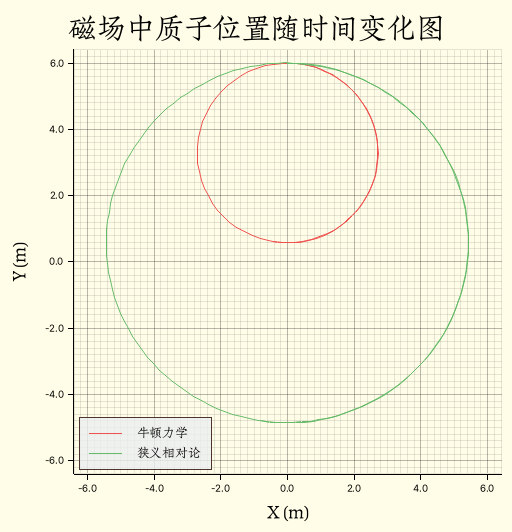

# Phyrs - 0x04

<p class="archive-time">archive time: 2025-07-13</p>

<p class="sp-comment">物理问题到最后都会变成数学问题</p>

[[toc]]

上一节中，我们构建好了 `Practicle` 以及相关实现，现在我们来看一些更有趣的例子

> 为了模拟电磁学相关内容，`Practicle` 新增了 `charge` 字段表示电荷量

## 卫星运动

我们现在考虑一个双星问题，比如地月系统，
忽略地球自转和公转以及月球自转，月球围绕地球做卫星运动

卫星运动中，两颗星体间的引力充当向心力

实际上，地球和月球都在以近似相同的角速度 $\omega$ 围绕一个地月之间的“质心”运动：

$$
\begin{gathered}
  M_\textnormal{moon} \omega^2 R_\textnormal{moon}
    = \dfrac{G M_\textnormal{moon} M_\textnormal{earth}}{(R_\textnormal{moon} + R_\textnormal{earth})^2}
    = M_\textnormal{earth} \omega^2 R_\textnormal{earth} \\\\
    \dfrac{R_\textnormal{earth}}{R_\textnormal{moon}}
      = \dfrac{M_\textnormal{moon}}{M_\textnormal{earth}}
\end{gathered}
$$

离质心的距离与星体质量成反比，所以地球与质心的距离在地月系统中可以忽略不计，
即可以近似为月球围绕地球做圆周运动

不过实际的卫星运动的轨迹并不是一个完美的圆形，而是椭圆，由开普勒定律描述，
而较大的星体位于椭圆轨迹的焦点处

例如哈雷彗星，公转周期约 75 年，质量约为 $2.2 \times 10^{14}\,\mathrm{kg}$，电荷量近似为零，
设哈雷彗星距离太阳最近的位置为 $\left(-8.766 \times 10^{10}\,\mathrm{m}, 0\right)$，
此时速度为 $\left(0, 54569\,\mathrm{m/s}\right)$[^1]

太阳质量约为 $1.98855 \times 10^{30}\,\mathrm{kg}$，
万有引力常数约为 $G = 6.6743 \times 10^{-11}\,\mathrm{m^3 kg^{-1} s^{-2}}$，则可以有：

```rust
use std::{fs::File, io::Write, rc::Rc};

use phyrs::newton::particle::Particle;
use plotters::{
    chart::ChartBuilder,
    prelude::{BitMapBackend, Circle, EmptyElement, IntoDrawingArea},
    series::{LineSeries, PointSeries},
    style::{
        ShapeStyle,
        full_palette::{ORANGE_400, PURPLE_300, RED_400, YELLOW_50},
    },
};
use rmatrix_ks::{
    matrix::vector::{VectorC, euclidean_norm, normalize},
    number::{
        instances::double::Double,
        traits::{floating::Floating, zero::Zero},
    },
};

fn main() {
    run().unwrap()
}

fn run() -> Option<()> {
    // 初始状态
    let state = Particle::<Double, 2>::without_charge(
        Double::of(2.2e14),
        VectorC::of(&[-Double::of(8.766e10), Double::zero()])?,
        VectorC::of(&[Double::zero(), Double::of(5.4569e4)])?, // 顺时针
        Double::zero(),
    );
    // 加速度
    let total_acc = Rc::new(|s: Particle<Double, 2>| -> VectorC<Double, 2> {
        let gravity_constant = Double::of(6.6743e-11);
        let sun_mass = Double::of(1.98855e30);
        // Fg = - (G M m / |r|^2) r/|r|
        -normalize(&s.position) * gravity_constant * sun_mass
            / euclidean_norm(&s.position).power(Double::of(2.0))
    });
    // 模拟计算
    let one_step = Particle::rk45_transition(total_acc, Double::of(0.0001));
    let states = state
        .simulate_adaptive(one_step, Double::of(24.0 * 60.0 * 60.0))
        .map(|(s, _)| s)
        .take_while(|s| s.time <= Double::of(78.0 * 365.25 * 24.0 * 60.0 * 60.0))
        .map(|s| {
            (
                s.time.raw(),
                s.position[(1, 1)].raw(),
                s.position[(2, 1)].raw(),
            )
        })
        .collect::<Vec<_>>();

    // 绘图
    let draw_area = BitMapBackend::gif("result/draw_halley.gif", (720, 320), 1)
        .ok()?
        .into_drawing_area();
    for s in states.iter().step_by(48) {
        draw_area.fill(&YELLOW_50).ok()?;
        let mut chart = ChartBuilder::on(&draw_area)
            .margin(10)
            .caption(
                "哈雷彗星轨迹图",
                ("Zhuque Fangsong (technical preview)", 48),
            )
            .x_label_area_size(48)
            .y_label_area_size(64)
            .build_cartesian_2d(-1e11..5.6e12, -7.5e11..7.5e11)
            .ok()?;
        chart
            .draw_series(PointSeries::of_element(
                [(0.0, 0.0)],
                8,
                ShapeStyle::from(ORANGE_400),
                &|coord, size, style| {
                    EmptyElement::at(coord) + Circle::new((0, 0), size, style.filled())
                },
            ))
            .ok()?;
        chart
            .draw_series(LineSeries::new(
                states
                    .iter()
                    .take_while(|si| si.0 <= s.0)
                    .map(|si| (si.1, si.2)),
                &PURPLE_300,
            ))
            .ok()?;
        chart
            .draw_series(PointSeries::of_element(
                [(s.1, s.2)],
                4,
                ShapeStyle::from(RED_400),
                &|coord, size, style| {
                    EmptyElement::at(coord) + Circle::new((0, 0), size, style.filled())
                },
            ))
            .ok()?;

        draw_area.present().ok()?;
    }

    // 保存数据
    let mut file_handle = File::options()
        .write(true)
        .truncate(true)
        .create(true)
        .open("result/halley.csv")
        .ok()?;
    file_handle
        .write_all(
            states
                .into_iter()
                .map(|state| format!("{},{},{}", state.0, state.1, state.2))
                .collect::<Vec<String>>()
                .join("\n")
                .as_bytes(),
        )
        .ok()?;

    Some(())
}
```

这是渲染得到的动图：

<div class="center-box">
  
</div>

其中通过状态模拟得到的哈雷彗星的周期约是 $74.64$ 年，与实际结果还是很接近的

## 磁场中的质子

磁场是高能粒子实验的常客，遵循的定律是洛伦兹定律：

$$
\vec{F}_\textnormal{Lorentz} = q \left[\vec{E} + \vec{v}(t) \times \vec{B}\right]
$$

带电粒子在均匀磁场中会做圆周运动或螺旋运动，我们可以用数值方法验证这一点：

```rust
use std::rc::Rc;

use phyrs::newton::{particle::Particle, utils::lorentz_force};
use plotters::{
    chart::ChartBuilder,
    prelude::{BitMapBackend, Circle, IntoDrawingArea},
    series::{LineSeries, PointSeries},
    style::{
        Color, ShapeStyle,
        full_palette::{BLUEGREY_400, ORANGE_400, RED_400, WHITE, YELLOW_50},
    },
};
use rmatrix_ks::{
    matrix::vector::{VectorC, basis_vector},
    number::{instances::double::Double, traits::zero::Zero},
};

fn main() {
    run().unwrap();
}

fn run() -> Option<()> {
    let state = Particle::<Double, 3>::with_charge(
        Double::of(1.672621898e-27),
        Double::of(1.602176621e-19),
        VectorC::default(),
        basis_vector(2) * Double::of(0.8) + basis_vector(3) * Double::of(0.32),
        Double::zero(),
    );

    let total_acc = Rc::new(|s: Particle<Double, 3>| -> VectorC<Double, 3> {
        let m = s.mass.clone();
        lorentz_force(VectorC::default(), basis_vector(3) * Double::of(3.2e-8), s) / m
    });

    let one_step = Particle::rk45_transition(total_acc, Double::of(0.001));
    let states = state
        .simulate_adaptive(one_step, Double::of(0.05))
        .map(|(s, _)| s)
        .take_while(|s| s.time <= Double::of(10.0));
    let draw_area = BitMapBackend::gif("result/draw_lorentz.gif", (512, 600), 1)
        .ok()?
        .into_drawing_area();
    let points = states
        .map(|s| {
            (
                s.time,
                s.position[(1, 1)].raw(),
                s.position[(2, 1)].raw(),
                s.position[(3, 1)].raw(),
            )
        })
        .collect::<Vec<_>>();
    for (t, x, y, z) in points.iter().step_by(2) {
        draw_area.fill(&YELLOW_50).ok()?;
        let mut chart = ChartBuilder::on(&draw_area)
            .margin(64)
            .caption(
                "磁场中质子位置随时间变化图",
                ("Zhuque Fangsong (technical preview)", 36),
            )
            .build_cartesian_3d(-0.36..0.64, -0.36..0.64, 0.0..4.0)
            .ok()?;
        chart
            .configure_axes()
            .axis_panel_style(WHITE.mix(0.32))
            .label_style(("Zhuque Fangsong (technical preview)", 24))
            .x_labels(1)
            .x_formatter(&|_e| String::from("X 轴"))
            .y_labels(1)
            .y_formatter(&|_e| String::from("Y 轴"))
            .z_labels(1)
            .z_formatter(&|_e| String::from("Z 轴"))
            .draw()
            .ok()?;
        chart
            .draw_series(PointSeries::<_, _, Circle<_, _>, _>::new(
                [(0.0, 0.0, 0.0)],
                2,
                ShapeStyle::from(ORANGE_400).filled(),
            ))
            .ok()?;
        chart
            .draw_series(LineSeries::new(
                points
                    .iter()
                    .take_while(|s| &s.0 <= t)
                    .map(|&(_, x, y, z)| (x, y, z)),
                &RED_400,
            ))
            .ok()?;
        chart
            .draw_series(PointSeries::<_, _, Circle<_, _>, _>::new(
                [(*x, *y, *z)],
                4,
                ShapeStyle::from(BLUEGREY_400).filled(),
            ))
            .ok()?;

        draw_area.present().ok()?;
    }

    Some(())
}
```

可以得到这样一幅图：

<div class="center-box">
  
</div>

可以发现质子确实是在做螺旋运动，原因在于洛伦兹力中有一个速度与磁场的叉乘，
这个操作会产生一个与速度方向和磁场方向都正交的力

## 狭义相对论

在牛顿力学之上，我们有了一个能更加准确描述我们的世界的工具，那就是狭义相对论

狭义相对论中，力的性质是没有太大变化的，
一个物体所的合力仍然是作用在该物体上的所有力的矢量之和：

$$
\vec{F}_\textnormal{net}(t, \vec{r}(t), \vec{v}(t))
  = \sum_j \vec{F}_j(t, \vec{r}(t), \vec{v}(t))
$$

但是对于牛顿第二定律，我们不使用加速度描述，而是使用物体的动量：

$$
\begin{gathered}
  \vec{F}_\textnormal{net}(t, \vec{r}(t), \vec{v}(t))
    = \dfrac{\mathrm{d} \vec{p}(t)}{\mathrm{d} t} \\\\
  \vec{p}(t) = \dfrac{m \vec{v}(t)}{
    \sqrt{1 - \dfrac{\lVert\vec{v}(t)\rVert^2}{\mathbf{c}^2}}}
\end{gathered}
$$

其中 $\mathbf{c} = 299792458\,\mathrm{m/s}$ 是真空光速

我们可以用动量来表示速度：

$$
\vec{v}(t) = \dfrac{\vec{p}(t)}{\sqrt{
  m^2 + \dfrac{\lVert\vec{p}(t)\rVert^2}{\mathbf{c}^2}}}
$$

不过加速度依旧是速度对时间的导数，所以可以得到：

$$
\dfrac{\mathrm{d} \vec{v}(t)}{\mathrm{d} t}
  = \sqrt{1 - \dfrac{\lVert\vec{v}(t)\rVert^2}{\mathbf{c}^2}}
    \left[ \dfrac{\vec{F}_\textnormal{net}(t, \vec{r}(t), \vec{v}(t))}{
      m} - \left(\dfrac{\vec{F}_\textnormal{net}(t, \vec{r}(t), \vec{v}(t))}{
        m} \cdot \dfrac{\vec{v}}{\mathbf{c}}\right)\dfrac{\vec{v}}{\mathbf{c}}\right]
$$

如果物体速度远小于光速，这个式子可以被化简为牛顿第二定律的形式，
也就是说，对于低速物体，牛顿定律依旧是适用的

狭义相对论的公式可以表示为：

```rust
pub fn relativity_acceleration<R: RealFloat, const E: usize>(
    p: Particle<R, E>,
    speed_of_light: R,
    force: Rc<dyn Fn(Particle<R, E>) -> VectorC<R, E>>,
) -> VectorC<R, E> {
    let f_net = force(p.clone());
    (f_net.clone() / p.mass.clone()
        - p.velocity.clone() / speed_of_light.clone()
            * dot_product(
                &(f_net / p.mass),
                &(p.velocity.clone() / speed_of_light.clone()),
            ))
        * (R::one()
            - euclidean_norm(&p.velocity).power(R::one() + R::one())
                / speed_of_light.clone().power(R::one() + R::one()))
        .square_root()
}
```

### 对恒力的影响

如果把时间尺度拉长，即便是恒力，狭义相对论下的物体状态也会与牛顿力学下的物体状态有非常大的差异：

```rust
use std::rc::Rc;

use phyrs::newton::{
    particle::Particle,
    relativity::{SPEED_OF_LIGHT, relativity_acceleration},
};
use plotters::{
    chart::{ChartBuilder, SeriesLabelPosition},
    prelude::{BitMapBackend, IntoDrawingArea, PathElement},
    series::LineSeries,
    style::{
        Color, TextStyle,
        full_palette::{BLUEGREY_50, BROWN_800, GREEN_400, RED_400, YELLOW_50},
    },
};
use rmatrix_ks::{
    matrix::vector::{VectorC, basis_vector},
    number::{instances::double::Double, traits::zero::Zero},
};

fn main() {
    run().unwrap();
}

fn run() -> Option<()> {
    let one_year = Double::of(365.25 * 24.0 * 60.0 * 60.0);
    let one_day = Double::of(24.0 * 60.0 * 60.0);
    let state = Particle::<Double, 1>::without_charge(
        Double::of(1.0),
        VectorC::default(),
        VectorC::default(),
        Double::zero(),
    );
    let const_force = Rc::new(|_p: Particle<Double, 1>| -> VectorC<Double, 1> {
        basis_vector(1) * Double::of(10.0)
    });
    let const_force_copy = const_force.clone();
    let newton_acc = Rc::new(move |p: Particle<Double, 1>| -> VectorC<Double, 1> {
        const_force(p.clone()) / p.mass
    });
    let newton_step = Particle::rk4_transition(newton_acc, one_day.clone());
    let relativity_acc = Rc::new(move |p: Particle<Double, 1>| -> VectorC<Double, 1> {
        relativity_acceleration(p, SPEED_OF_LIGHT, const_force_copy.clone())
    });
    let relativity_step = Particle::rk4_transition(relativity_acc, one_day);
    let newton_states = state
        .clone()
        .simulate(newton_step)
        .take_while(|s| s.time <= one_year);
    let relativity_state = state
        .simulate(relativity_step)
        .take_while(|s| s.time <= one_year);
    let draw_area = BitMapBackend::new("result/draw_relconst.png", (512, 600)).into_drawing_area();
    draw_area.fill(&YELLOW_50).ok()?;
    let mut chart = ChartBuilder::on(&draw_area)
        .margin(16)
        .caption(
            "相对论与牛顿恒力对比",
            ("Zhuque Fangsong (technical preview)", 48),
        )
        .x_label_area_size(48)
        .y_label_area_size(64)
        .build_cartesian_2d(0.0..1.0, 0.0..1.2)
        .ok()?;
    chart
        .configure_mesh()
        .axis_desc_style(("Zhuque Fangsong (technical preview)", 24))
        .x_desc("时间 (年)")
        .y_desc("约化速度 (v / c)")
        .draw()
        .ok()?;

    draw_area
        .draw_text(
            "质量 m = 1 kg",
            &TextStyle::from(("Zhuque Fangsong (technical preview)", 16)),
            (4, 80),
        )
        .ok()?;
    draw_area
        .draw_text(
            "受力 F = 10 N",
            &TextStyle::from(("Zhuque Fangsong (technical preview)", 16)),
            (4, 108),
        )
        .ok()?;
    chart
        .draw_series(LineSeries::new(
            newton_states.map(|s| {
                (
                    (s.time / one_year.clone()).raw(),
                    (s.velocity[(1, 1)].clone() / SPEED_OF_LIGHT).raw(),
                )
            }),
            &RED_400,
        ))
        .ok()?
        .label("牛顿力学")
        .legend(|(x, y)| PathElement::new(vec![(x, y), (x + 32, y)], RED_400));
    chart
        .draw_series(LineSeries::new(
            relativity_state.map(|s| {
                (
                    (s.time / one_year.clone()).raw(),
                    (s.velocity[(1, 1)].clone() / SPEED_OF_LIGHT).raw(),
                )
            }),
            &GREEN_400,
        ))
        .ok()?
        .label("狭义相对论")
        .legend(|(x, y)| PathElement::new(vec![(x, y), (x + 32, y)], GREEN_400));
    chart
        .configure_series_labels()
        .border_style(BROWN_800)
        .label_font(("Zhuque Fangsong (technical preview)", 16))
        .legend_area_size(48)
        .background_style(BLUEGREY_50.mix(0.8))
        .position(SeriesLabelPosition::UpperLeft)
        .draw()
        .ok()?;
    draw_area.present().ok()?;

    Some(())
}
```

得到的图像为：

<div class="center-box">
  
</div>

可以看到，牛顿力学下，物体的速度没有真空光速这一限制，所以可以超过光速，
而在狭义相对论下，物体速度不能超过真空光速，所以图像出现了“弯曲”

### 狭义相对论下磁场中的质子

那我们再回过头看看在狭义相对论下，磁场中的质子又将会如何运动：

```rust
use std::rc::Rc;

use phyrs::newton::{
    particle::Particle,
    relativity::{SPEED_OF_LIGHT, relativity_acceleration},
    utils::lorentz_force,
};
use plotters::{
    chart::{ChartBuilder, SeriesLabelPosition},
    prelude::{BitMapBackend, IntoDrawingArea, PathElement},
    series::LineSeries,
    style::{
        Color,
        full_palette::{BLUEGREY_50, BROWN_800, GREEN_400, RED_400, YELLOW_50},
    },
};
use rmatrix_ks::{
    matrix::vector::{VectorC, basis_vector},
    number::{
        instances::double::Double,
        traits::{one::One, zero::Zero},
    },
};

fn main() {
    run().unwrap();
}

fn run() -> Option<()> {
    let state = Particle::<Double, 3>::with_charge(
        Double::of(1.672621898e-27),
        Double::of(1.602176621e-19),
        VectorC::default(),
        basis_vector(2) * Double::of(0.72) * SPEED_OF_LIGHT,
        Double::zero(),
    );

    let force = Rc::new(|p: Particle<Double, 3>| {
        lorentz_force(VectorC::default(), basis_vector(3) * Double::one(), p)
    });
    let force_copy = force.clone();

    let newton_acc = Rc::new(move |s: Particle<Double, 3>| -> VectorC<Double, 3> {
        let m = s.mass.clone();
        force(s) / m
    });
    let newton_step = Particle::rk4_transition(newton_acc, Double::of(1e-9));
    let newton_states = state.clone().simulate(newton_step).take(100);
    let relativity_acc = Rc::new(move |s: Particle<Double, 3>| -> VectorC<Double, 3> {
        relativity_acceleration(s.clone(), SPEED_OF_LIGHT, force_copy.clone())
    });
    let relativity_step = Particle::rk4_transition(relativity_acc, Double::of(1e-9));
    let relativity_states = state.simulate(relativity_step).take(120);
    let draw_area = BitMapBackend::new("result/draw_rlorentz.png", (512, 600)).into_drawing_area();
    draw_area.fill(&YELLOW_50).ok()?;
    let mut chart = ChartBuilder::on(&draw_area)
        .margin(10)
        .caption(
            "磁场中质子位置随时间变化图",
            ("Zhuque Fangsong (technical preview)", 36),
        )
        .x_label_area_size(48)
        .y_label_area_size(64)
        .build_cartesian_2d(0.0..9.0, -5.0..5.0)
        .ok()?;

    chart
        .configure_mesh()
        .axis_desc_style(("Zhuque Fangsong (technical preview)", 24))
        .x_desc("X (m)")
        .y_desc("Y (m)")
        .draw()
        .ok()?;

    chart
        .draw_series(LineSeries::new(
            newton_states.map(|s| (s.position[(1, 1)].raw(), s.position[(2, 1)].raw())),
            &RED_400,
        ))
        .ok()?
        .label("牛顿力学")
        .legend(|(x, y)| PathElement::new(vec![(x, y), (x + 32, y)], RED_400));

    chart
        .draw_series(LineSeries::new(
            relativity_states.map(|s| (s.position[(1, 1)].raw(), s.position[(2, 1)].raw())),
            &GREEN_400,
        ))
        .ok()?
        .label("狭义相对论")
        .legend(|(x, y)| PathElement::new(vec![(x, y), (x + 32, y)], GREEN_400));

    chart
        .configure_series_labels()
        .border_style(BROWN_800)
        .label_font(("Zhuque Fangsong (technical preview)", 16))
        .legend_area_size(48)
        .background_style(BLUEGREY_50.mix(0.8))
        .position(SeriesLabelPosition::UpperLeft)
        .draw()
        .ok()?;

    draw_area.present().ok()?;

    Some(())
}
```

其中，初速度为 y 轴方向 $0.72 \mathbf{c}$，磁场强度为 $1\,\mathrm{T}$，得到的图像为：

<div class="center-box">
  
</div>

可以看见，狭义相对论中质子运动轨迹的半径要比牛顿力学重点轨迹半径要更大，
这个差距来源于动量的定义，具体来说，狭义相对论的半径是牛顿力学半径的比例为：

$$
\dfrac{R_\textnormal{relativity}}{R_\textnormal{newton}}
    = \dfrac{1}{\sqrt{1 - \dfrac{\lVert\vec{v}\rVert^2}{\mathbf{c}^2}}}
$$

这个因子就是所谓的洛伦兹因子，这个现象被称为尺缩效应[^2]

---

不得不说，**plotters** 画图是真的麻烦，特别是三维图和动图

[^1]:
    1P/Halley.Solar System Dynamics \[DB/OL\].(2024-04-26)\[2025-07-13\].
    <https://ssd.jpl.nasa.gov/tools/sbdb_lookup.html#/?des=1P&view=O>

[^2]:
    Length contraction.Wikipedia \[DB/OL\].(2025-05-10)\[2025-07-13\].
    <https://en.wikipedia.org/wiki/Length_contraction>
