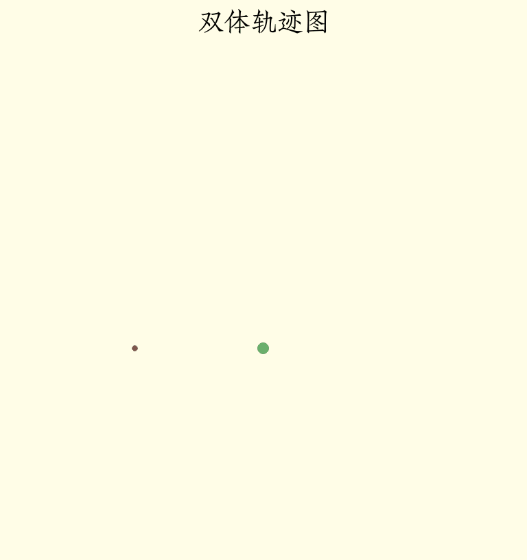

# Phyrs - 0x05

<p class="archive-time">archive time: 2025-07-15</p>

<p class="sp-comment">牛爵爷就是牛</p>

之前我们的例子都是单体的，也就是是只有一个粒子运动，现在我们再来看看多体情况下该怎么分析

## 牛顿第三定律

牛顿第三定律虽然不起眼，但这正是多体运动分析的基石

物体 A 对物体 B 施加了一个力，那么物体 B 也会对物体 A 施加一个等大反向的力：

```math
\vec{F}_{A B} = -\vec{F}_{B A}
```

这称为作用力和反作用力，这两个力同时产生，没有时间顺序

### 万有引力

在[卫星运动](./20250713-phyrs-0x04.md#卫星运动)中，我们使用了万有引力，
这其实就是一个典型的相互作用力，即卫星对星体的引力也是星体对卫星的引力：

```rust
pub fn universal_gravity<R: RealFloat, const E: usize>(
    center: Particle<R, E>,
    p: Particle<R, E>,
) -> VectorC<R, E> {
    let gravity_constant = real_to_frac::<Double, R>(Double::of(6.6743e-11));
    let dr = p.position - center.position;
    let diretion_vector = normalize(&dr);
    let distance = euclidean_norm(&dr);
    // Fg = - (G M1 M2 / |r|^2) (r/|r|)
    -diretion_vector * gravity_constant * center.mass * p.mass / distance.power(R::one() + R::one())
}
```

其中方向向量从引力中心 `from` 指向 `p`，而引力方向与方向向量相反，即 `-diretion_vector`

如果交换 `from` 和 `p`，那么得到的引力方向就会反向，符合牛顿第三定律

### 恒定斥力

恒定斥力表示物体 A 对物体 B 有一个恒定的斥力，如果我们写成：

```rust
pub fn wrong_constant_repulsive_force<R: RealFloat, const E: usize>(
    force: VectorC<R, E>,
    _p: Particle<R, E>,
) -> VectorC<R, E> {
    force
}
```

这很明显是错误的，因为这没有考虑两个物体的位置变化，所以正确的方式应该是传入力的大小而不是力本身：

```rust
pub fn constant_repulsive_force<'a, R: RealFloat + 'a, const E: usize>(
    force: R,
) -> Rc<dyn Fn(Particle<R, E>, Particle<R, E>) -> VectorC<R, E> + 'a> {
    Rc::new(
        move |center: Particle<R, E>, p: Particle<R, E>| -> VectorC<R, E> {
            normalize(&(p.position - center.position)) * force.clone()
        },
    )
}
```

这样，我们就可以根据两个物体的相对位置来得到正确的斥力，
并且交换两个物体，斥力方向也会相应改变

### 线性弹力

这里假设弹簧只能沿轴线拉伸和压缩，并且不会超过弹性限度，
根据两端的位置，弹簧对于两端都会产生一个力：

|              位置关系               | 弹簧状态 |                          在端点 A 的力                           |                           在端点 B 的力                           |
| :---------------------------------: | :------: | :--------------------------------------------------------------: | :---------------------------------------------------------------: |
| `$\lVert\vec{r}_{B A}\rVert > r_e$` |   拉伸   | `$k \left(\lVert\vec{r_{B A}}\rVert - r_e\right) \hat{r}_{B A}$` | `$-k \left(\lVert\vec{r_{B A}}\rVert - r_e\right) \hat{r}_{B A}$` |
| `$\lVert\vec{r}_{B A}\rVert = r_e$` |   平衡   |                              `$0$`                               |                               `$0$`                               |
| `$\lVert\vec{r}_{B A}\rVert < r_e$` |   压缩   | `$k \left(\lVert\vec{r_{B A}}\rVert - r_e\right) \hat{r}_{B A}$` | `$-k \left(\lVert\vec{r_{B A}}\rVert - r_e\right) \hat{r}_{B A}$` |

这里我们考虑端点 B 的力：

```rust
pub fn linear_spring<'a, R: RealFloat + 'a, const E: usize>(
    k: R,
    original_length: R,
) -> Rc<dyn Fn(Particle<R, E>, Particle<R, E>) -> VectorC<R, E> + 'a> {
    Rc::new(
        move |center: Particle<R, E>, p: Particle<R, E>| -> VectorC<R, E> {
            let dr = p.position - center.position;
            let dx = euclidean_norm(&dr) - original_length.clone();
            let direction_vector = normalize(&dr);
            -direction_vector * k.clone() * dx
        },
    )
}
```

如果 A 端固定，则可以简化为：

```rust
pub fn fixed_linear_spring<'a, R: RealFloat + 'a, const E: usize>(
    k: R,
    original_length: R,
    fixed_postion: VectorC<R, E>,
) -> Rc<dyn Fn(Particle<R, E>) -> VectorC<R, E> + 'a> {
    Rc::new(move |p: Particle<R, E>| -> VectorC<R, E> {
        linear_spring(k.clone(), original_length.clone())(
            // 只有位置的虚粒子
            Particle::without_charge(
                R::zero(),
                fixed_postion.clone(),
                VectorC::default(),
                R::zero(),
            ),
            p,
        )
    })
}
```

### 有心力

可以发现，万有引力、恒定斥力和线性弹力有一个共通点，
即由两个物体产生并且方向沿两个物体的连线，
这种力称为有心力[^1]，可以选取其中一个物体作为力中心点：

```math
\vec{F} = F \hat{r}
```

其中有心力还可以分为强有心力和弱有心力，强有心力的大小与两个物体的间距有关：

```math
\vec{F} = F(\lVert\vec{r}\rVert) \hat{r}
```

使用 Rust 可以表示为：

```rust
pub fn central_force<'a, R: RealFloat + 'a, const E: usize>(
    relation: Rc<dyn Fn(R) -> R + 'a>,
) -> Rc<dyn Fn(Particle<R, E>, Particle<R, E>) -> VectorC<R, E> + 'a> {
    Rc::new(
        move |center: Particle<R, E>, p: Particle<R, E>| -> VectorC<R, E> {
            let dr = p.position - center.position;
            normalize(&dr) * relation(euclidean_norm(&dr))
        },
    )
}
```

那么上述的万有引力、恒定斥力以及线性弹力可以改写为：

```rust
pub fn universal_gravity<'a, R: RealFloat + 'a, const E: usize>(
    center: Particle<R, E>,
    p: Particle<R, E>,
    gravity_constant: R,
) -> VectorC<R, E> {
    let m1 = center.mass.clone();
    let m2 = p.mass.clone();
    // fg = -G M1 M2 / |r|^2
    let relation = Rc::new(move |distance: R| -> R {
        -gravity_constant.clone() * m1.clone() * m2.clone() / distance.power(R::one() + R::one())
    });
    central_force(relation)(center, p)
}

pub fn constant_repulsive_force<'a, R: RealFloat + 'a, const E: usize>(
    force: R,
) -> Rc<dyn Fn(Particle<R, E>, Particle<R, E>) -> VectorC<R, E> + 'a> {
    central_force(Rc::new(move |_: R| -> R { force.clone() }))
}

pub fn linear_spring<'a, R: RealFloat + 'a, const E: usize>(
    k: R,
    original_length: R,
) -> Rc<dyn Fn(Particle<R, E>, Particle<R, E>) -> VectorC<R, E> + 'a> {
    central_force(Rc::new(move |distance: R| -> R {
        -k.clone() * (distance - original_length.clone())
    }))
}
```

## 多体系统

一般而言，我们研究的对象往往不只一个物体，这时候就需要引入多体系统来管理系统状态

对于系统的力通常可以分为两类，一类是系统内部物体之间相互作用的力，也被称为内力，
另一类是系统外对于系统内某个物体施加的力，称为外力：

```rust
#[derive(Clone)]
pub enum SystemForce<R: RealFloat, const E: usize> {
    ExternalForce(usize, Rc<dyn Fn(Particle<R, E>) -> VectorC<R, E>>),
    InternalForce(
        usize,
        usize,
        Rc<dyn Fn(Particle<R, E>, Particle<R, E>) -> VectorC<R, E>>,
    ),
}
```

其中 `usize` 表示在系统中的物体的索引，例如物体 1 和物体 2 之间的力可以表示为：

```rust
InternalForce(1, 2, Rc::new(|_, _| VectorC::default()))
```

整个系统的状态就是由内部所有物体的状态以及作用力组成：

```rust
#[derive(Clone)]
pub struct ParticleSystem<R: RealFloat, const E: usize> {
    pub particles: Vec<Particle<R, E>>,
    pub time: R,
}
```

这里可以使用 Builder 模式[^2]来构建系统：

```rust
pub struct ParticleSystemBuilder<R: RealFloat, const E: usize>(ParticleSystem<R, E>);
impl<R: RealFloat, const E: usize> ParticleSystemBuilder<R, E> {
    pub fn of() -> Self {
        ParticleSystemBuilder(ParticleSystem {
            particles: Vec::new(),
            time: R::zero(),
        })
    }

    pub fn add_particle(mut self, p: Particle<R, E>) -> Self {
        self.0.particles.push(p);
        self
    }

    pub fn set_time(mut self, time: R) -> Self {
        self.0.time = time;
        self
    }

    pub fn build(self) -> ParticleSystem<R, E> {
        self.0
    }
}
```

系统内的非相对论体系的牛顿第二定律可以用如下方程组来表示：

```math
\begin{gathered}
  \dfrac{\mathrm{d}}{\mathrm{d} t} \left[t\right] = 1,
    \quad\dfrac{\mathrm{d}}{\mathrm{d} t}\left[\vec{r}_n(t)\right] = \vec{v}_n(t) \\\\
  \dfrac{\mathrm{d}}{\mathrm{d} t} \left[\vec{v}_n(t)\right] = \dfrac{1}{m_n}\left(
    \vec{F}_{\textnormal{ex}\left[n\right]}\left(t, \vec{r}_n(t), \vec{v\}_n(t)\right)
      + \sum_m \vec{F}_{n m}\left(\vec{r}_n(t) - \vec{r}_m(t), \vec{v}_n(t) - \vec{v}_m(t)\right)\right)
\end{gathered}
```

其中 `$\vec{F}_{\textnormal{ex}\left[n\right]}$` 表示物体 n 所受合外力，
`$\vec{F}_{n m}$` 表示物体 n 与物体 m 之间的内力，一般认为内力不会直接依赖于时间

我们可以复用在单体系统中定义的数值方法：

```rust
impl<R: RealFloat + 'static, const E: usize> ParticleSystem<R, E> {
    pub fn force_to_acceleration(
        system: &Self,
        force: SystemForce<R, E>,
        f2a: Rc<
            dyn Fn(
                Rc<dyn Fn(Particle<R, E>) -> VectorC<R, E>>,
            ) -> Rc<dyn Fn(Particle<R, E>) -> VectorC<R, E>>,
        >,
        index: usize,
    ) -> Rc<dyn Fn(Particle<R, E>) -> VectorC<R, E>> {
        let f2a_capture = f2a.clone();
        match force {
            SystemForce::ExternalForce(n, f_ex) if n == index => f2a_capture(f_ex.clone()),
            SystemForce::InternalForce(n, m, f_in) if n == index => {
                let p_m = system.particles[m].clone();
                let one_body_force =
                    Rc::new(move |p: Particle<R, E>| -> VectorC<R, E> { f_in(p_m.clone(), p) });
                f2a_capture(one_body_force)
            }
            SystemForce::InternalForce(m, n, f_in) if n == index => {
                let p_m = system.particles[m].clone();
                let one_body_force =
                    Rc::new(move |p: Particle<R, E>| -> VectorC<R, E> { f_in(p_m.clone(), p) });
                f2a_capture(one_body_force)
            }
            _ => Rc::new(|_| VectorC::default()),
        }
    }

    pub fn system_transition(
        forces: Vec<SystemForce<R, E>>,
        f2a: Rc<
            dyn Fn(
                Rc<dyn Fn(Particle<R, E>) -> VectorC<R, E>>,
            ) -> Rc<dyn Fn(Particle<R, E>) -> VectorC<R, E>>,
        >,
        dt: R,
        particle_transition: Rc<
            dyn Fn(
                Rc<dyn Fn(Particle<R, E>) -> VectorC<R, E>>,
                R,
            ) -> Rc<dyn Fn(Particle<R, E>) -> Particle<R, E>>,
        >,
    ) -> Rc<dyn Fn(Self) -> Self> {
        let f2a_capture = f2a.clone();
        Rc::new(
            move |system: ParticleSystem<R, E>| -> ParticleSystem<R, E> {
                let particles = system
                    .particles
                    .iter()
                    .enumerate()
                    .map(|(idx, p)| {
                        let f2a_inner_capture = f2a_capture.clone();
                        let forces_capture = forces.clone();
                        let system_capture = system.clone();

                        let acceleration = Rc::new({
                            move |p: Particle<R, E>| -> VectorC<R, E> {
                                forces_capture
                                    .iter()
                                    .map(|f| {
                                        Self::force_to_acceleration(
                                            &system_capture,
                                            f.clone(),
                                            f2a_inner_capture.clone(),
                                            idx,
                                        )
                                    })
                                    .map(|a_fn| a_fn(p.clone()))
                                    .fold(VectorC::default(), |acc, a| acc + a)
                            }
                        });
                        particle_transition(acceleration, dt.clone())(p.clone())
                    })
                    .collect::<Vec<Particle<R, E>>>();
                ParticleSystem {
                    particles,
                    time: system.time + dt.clone(),
                }
            },
        )
    }

    pub fn simulate<'a>(self, transition: Rc<dyn Fn(Self) -> Self + 'a>) -> Iterate<'a, Self> {
        Iterate::of(transition, self)
    }
}
```

作为验证，我们来看一个双体系统的例子：

```rust
use std::rc::Rc;

use phyrs::newton::{
    particle::Particle,
    relativity::{SPEED_OF_LIGHT, relativity_acceleration},
    system::{ParticleSystem, ParticleSystemBuilder, SystemForce},
    utils::central_force,
};
use plotters::{
    chart::ChartBuilder,
    prelude::{BitMapBackend, Circle, EmptyElement, IntoDrawingArea},
    series::{LineSeries, PointSeries},
    style::{
        ShapeStyle,
        full_palette::{BLUE_400, GREEN_400, ORANGE_400, RED_400, YELLOW_50},
    },
};
use rmatrix_ks::{
    matrix::vector::{VectorC, basis_vector},
    number::{
        instances::double::Double,
        traits::{floating::Floating, zero::Zero},
    },
};

fn main() {
    run().unwrap()
}

fn run() -> Option<()> {
    let system = ParticleSystemBuilder::<Double, 2>::of()
        .add_particle(Particle::without_charge(
            Double::of(2.0),
            basis_vector(1) * Double::of(-3.0),
            basis_vector(2) * Double::of(-3.0),
            Double::zero(),
        ))
        .add_particle(Particle::without_charge(
            Double::of(3.0),
            basis_vector(1) * Double::of(2.0),
            basis_vector(2) * Double::of(2.0),
            Double::zero(),
        ))
        .build();
    let force = Rc::new(
        |center: Particle<Double, 2>, p: Particle<Double, 2>| -> VectorC<Double, 2> {
            let m1 = center.mass.clone();
            let m2 = p.mass.clone();
            let relation = Rc::new(move |distance: Double| -> Double {
                -Double::of(16.0) * m1.clone() * m2.clone() / distance.power(Double::of(2.0))
            });
            central_force(relation)(center, p)
        },
    );
    let f2a = Rc::new(
        |force: Rc<dyn Fn(Particle<Double, 2>) -> VectorC<Double, 2>>| -> Rc<dyn Fn(_) -> _> {
            Rc::new(move |p: Particle<Double, 2>| -> VectorC<Double, 2> {
                relativity_acceleration(p, SPEED_OF_LIGHT, force.clone())
            })
        },
    );
    let one_step = ParticleSystem::system_transition(
        vec![SystemForce::InternalForce(0, 1, force)],
        f2a,
        Double::of(0.001),
        Rc::new(Particle::dormand_prince_transition),
    );
    let total_time = 64.0;
    let states = system
        .simulate(one_step)
        .take_while(|s| s.time < Double::of(total_time))
        .map(|s| {
            (
                s.time,
                s.particles
                    .iter()
                    .map(|p| (p.position[(1, 1)].raw(), p.position[(2, 1)].raw()))
                    .collect::<Vec<(f64, f64)>>(),
            )
        })
        .collect::<Vec<_>>();
    // 绘图
    let draw_area = BitMapBackend::gif("result/draw_double.gif", (768, 816), 1)
        .ok()?
        .into_drawing_area();
    for s in states
        .iter()
        .step_by((states.len() as f64 / total_time / 10.0).floor() as usize)
    {
        draw_area.fill(&YELLOW_50).ok()?;
        let mut chart = ChartBuilder::on(&draw_area)
            .margin(10)
            .caption("双体轨迹图", ("Zhuque Fangsong (technical preview)", 48))
            .build_cartesian_2d(-8.0..12.0, -8.0..12.0)
            .ok()?;

        chart
            .draw_series(LineSeries::new(
                states
                    .iter()
                    .take_while(|si| si.0 <= s.0)
                    .map(|si| (si.1[0].0, si.1[0].1)),
                &ORANGE_400,
            ))
            .ok()?;
        chart
            .draw_series(PointSeries::of_element(
                [(s.1[0].0, s.1[0].1)],
                4,
                ShapeStyle::from(RED_400),
                &|coord, size, style| {
                    EmptyElement::at(coord) + Circle::new((0, 0), size, style.filled())
                },
            ))
            .ok()?;

        chart
            .draw_series(LineSeries::new(
                states
                    .iter()
                    .take_while(|si| si.0 <= s.0)
                    .map(|si| (si.1[1].0, si.1[1].1)),
                &BLUE_400,
            ))
            .ok()?;
        chart
            .draw_series(PointSeries::of_element(
                [(s.1[1].0, s.1[1].1)],
                8,
                ShapeStyle::from(GREEN_400),
                &|coord, size, style| {
                    EmptyElement::at(coord) + Circle::new((0, 0), size, style.filled())
                },
            ))
            .ok()?;

        draw_area.present().ok()?;
    }
    Some(())
}
```

得到的图像为：

<div class="center-box">
  
</div>

---

终于实现多体系统了，可以用来模拟一些有趣的东西了

[^1]:
    Central force.Wikipedia \[DB/OL\].(2025-05-16)\[2025-07-15\].
    <https://en.wikipedia.org/wiki/Central_force>

[^2]:
    Builder pattern.Wikipedia \[DB/OL\].(2025-05-05)\[2025-07-15\].
    <https://en.wikipedia.org/wiki/Builder_pattern>
