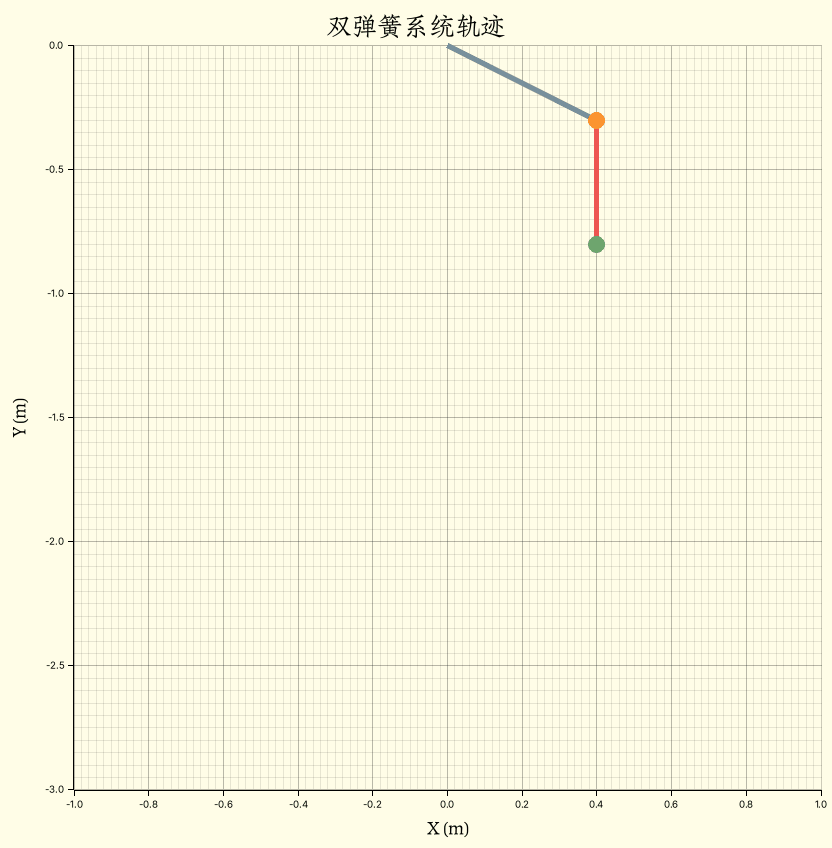
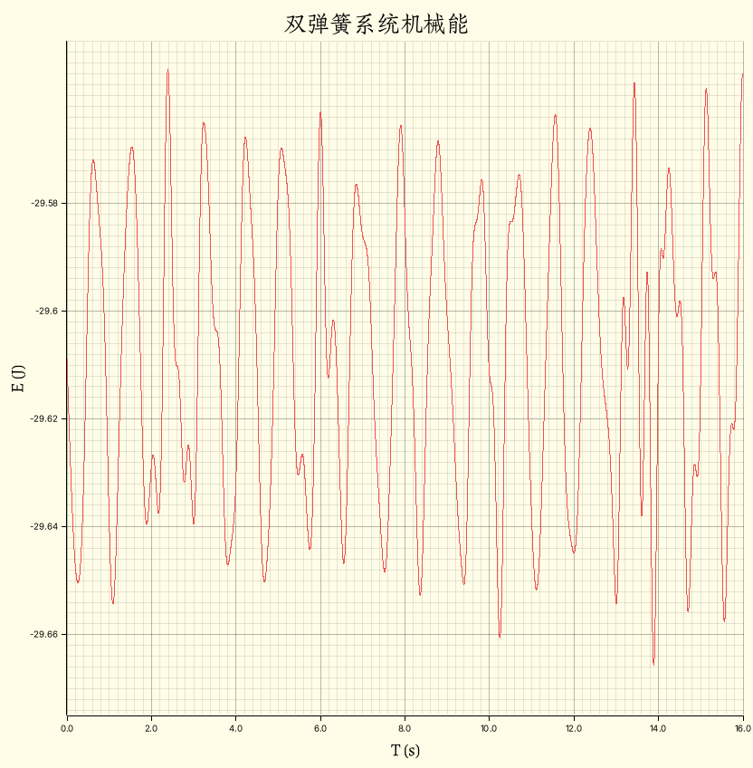
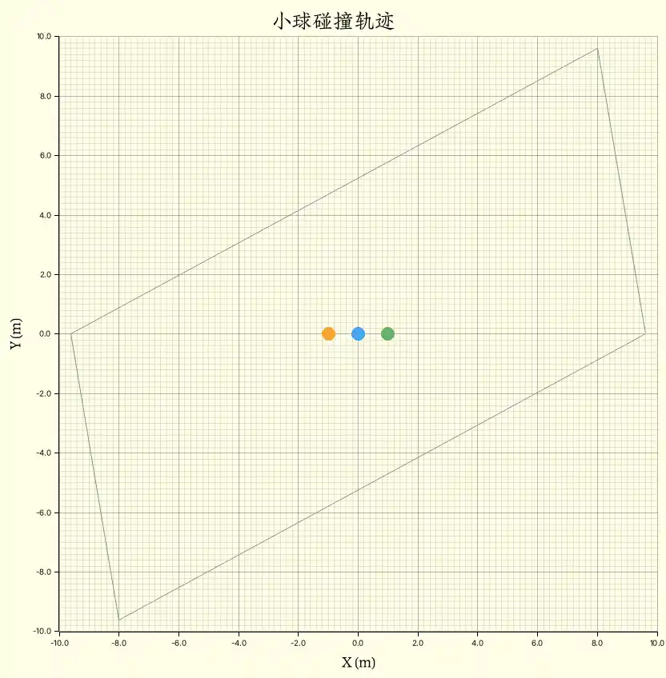
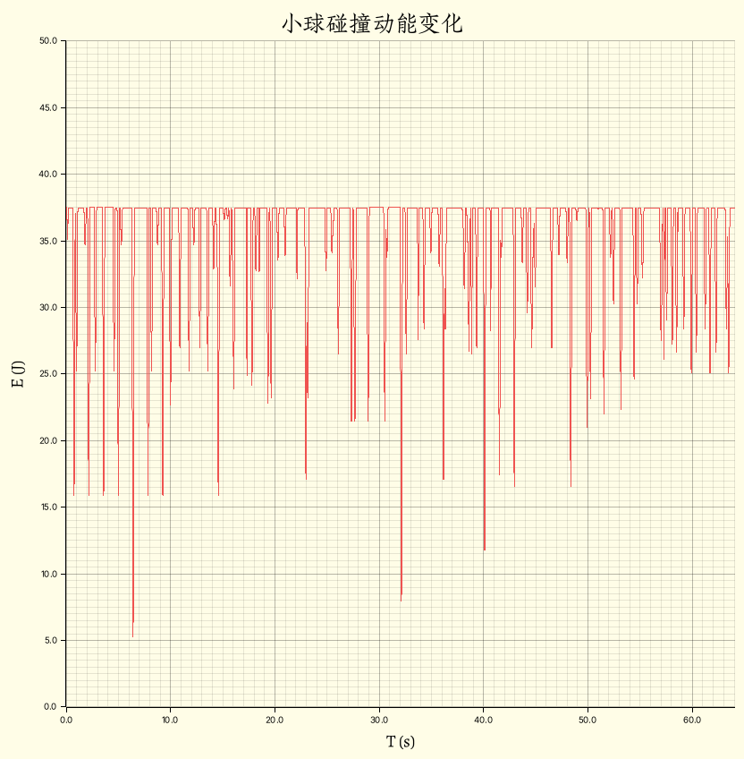

# Phyrs - 0x06

<p class="archive-time">archive time: 2025-07-17</p>

<p class="sp-comment">唉，误差</p>

我们再来看几个多体系统分析的例子

## 弹簧系统

假设我们有两个弹簧，其中一个一端固定在天花板上，另一端有一质量为 \\( m\_0 \\) 的小球

并且 \\( m\_0 \\) 还接着另一个弹簧，第二个弹簧末端有一质量为 \\( m\_1 \\) 的小球

由于第一个弹簧是固定弹簧，所以其对 \\( m\_0 \\) 的弹力可以被视为外力，
而 \\( m\_0 \\) 和 \\( m\_1 \\) 之间的弹力则是系统内力

\\[
  \begin{gathered}
    \vec{F}\_{\textnormal{ex}\left[m\_0\right]}
      = - k\_0 \left(\lVert\vec{r}\_0\rVert - r\_{e 0}\right) \hat{r}\_0 \\\\\\\\
    \vec{F}\_{m\_0 m\_1}
      = - k\_1 \left(\lVert\vec{r}\_1 - \vec{r}\_0\rVert - r\_{e 1}\right)
        \dfrac{\vec{r}\_1 - \vec{r}\_0}{\lVert\vec{r}\_1 - \vec{r}\_0\rVert}
  \end{gathered}
\\]

其中 \\( k\_n \\) 和 \\( r\_{e n} \\) 是第 \\( n + 1 \\) 个弹簧的劲度系数和平衡长度

设弹簧劲度系数和平衡长度分别为 \\( 100\\,\mathrm{kg/s^2} \\) 和 \\( 0.5\\,\mathrm{m} \\)，
包含重力，使用 Rust 可以表示为：

```rust
let fg = Rc::new(move |p: Particle<Double, 2>| -> VectorC<Double, 2> {
    -basis_vector(2) * Double::PI.power(Double::of(2.0)) * p.mass
});
let forces: Vec<SystemForce<Double, 2>> = vec![
    SystemForce::ExternalForce(
        0,
        fixed_linear_spring(Double::of(100.0), Double::of(0.5), VectorC::default()),
    ),
    SystemForce::ExternalForce(0, fg.clone()),
    SystemForce::ExternalForce(1, fg),
    SystemForce::InternalForce(0, 1, linear_spring(Double::of(100.0), Double::of(0.5))),
];
```

假设 \\( m\_0 = 2\\,\mathrm{kg} \\)，初始位移为 \\( \left(0.4, -0.3\right) \\)，
而 \\( m\_1 = 3\\,\mathrm{kg} \\)，初始位移为 \\( \left(0.4, -0.8\right) \\)，初速度都为 \\( \vec{0} \\)，则：

```rust
let system = ParticleSystemBuilder::<Double, 2>::of()
    .add_particle(Particle::without_charge(
        Double::of(2.0),
        basis_vector(1) * Double::of(0.4) + basis_vector(2) * Double::of(-0.3),
        VectorC::default(),
        Double::zero(),
    ))
    .add_particle(Particle::without_charge(
        Double::of(3.0),
        basis_vector(1) * Double::of(0.4) + basis_vector(2) * Double::of(-0.8),
        VectorC::default(),
        Double::zero(),
    ))
    .build();
```

最后我们可以得到这么一个轨迹图：

<div class="center-box">
  
</div>

## 机械能守恒

这里，系统满足机械能守恒[^1]的条件，即只有保守力[^2]做功，并且系统与外界无机械能交换

我们可以尝试验证一下我们的模拟系统是否满足理论，其中机械能由势能和动能组成：

\\[
  \begin{gathered}
    E\_m = E\_k + U \\\\\\\\
    E\_k = \sum\_i \dfrac{1}{2} m\_i \lVert\vec{v}\_i\rVert^2
  \end{gathered}
\\]

势能部分，这个系统仅包含两个小球的重力势能以及两个弹簧的弹性势能:

```rust
let p4gs = states
    .iter()
    .map(|s| {
        s.particles
            .iter()
            .map(|p| {
                potential_for_gravity(
                    p.mass.clone(),
                    Double::PI.power(Double::of(2.0)),
                    p.position[(2, 1)].clone(),
                )
            })
            .fold(Double::zero(), |acc, e| acc + e)
    })
    .collect::<Vec<Double>>();
let p4ss = states
    .iter()
    .map(|s| {
        let p4s = potential_for_spring(Double::of(100.0), Double::of(0.5));
        let fixed = Particle::without_charge(
            Double::zero(),
            VectorC::default(),
            VectorC::default(),
            Double::zero(),
        );

        p4s(fixed, s.particles[0].clone()) + p4s(s.particles[0].clone(), s.particles[1].clone())
    })
    .collect::<Vec<Double>>();
```

其中 `states` 是我们模拟得到的数据：

```rust
let f2a = Rc::new(
    |force: Rc<dyn Fn(Particle<Double, 2>) -> VectorC<Double, 2>>| -> Rc<dyn Fn(_) -> _> {
        Rc::new(move |p: Particle<Double, 2>| -> VectorC<Double, 2> {
            force(p.clone()) / p.mass
        })
    },
);

let total_time = 16.0;
let init_step = Double::of(1e-3);

let one_step = ParticleSystem::system_transition(
    forces,
    f2a,
    init_step,
    Rc::new(Particle::default_transition),
);
let states = system
    .simulate(one_step)
    .take_while(|s| s.time <= Double::of(total_time))
    .enumerate()
    .inspect(|(n, s)| {
        if n.is_multiple_of(512) {
            let used_time = timer
                .elapsed()
                .expect("Error[two_spring::run]: Failed to get the time elapsed.")
                .as_secs_f64();
            println!(
                "{:.2} min => {} | rest: {:.2} min",
                used_time / 60.0,
                s.time,
                (total_time * used_time / s.time.raw() - used_time) / 60.0
            )
        }
    })
    .map(|(_, s)| s)
    .collect::<Vec<_>>();
```

动能和势能的计算函数定义如下：

```rust
fn potential_for_gravity<R: RealFloat>(m: R, g: R, h: R) -> R {
    m * g * h
}

fn potential_for_spring<'a, R: RealFloat + 'a, const E: usize>(
    k: R,
    original_length: R,
) -> Rc<dyn Fn(Particle<R, E>, Particle<R, E>) -> R + 'a> {
    Rc::new(move |center: Particle<R, E>, p: Particle<R, E>| -> R {
        let distance = euclidean_norm(&(center.position - p.position)) - original_length.clone();
        R::half() * k.clone() * distance.absolute_value().power(R::one() + R::one())
    })
}

fn kinetic_energy<R: RealFloat, const E: usize>(s: &ParticleSystem<R, E>) -> R {
    s.particles
        .iter()
        .map(|p| (p.mass.clone(), &p.velocity))
        .map(|(m, v)| R::half() * m * euclidean_norm(v).power(R::one() + R::one()))
        .fold(R::zero(), |acc, e| acc + e)
}
```

结合系统动能，我们可以得到模拟数据中系统的机械能：

```rust
let mes = states
    .iter()
    .map(|s| (s.time.raw(), kinetic_energy(s)))
    .zip(p4gs.iter())
    .zip(p4ss.iter())
    .map(|(((t, k), g), s)| (t, (k + g.clone() + s.clone()).raw()))
    .collect::<Vec<_>>();
```

通过作图，可以发现在初始步长 \\( \mathrm{d}t = 10^{-3}\\,\mathrm{s} \\) 的情况下[^3]，机械能也不是守恒的：

<div class="center-box">
  
</div>

在 \\( 16\\,\mathrm{s} \\) 内，相对误差约为 \\( 0.168\\% \\)，这主要是浮点数截断误差以及数值模拟算法的误差

## 碰撞

小球的碰撞也是多体模型中非常重要的一个例子，这里我们假设碰撞遵循弹性碰撞，并且弹力满足：

\\[
  F\_k = \begin{cases}
      0 & \textnormal{if}\quad\lVert\Delta{\vec{r}}\rVert \gt r\_e \\\\
      -k \left(\lVert\Delta{\vec{r}}\rVert - r\_e\right) \Delta{\hat{r}} & \textnormal{otherwise}
    \end{cases}
\\]

其中 \\( r\_e \\) 是我们认为物体快要发生碰撞时两个小球中心的最小距离，
这个模型的难点在于这个距离以及 \\( k \\) 要如何寻找

\\( k \\) 太小或太大都有可能让系统的动能不守恒，
而如果 \\( r\_e \\) 仅设置为物体大小，那么对于小物体，可能会导致错位，
即速度太快，在碰撞判定前就已经通过物体，导致无法正常碰撞

这里就是我的设置：

```rust
let wall_force =
    Rc::new(
        move |p1: VectorC<Double, 2>,
                p2: VectorC<Double, 2>|
                -> Rc<
            dyn Fn(Double) -> Rc<dyn Fn(Particle<Double, 2>) -> VectorC<Double, 2>>,
        > {
            Rc::new(move |size: Double| -> Rc<_> {
                let p1 = p1.clone();
                let p2 = p2.clone();
                Rc::new(move |p: Particle<Double, 2>| -> VectorC<Double, 2> {
                    let p1p2 = p2.clone() - p1.clone();
                    let p1p = p.position.clone() - p1.clone();
                    let t = dot_product(&p1p, &p1p2) / dot_product(&p1p2, &p1p2);
                    if t > Double::one() || t < Double::zero() {
                        VectorC::default()
                    } else {
                        let d = p1.clone() + p1p2 * t;
                        billiard(Double::of(k0), size.clone())(
                            Particle::without_charge(
                                Double::zero(),
                                d,
                                VectorC::default(),
                                Double::zero(),
                            ),
                            p,
                        )
                    }
                })
            })
        },
    );
let wall_ab = wall_force(point_a.clone(), point_b.clone());
let wall_bc = wall_force(point_b.clone(), point_c.clone());
let wall_cd = wall_force(point_c.clone(), point_d.clone());
let wall_da = wall_force(point_d.clone(), point_a.clone());
let forces: Vec<SystemForce<Double, 2>> = vec![
    SystemForce::ExternalForce(0, wall_ab(Double::of(0.8))),
    SystemForce::ExternalForce(0, wall_bc(Double::of(0.8))),
    SystemForce::ExternalForce(0, wall_cd(Double::of(0.8))),
    SystemForce::ExternalForce(0, wall_da(Double::of(0.8))),
    SystemForce::ExternalForce(1, wall_ab(Double::of(0.8))),
    SystemForce::ExternalForce(1, wall_bc(Double::of(0.8))),
    SystemForce::ExternalForce(1, wall_cd(Double::of(0.8))),
    SystemForce::ExternalForce(1, wall_da(Double::of(0.8))),
    SystemForce::ExternalForce(2, wall_ab(Double::of(0.8))),
    SystemForce::ExternalForce(2, wall_bc(Double::of(0.8))),
    SystemForce::ExternalForce(2, wall_cd(Double::of(0.8))),
    SystemForce::ExternalForce(2, wall_da(Double::of(0.8))),
    SystemForce::InternalForce(0, 1, billiard(Double::of(k0), Double::of(0.8))),
    SystemForce::InternalForce(0, 2, billiard(Double::of(k0), Double::of(0.8))),
    SystemForce::InternalForce(1, 2, billiard(Double::of(k0), Double::of(0.8))),
];
```

其中系统中有三个小球：

```rust
let system = ParticleSystemBuilder::<Double, 2>::of()
    .add_particle(Particle::without_charge(
        Double::of(1.0),
        basis_vector(1) * Double::of(-1.0),
        basis_vector(1) * Double::of(3.2) + basis_vector(2) * Double::of(-4.8),
        Double::zero(),
    ))
    .add_particle(Particle::without_charge(
        Double::of(1.0),
        basis_vector(1) * Double::of(1.0),
        basis_vector(1) * Double::of(-6.4) + basis_vector(2) * Double::of(3.2),
        Double::zero(),
    ))
    .add_particle(Particle::without_charge(
        Double::of(1.0),
        VectorC::default(),
        basis_vector(2) * Double::of(8.0),
        Double::zero(),
    ))
    .build();
```

`wall_ab` 表示碰撞墙壁可能会产生的力，其中 `billiard` 的定义为：

```rust
fn billiard<'a, R: RealFloat + 'a, const E: usize>(
    k: R,
    size: R,
) -> Rc<dyn Fn(Particle<R, E>, Particle<R, E>) -> VectorC<R, E> + 'a> {
    central_force::<R, E>(Rc::new(move |distance: R| -> R {
        if distance < size.clone() {
            k.clone() * (size.clone() - distance)
        } else {
            R::zero()
        }
    }))
}
```

在这里，我的 \\( k = 144\\,\mathrm{kg/m^2} \\)，而碰撞距离都设置为了 \\( 0.8\\,m \\)，即：

```rust
let f2a = Rc::new(
    |force: Rc<dyn Fn(Particle<Double, 2>) -> VectorC<Double, 2>>| -> Rc<dyn Fn(_) -> _> {
        Rc::new(move |p: Particle<Double, 2>| -> VectorC<Double, 2> {
            force(p.clone()) / p.mass
        })
    },
);
let one_step = ParticleSystem::system_transition(
    forces,
    f2a,
    init_step,
    Rc::new(Particle::default_transition),
);
let states = system
    .simulate(one_step)
    .take_while(|s| s.time <= Double::of(total_time))
    .enumerate()
    .inspect(|(n, s)| {
        if n.is_multiple_of(512) {
            let used_time = timer
                .elapsed()
                .expect("Error[two_spring::run]: Failed to get the time elapsed.")
                .as_secs_f64();
            println!(
                "{:.2} min => {:.8} | rest: {:.2} min",
                used_time / 60.0,
                s.time.raw(),
                (total_time * used_time / s.time.raw() - used_time) / 60.0,
            )
        }
    })
    .map(|(_, s)| s)
    .collect::<Vec<_>>();
```

其中步长设置为 \\( \mathrm{d}t = 10^{-3}\\,\mathrm{s} \\)，得到的动图为：

<div class="center-box">
  
</div>

可以看到除了部分碰撞轨迹方向以及速度有问题，大部分碰撞都可以说符合预期了

我们还可以检查一下动能的变化：

<div class="center-box">
  
</div>

可以看到系统动能基本是守恒的，波动的地方发生了动能到弹性势能的变化

---

为了这个弹簧系统的结果可以接受，但是算法的实现可能还有些问题

[^1]:
    Conservation of mechanical energy.Wikipedia \[DB/OL\].(2025-05-30)\[2025-07-17\].
    <https://en.wikipedia.org/wiki/Mechanical_energy#Conservation_of_mechanical_energy>

[^2]:
    Conservative force.Wikipedia \[DB/OL\].(2025-05-30)\[2025-07-17\].
    <https://en.wikipedia.org/wiki/Conservative_force>

[^3]: 在我的电脑上跑完一次大概需要 \\( 32\\,\mathrm{s} \\)
