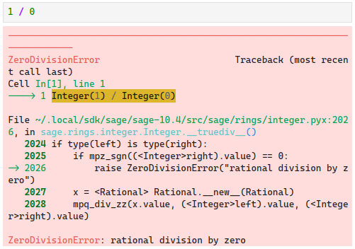

# SageMath 基本运算与函数

<p class="archive-time">archive time: 2024-08-30</p>

<p class="sp-comment">第一篇教程，算是简单开个头</p>

[[toc]]

## 基本运算

> 作为使用 SageMath 的第一个例子，让我们来看看 SageMath 中的基本运算该怎么写

加法使用 `+` 符号来表示

```python
1234 + 5678
# => 6912
```

乘法则使用 `*` 来表示

```python
1234 * 5678
# => 7006652
```

### 知识点

|  运算  |   例子   |
| :----: | :------: |
|  加法  | `2 + 2`  |
|  减法  | `5 - 2`  |
|  乘法  | `2 * 3`  |
|  除法  | `5 / 2`  |
|  乘方  | `3 ^ 2`  |
| 乘方\* | `3 ** 2` |
|  求余  | `10 % 4` |

其中除法默认是精确的，例如：

```python
5 / 2
# => 5/2
```

如果想要获得数值解，可以使用 `N` 或者 `n` 函数

```python
n(5 / 2)
# => 2.50000000000000

N(5 / 2)
# => 2.50000000000000
```

`1 / 0` 会得到一个除零错误：



### 小练习

#### 将数字 $1$，$2$，$3$，$4$，$5$ 加起来

```python
1 + 2 + 3 + 4  + 5
```

```python
add([1, 2, 3, 4, 5])
```

#### 计算 $5$ 的平方

```python
5 ^ 2
```

#### 计算 $3$ 的 $7$ 乘 $8$ 次方

```python
3 ^ (7 * 8)
```

#### 添加括号使 $4 - 2 \times 3 + 4 = 14$ 成立

```python
(4 - 2) * (3 + 4) == 14
```

## 函数

> 对于 `2 + 3 + 4` 这样的一个式子，
> 有一个等价形式 `add([2, 3, 4])`，
> 其中 `add` 被称为一个 **函数**

所有 SageMath 中的函数都使用小括号，并且一般是蛇形格式命名，例如 `find_root`

最大值和最小值分别对应函数 `max` 和 `min`，
而在 `a` 到 `b` 之间的随即整数可以通过 `randint(a, b)` 得到

```python
max([2, 7, 4])
# => 7
```

```python
min([4, 5, 3])
# => 3
```

```python
randint(0, 100)
# => 75
```

### 知识点

|  运算  |   例子   |   函数格式    |
| :----: | :------: | :-----------: |
|  加法  | `2 + 2`  | `add([2, 2])` |
|  减法  | `5 - 2`  |      无       |
|  乘法  | `2 * 3`  | `mul([2, 3])` |
|  除法  | `5 / 2`  |      无       |
|  乘方  | `3 ^ 2`  | `power(3, 2)` |
| 乘方\* | `3 ** 2` |  `pow(3, 2)`  |
|  求余  | `10 % 4` | `mod(10, 4)`  |

并非所有运算都有等价函数形式，例如减法和除法

### 小练习

#### 通过函数计算 $2 \times (3 + 4)$

```python
mul([2, add([3, 4])])
```

#### 将两个在 $20$ 到 $80$ 之间的随即整数相加

```python
add([randint(20, 80),randint(20, 80)])
```

## 后记

SageMath 是基于 Python 的 CAS，所以在语法上基本就是 Python 语法，
所以只要学会 Python 就可以学会 SageMath，或者说学会 SageMath 就可以学会 Python
