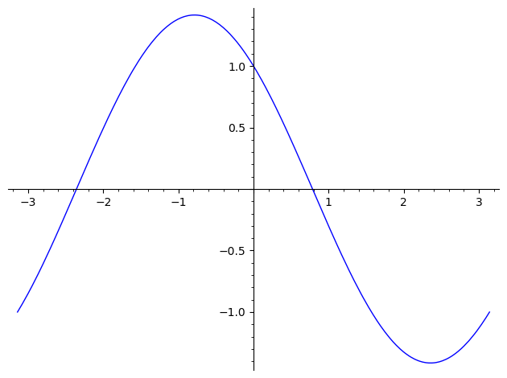

# SageMath 代数初步

<p class="archive-time">archive time: 2024-08-31</p>

<p class="sp-comment">
因为 SageMath 结合了许多工具，
所以计算简单代数还是非常轻松的
</p>

在 SageMath 中，如果想使用符号变量，
例如数学上常见的 $x$，$y$，$z$，$u$ 这些，
可以使用 `var()` 函数定义

```python
x, y, z, u = var("x, y, z, u")
```

其中 `var()` 函数接受一个字符串，字符串内是你想要用的符号变量，
可以用空格或者逗号分隔，返回一个符号变量元组，
分别对应你要的那些变量

如果想要查看已经定义了哪些变量，可以使用 `vars()` 函数

```python
vars()
# => omit
```

> 注意：在 SageMath 10.4 和 10.5.beta2 版本中，
> 第一次使用 `vars()` 会有 `DeprecationWarning`，
> 这是正常现象

## 解方程

### 精确解

如果想要获得一个方程的精确解，可以尝试使用 `solve()` 函数

```python
x = var("x")
solve(x^2 + 3*x + 2 == 0, x)
# => [x == -2, x == -1]
```

`solve()` 函数的第一个参数是要求解的方程，也可以是一个表达式，
默认求解表达式等于 $0$ 的解，即 `expr == 0`

后续参数分别是要求解的符号变量和一些参数，例如 `solution_dict`：

```python
x = var("x")
solve(x^2 + 3*x + 2, x, solution_dict=True)
# => [{x: -2}, {x: -1}]
```

得到的解可以是符号表达式：

```python
x, a, b, c = var("x, a, b, c")
solve(a*x^2 + b*x + c == 0, x)
# =>
# [x == -1/2*(b + sqrt(b^2 - 4*a*c))/a,
#  x == -1/2*(b - sqrt(b^2 - 4*a*c))/a]
```

方程组也可以求解：

```python
x, y, p, q = var("x, y, p, q")
eq1 = p + q == 9
eq2 = p * x + q * y == -6
eq3 = p * x^2 + q*y^2 == 24
solve([eq1, eq2, eq3, p == 1], p, q, x, y, solution_dict=True)
# =>
# [{p: 1, q: 8, x: -4/3*sqrt(10) - 2/3, y: 1/6*sqrt(10) - 2/3},
#  {p: 1, q: 8, x: 4/3*sqrt(10) - 2/3, y: -1/6*sqrt(10) - 2/3}]
```

如果想要数值解，可以使用 列表推导式[^1] 来转换：

```python
x, y, p, q = var("x, y, p, q")
eq1 = p + q == 9
eq2 = p * x + q * y == -6
eq3 = p * x^2 + q*y^2 == 24
solns = solve([eq1, eq2, eq3, p == 1], p, q, x, y, solution_dict=True)
[(
    s[p].n(digits=8),
    s[q].n(digits=8),
    s[x].n(digits=8),
    s[y].n(digits=8)
) for s in solns]
# =>
# [(1.0000000, 8.0000000, -4.8830369, -0.13962039),
#  (1.0000000, 8.0000000, 3.5497035, -1.1937129)]
```

### 数值解

在实际情况下，很多方程实际上是很难求得精确解的，甚至没有精确解，
这个情况下我们就需要考虑求解方程的数值解，例如：

```python
t = var("t")
solve(cos(t) == sin(t), t)
# => [sin(t) == cos(t)]
```

上面这个例子中，`t` 的精确解就无法很好的求出来，
我们可以看看函数的图像：

```python
plot(cos(t) - sin(t), (t, -pi, pi))
```

<div style="text-align: center;">
  
</div>

我们发现在 $(0, 1)$ 和 $(-3, -2)$ 这两个区间内是有解的，
所以我们就可以尝试使用 `find_root()` 函数来求解

```python
t = var("t")
(find_root(cos(t) == sin(t), -3, -1),
 find_root(cos(t) == sin(t), 0, 1))
# => (-2.356194490192345, 0.7853981633974483)
```

只不过要注意，`find_root()` 只能用于求解一元方程，并且只会返回一个解，
参数分别是 **方程**，**下界**，**上界** 以及其他参数，例如 `full_output`

## 微积分

对于函数的微分和积分，SageMath 自然也是不在话下的

一般可以通过 `diff()` 函数求解函数微分

```python
f(x, y) = x^2 + 17*y^2
(diff(f, x), f.diff(y))
# => ((x, y) |--> 2*x, (x, y) |--> 34*y)
```

`diff()` 函数的参数分别是函数本身，要对哪个变量求微分，以及求多少阶微分

```python
t = var("t")
f = cos(t)
diff(f, t, 2)
# => -cos(t)
```

而积分和定积分都是可以通过 `integral()` 函数求解：

```python
(integral(x * sin(x^2), x),
 integral(x / (x^2 + 1), x, 0, 1))
# => (-1/2*cos(x^2), 1/2*log(2))
```

对于常见的函数拆分，可以使用 `partial_fraction()` 函数完成：

```python
(1 / (x^2 - 1)).partial_fraction(x)
# => -1/2/(x + 1) + 1/2/(x - 1)
```

## 求解微分方程

微分方程是在实际科学问题中经常需要求解的问题，
但是往往又很难直接求解，所以就出现了很多求解微分方程的方法，
例如 拉普拉斯变换 和 欧拉法求数值解

在 SageMath 中，对于简单的微分方程，可以通过 `desolve()` 函数求解

```python
t = var("t")
p = function("p")(t)
de = diff(p, t) == (2.35 / 100) * p
desolve(de, [p, t])
# => _C*e^(47/2000*t)
```

因为 `desolve()` 默认情况下是 SageMath 调用 Maxima[^2] 来求解的，
可以求解一阶和二阶常微分方程，包括对 **初始值问题** 和 **边界问题** 两种方程的求解，
所以输出格式和通常的 SageMath 输出不太一样，一般通过 `_C` 表示任意常量

对于 初始值 和 边界，可以通过 `ics` 参数指定，
其中参数的值分别为 `[x0, f(x0)]`，`[x0, f(x0), f'(x0)]` 以及 `[x0, f(x0), x1, f(x1)]` 这三种

我们还可以尝试使用 `desolve_laplace()` 来使用 拉普拉斯变换 求解：

```python
t = var("t")
p = function("p")(t)
de = diff(p, t) == (2.35 / 100) * p
desolve_laplace(de, [p, t])
# => e^(47/2000*t)*p(0)
```

类似的 `desolve_laplace()` 也可以通过 `ics` 来指定初始条件或者边界，
你也可以通过 `laplace()` 和 `inverse_laplace()` 来求解

而欧拉法可以通过 `eulers_method` 或者 `euler_method_2x2` 来计算

基于 PARI/GP[^3]，GAP[^4]，以及 Maxima，
SageMath 中有许多 [**正交多项式**](https://doc.sagemath.org/html/en/reference/functions/sage/functions/orthogonal_polys.html)
以及 [**特殊函数**](https://doc.sagemath.org/html/en/reference/functions/index.html)，例如 **贝塞尔函数** 等等

```python
x = polygen(QQ, "x")
bessel_I(1, 1).n(digits=32)
# => 0.56515910399248502720769602760986
```

但是 SageMath 目前只是包装了这些特殊函数的数值计算接口，
对于符号计算，仍然需要直接调用对应的接口，例如 Maxima：

```python
(maxima.eval("f:bessel_y(v, w)"),
 maxima.eval("diff(f, w)"))
# =>
# ('bessel_y(v,w)',
#  '(bessel_y(v-1,w)-bessel_y(v+1,w))/2')
```

上述代码展示了通过 `maxima` 调用 Maxima，先定义了一个函数 `f` 是 `bessel_y(v, w)`，
然后在这个函数 `f` 上对 `w` 求一阶偏导

有关向量微积分可以参考 [这个教程](https://doc.sagemath.org/html/en/thematic_tutorials/vector_calculus.html)

## 后记

SageMath 作为一个 CAS，有着很好的符号计算和数值计算能力，
同时配合 Jupyter Notebook 和 Jupyter Lab 有了不错的交互界面，
但是在细节方面，以及可用性上，还是有待打磨

---

[^1]:
    列表推导式.Python Docs \[DB/OL\].(2024-08-29)\[2024-08-31\].
    <https://docs.python.org/zh-cn/3/tutorial/datastructures.html#list-comprehensions>

[^2]: Maxima: v5.47 \[CP/OL\].(2023-05-31)\[2024-08-31\].<https://maxima.sourceforge.io/zh/index.html>
[^3]: Pari/GP: v2.15.5 \[CP/OL\].(2024-02-11)\[2024-08-31\].<https://pari.math.u-bordeaux.fr>
[^4]: GAP: v4.13.1 \[CP/OL\].(2024-06-11)\[2024-08-31\].<https://www.gap-system.org>
