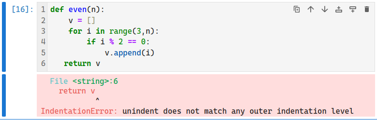

# SageMath 基本语法

<p class="archive-time">archive time: 2024-08-31</p>

<p class="sp-comment">SageMath 就是 Python 的超集</p>

## 函数的定义与使用

在 SageMath 中定义函数与 Python 中是一样的，使用 `def` 关键词，例如：

```python
def self_fib_fun(n):
    def inner_fib(n, a, b):
        if n == 0:
            return a
        elif n == 1:
            return b
        else:
            return inner_fib(n - 1, b, a + b)
    return inner_fib(n, 0, 1)
```

在使用方面，和内置的函数一样，都是使用小括号和可能需要的参数来调用

```python
self_fib_fun(10)
# => 55
```

在定义函数时，函数的参数可以有默认值，
那么有默认值的参数在函数调用时就可以不传递参数，而是使用默认值，例如：

```python
def another_fib_fun(n, a = 0, b = 1):
    if n == 0:
        return a
    elif n == 1:
        return b
    else:
        return another_fib_fun(n - 1, b, a + b)
```

不传递参数的情况：

```python
# a = 0, b = 1
another_fib_fun(10)
# => 55
```

也可以显式传递参数：

```python
# b = 1
another_fib_fun(10, a = 1)
# => 89
```

虽然不推荐，但是也可以根据位置传递参数：

```python
# a = 1, b = 1
another_fib_fun(10, 1)
# => 89

# a = 1, b = 2
another_fib_fun(10, 1, 2)
# => 144
```

类似的，对于所有的参数，都可以使用名称来传递参数值，这样就可以按照自己想要的顺序传递参数，例如：

```python
another_fib_fun(a = 1, n = 10, b = 2)
# => 144
```

## 作用域

在 SageMath 和 Python 中，作用域是通过缩进来区分的，
所以每个缩进的大小都应该要一致，一般是 $4$ 个空格

如果缩进不一致，则会出现 **IndentationError**：



图中可能不明显，错误之处在于 `return v` 一行的缩进是 $3$ 个空格，
而其他地方使用的都是 $4$ 个空格，缩进不匹配，导致解释器不知道具体的层级

## 流程控制

一般来说，控制流有三种，分别是 **顺序执行**，**分支执行** 和 **循环执行**

默认情况下，SageMath 和 Python 都是自上而下执行的，也就是所谓的顺序执行，
但是我们有办法让执行顺序改变，也就是所谓的流程控制

例如在之前的 `self_fib_fun` 中看到的 `if ... elif ... else ...` 就是分支执行

这种分支执行顺序是通过某种条件来判断状态，进而选择一条分支来执行，其他的分支就被放弃

```python
a = 10

# 分支执行
if a == 1:
    print("a is ONE")
elif a == 2:
    print("a is TWO")
elif a == 3:
    print("a is THREE")
else:
    print(f"a is {a}")
# => a is 10
```

而循环执行则是通过 `while ...` 和 `for ... in ...` 的形式来完成的

```python
for i in range(5):
    print(i, end=" ")
else:
    print()

a = 10
while a > 0:
    print(a, end=" ")
    a = a - 1
else:
    print()

# =>
# 0 1 2 3 4
# 10 9 8 7 6 5 4 3 2 1
```

在循环执行中还可以通过 `break` 或者 `continue` 来中断或者跳过某次循环，
而循环执行中的 `else` 是在循环正常结束的时候执行的内容：

```python
for i in range(10):
    print(f"ok for {i}")
    if i == 2:
        break
else:
    print("finished")
# =>
# ok for 0
# ok for 1
# ok for 2
```

上述代码中，由于循环是通过 `break` 结束的，所以并不会输出 `finished`

# 可迭代对象

在 `for ... in ...` 循环中，`in` 后面的对象被称为 **可迭代对象（Iterable）**

在 SageMath 和 Python 中，最常见也是最实用的可迭代对象就是 **列表（List）**

通常情况下，可以通过 `list()` 函数来将可迭代对象变成一个列表，例如：

```python
list(range(1, 15, 2))
# => [1, 3, 5, 7, 9, 11, 13]
```

并且列表中的元素的类型不固定，可以是任意类型的对象，并且列表的索引是从 $0$ 开始的

```python
x = var("x")
# 定义并初始化一个列表
v = [1, "hello", 2/3, sin(x^3)]
# 通过索引获取列表中的值
bool((v[3]).subs(x = 3) == sin(27))
# => True
```

> 可以通过 `bool()` 函数判断两个表达式是否相等

对于列表，常用的函数有 `len()`，`append()`，以及 `del` 操作符

除了列表，字典，或者说关联列表，也是常用的一种可迭代对象

```python
d = {
    "hi": "hello",
    pi: e
}

d["hi"] == "hello"
# => True
```

字典的每个元素都可以看成是一个键值对，
其中 **键** 是用于索引的元素，**值** 是每个键对应的元素，
元素的类型对是不固定的，但是作为 **键** 的元素一定要是 **不变的**

```python
bool(d[pi] == e)
# => True
```

## 自定义可迭代对象

除了自带的一些可迭代对象和类型，SageMath 和 Python 还给了我们自定义类型的能力：

```python
class Odds(list):
    def __init__(self, n):
        self.n = n
        list.__init__(self, range(1, n+1, 2))
    def __repr__(self):
        return f"odds positive numbers up to {self.n}."

odd7 = Odds(7)
odd7
# => odds positive numbers up to 7.
```

这里，我们定义了一个类型 `Odds`，其中 `Odds` 是基于 `list` 类型的，
这在 Python 中称为继承关系，`list` 是 `Odds` 的父类，
`Odds` 是 `list` 的子类

类似的，我们也可以使用 `list()` 函数将 `Odds` 转变为一个列表

```python
list(odd7)
# => [1, 3, 5, 7]
```

对于 `odd7`，我们也可以进行索引和迭代：

```python
odd7[2]
# => 5
```

## 后记

SageMath 和 Python 语法几乎一模一样，仅有一些细节上有区别，
这既是好事，降低了使用者的学习门槛，也方便已经熟悉 Python 语法的人使用 SageMath，
也是坏事，因为 Python 的与 JavaScript 类似的动态类型，让 Python 变得不再可靠，
如果出现错误，除了需要花时间排查逻辑上的问题，还需要花时间去检查语法问题
