# SageMath 基本作图

<p class="archive-time">archive time: 2024-09-01</p>

<p class="sp-comment">某种意义上说，SageMath 的作图功能比 Wolfram 要好用很多</p>

> 数缺形时少直观，形少数时难入微。形数结合百般好，隔离分家万事休。
>
> **华罗庚**

数形结合，这个是我们从小学开始就在培养的一种能力，或者说一种素养

通过数字，我们可以理性去分析问题，通过图形几何，我们可以直观去判断问题

所以适时地看一下图像作为辅助也是非常重要的

# 二维作图

就支持的画图种类来说，SageMath 还是很全面的，
包括常见的直角坐标和极坐标，以及可以用来画曲线的轮廓图

特殊的还可以画基本图形，以及向量图和流图，一些详细的例子可以参考 [这个文档](https://doc.sagemath.org/html/en/constructions/plotting.html)

## 基本图形

下面是 SageMath 在坐标原点画一个半径为 1 的绿色圆形的例子：

```python
c = circle((0, 0), 1, rgbcolor=(0, 1, 0))
c.show()
```

<div style="text-align: center;">
  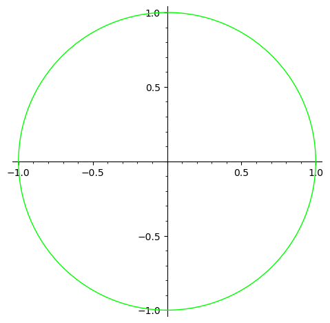
</div>

通过 `rgbcolor`，可以简单控制边缘线条以及内部填充的颜色，
如果要控制边缘和填充颜色不同，那么可以使用 `edgecolor` 和 `facecolor` 控制

下面是一个填充的例子，边缘颜色是绿色，填充红色，半透明：

<div style="text-align: center;">
  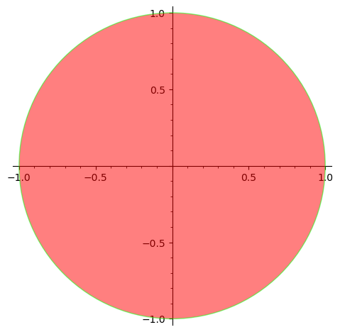
</div>

默认的 `edgecolor` 和 `facecolor` 都是蓝色，更加具体的可以参考 `?circle`

如果想要在非 Jupyter 环境画出图像，可以使用 `show()` 函数，
并且在 `show()` 函数中可以使用 `aspect_ratio` 参数来控制长宽比，
如果要保存图像，可以使用 `save()` 函数

```python
c.show(aspect_ratio=0.5)
c.save("assets/day04-circle-example.png")
```

<div style="text-align: center;">
  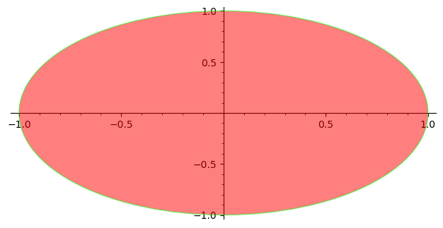
</div>

### 函数作图

对于函数作图，通常可以使用 `plot()` 函数来完成：

```python
x = var("x")
plot(x^2, (x, -1, 1))
```

<div style="text-align: center;">
  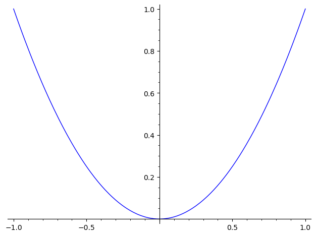
</div>

特别的，对于一元函数，`plot()` 可以不指定符号变量，并且可以避免意外求值问题[^1]：

```python
plot([cos, sin], (-pi, pi), fill=True)
```

<div style="text-align: center;">
  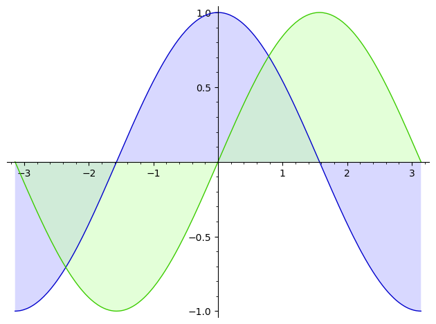
</div>

特别的，对于参数函数，可以使用 `parametric_plot()` 作图：

```python
x = var("x")
parametric_plot((cos(x), sin(x)), (x, -pi, pi),
    color=hue(0.6))
```

<div style="text-align: center;">
  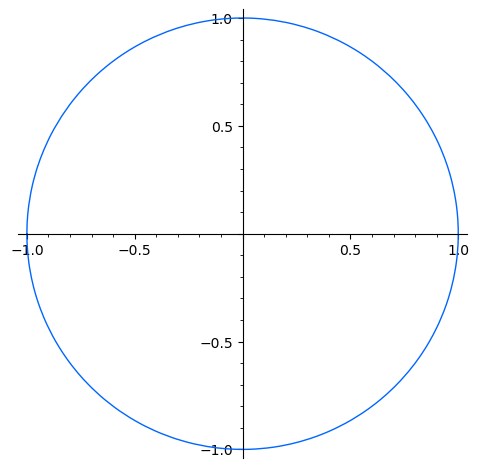
</div>

对于多个图像，可以使用 `+` 将其拼接成一个图像，并且可以通过 `show()` 或者 `save()` 等函数进行进一步操作：

```python
x = var('x')
p1 = parametric_plot(
    (cos(x), sin(x)),
    (x, 0, 2*pi), color=(79/255, 23/255, 135/255))
p2 = parametric_plot(
    (cos(x), sin(x)^2),
    (x, 0, 2*pi), color=(119/255, 176/255, 170/255))
p3 = parametric_plot(
    (cos(x), sin(x)^3),
    (x, 0, 2*pi), color=(251/255, 119/255, 60/255))
show(p1 + p2 + p3, axes=false)
```

<div style="text-align: center;">
  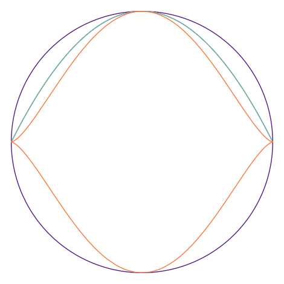
</div>

如果想要画出一个特定形状的填充图形，一个比较好的方法就是使用足够多的端点来作出一个多边形，然后指定填充颜色

并且如果还想要在图像上添加文字，也可以用拼接的方式完成，而文字本身可以使用 `text()` 函数画出，
其中第一个参数是文字内容，第二个参数是文字的中心位置的坐标，还有一些参数，可以参考 `?text`

```python
v = [(1, 1), (1/2, 0),
     (1, -1), (0, -1/2),
     (-1, -1), (-1/2, 0),
     (-1, 1), (0, 1/2)]
p = polygon(v, edgecolor=(240/255, 90/255, 126/255),
        rgbcolor=(209/255, 233/255, 246/255), alpha=0.5)

t = text("Polygon Fill",
    (0, 0.8),
    fontsize=16,
    fontstyle="italic",
    fontweight="semibold",
    rgbcolor=(18/255, 91/255, 154/255))
show(p + t, axes=False)
```

<div style="text-align: center;">
  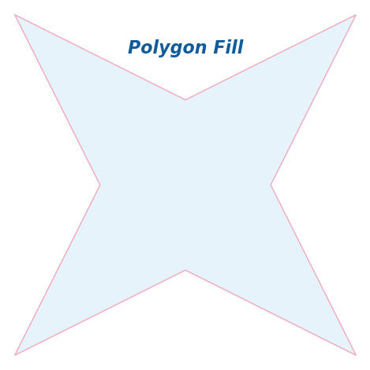
</div>

如果想要类似反函数的效果，可以尝试使用 `line()` 函数配合列表推导式来完成：

```python
v = [(sin(x), x) for x in srange(-float(pi/2), float(pi/2), 0.1)]
show(line(v), aspect_ratio=1)
```

<div style="text-align: center;">
  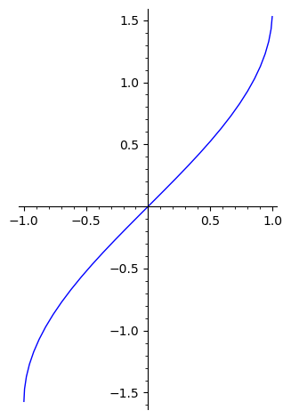
</div>

有时候画出来的图比较长或者比较高，导致一些细节不能很好体现，
可以使用 `show()` 函数的 `[xy]min` 和 `[xy]min` 这两组参数来调整作图的范围：

```python
v = [(tan(x), x) for x in srange(float(-pi), float(pi/2), 0.01)]
show(line(v), xmin=-20, xmax=20)
```

<div style="text-align: center;">
  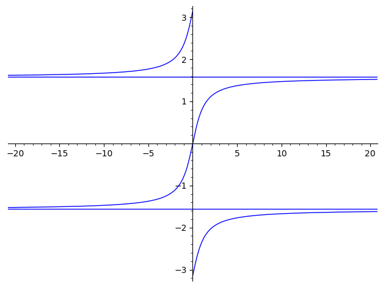
</div>

其他的作图可以在 [这个文档](https://doc.sagemath.org/html/en/reference/plotting/sage/plot/plot.html) 中找到，
下面是一个轮廓图的例子，可以通过 `contour_plot()` 函数画出，
其中 `contours` 参数可以理解为你要画的方程的值，或者说哪一条等高线：

```python
x, y = var("x, y")
f(x, y) = x^2 / 2 + y^2
contour_plot(f(x, y), (x, -4, 4), (y, -2, 2), contours=[1, 4], fill=False)
```

<div style="text-align: center;">
  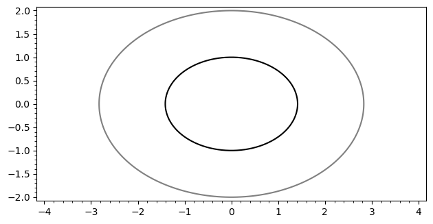
</div>

在 Wolfram 文档中有这样一个例子：

```mathematica
f[n_, x_] :=
 Abs[((1/Pi)^(1/4) HermiteH[n, x])/(E^(x^2/2) Sqrt[2^n n!])]^2
Plot[Evaluate@
    Append[Table[f[n, x] + n + 1/2, {n, 0, 7}], x^2/2], {x, -4, 4},
 Filling -> Table[n -> n - 1/2, {n, 1, 8}]]
```

我们也可以用 SageMath 复现出来：

```python
x = polygen(QQ, "x")
f(n, x) = abs(((1/pi)^(1/4) * hermite(n, x)) / (e^(x^2 / 2) * sqrt(2^n * factorial(n))))^2

fns = [f(n, x) + n + 1/2 for n in range(0, 8)]
fns.append(x^2 / 2)

plot(fns, (x, -4, 4), fill=[n - 1/2 for n in range(1, 9)])
```

<div style="text-align: center;">
  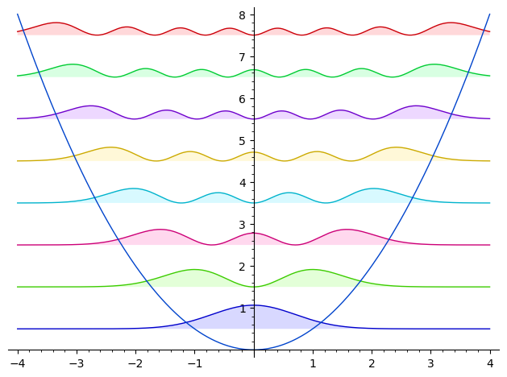
</div>

## 三维作图

上述是最常见的二维作图的例子，但是有些情况下我们还需要三维作图，怎么办呢？

### 函数作图

默认情况下，SageMath 的三维作图是依赖 ThreeJS[^2] 的，
在 Jupyter 上可以进行交互，例如缩放和旋转，并且实际绘图效果要比 Wolfram 还要好一点

```python
x, y = var("x, y")
plot3d(x^2 + y^2, (x,-1, 1), (y,-1, 1), mesh=True)
```

<div style="text-align: center;">
  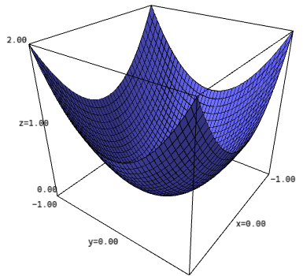
</div>

至于其他的比如参数作图，隐式作图也有对应的三维版本，参数可以通过 `?plot3d` 查看

```python
u, v = var("u, v")
fx = (3 + sin(v) + cos(u)) * cos(2*v)
fy = (3 + sin(v) + cos(u)) * sin(2*v)
fz = sin(u) + 2 * cos(v)
parametric_plot3d([fx, fy, fz],
    (u, 0, 2*pi), (v, 0, 2*pi),
    frame=False, color="red")
```

<div style="text-align: center;">
  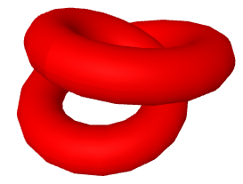
</div>

# 后记

SageMath 的绘图功能由于 matplotlib 以及 ThreeJS 等技术的成熟发展，
加上还有 R 的 ggplot2 这些前辈的努力，如今也是非常强大了，比起一些专业软件也是不相上下，
就是一些细节和默认参数并不是非常好用，需要用户自己调整

[^1]: 可以参考 [这个教程](https://doc.sagemath.org/html/en/tutorial/tour_functions.html)
[^2]: ThreeJS: r168 \[CP/OL\].(2024-08-30)\[2024-09-1\].<https://threejs.org>
