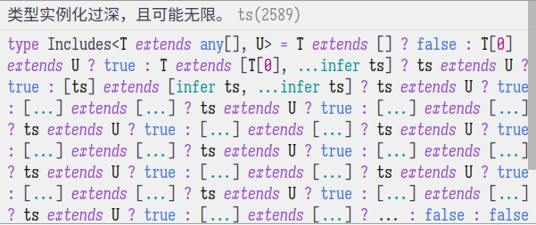

# TypeScript 类型体操 02

<p class="archive-time">archive time: 2023-04-28</p>

<p class="sp-comment">今天继续尝试写一下类型体操</p>

[[toc]]

## Exclude (43) {Easy}

### Question

> Implement the built-in Exclude<T, U>
>
> > Exclude from T those types that are assignable to U
>
> For example:
>
> ```typescript
> type Result = MyExclude<"a" | "b" | "c", "a">; // 'b' | 'c'
> ```

### Answer

我们在文档的 [Conditional Types](https://www.typescriptlang.org/docs/handbook/2/conditional-types.html) 一文中就可以看到答案

我们可以使用 `extends` 关键词来判断一个类型是否符合某些条件，以此来作为 _筛选_

```typescript
type MyExclude<T, U> = T extends U ? never : T;
```

这个就是我的答案，即使用 `extends` 来作为一个 _相等_ 的判断，
如果符合 `U` 这个类型，那么就为 `never`，即删掉这个选项，否则就原样不动

## Awaited (189) {Easy}

### Question

> If we have a type which is wrapped type like Promise.
> How we can get a type which is inside the wrapped type?
>
> For example: if we have `Promise<ExampleType>` how to get ExampleType?
>
> ```typescript
> type ExampleType = Promise<string>;
> type Result = MyAwaited<ExampleType>; // string
> ```

### Answer

在 TypeScript 里，我们可以使用 `infer` 关键词来自动 _填_ 上一个类型

即做到类似模式匹配的效果，所以我们可以使用如下方法得到 `Promise` 中的类型

```typescript
type MyAwaited<T> = T extends PromiseLike<infer U> ? U : T;
```

由于没有说对于非 `Promise` 类型该如何处理，我这里就返回了原类型

## If (268) {Easy}

### Question

> Implement the util type `If<C, T, F>`
> which accepts condition `C`, a truthy value `T`, and a falsy value `F`.
> `C` is expected to be either `true` or `false`
> while `T` and `F` can be any type.
>
> ```typescript
> type A = If<true, "a", "b">; // expected to be 'a'
> type B = If<false, "a", "b">; // expected to be 'b'
> ```

### Answer

由于这里 `C` 只能是 `true` 或者 `false`，所以我们可以简单的使用

```typescript
C extends boolean
```

来作为约束，即

```typescript
type If<C extends boolean, T, F> = C extends true ? T : F;
```

## Concat (533) {Easy}

### Question

> Implement the JavaScript `Array.concat` function in the type system.
> A type takes the two arguments.
> The output should be a new array that includes inputs in ltr order
>
> ```typescript
> type Result = Concat<[1], [2]>; // expected to be [1, 2]
> ```

### Answer

> 在看了答案后感觉醍醐灌顶

TypeScript 里可以使用 `...T` 的方式来解构一个数组，类似于其他语言的元组

这种特性同样可以作用在类型上，所以

```typescript
type Concat<T extends any[], U extends any[]> = [...T, ...U];
```

## Includes (898) {Easy}

### Question

> Implement the JavaScript `Array.includes` function in the type system.
> A type takes the two arguments. The output should be a boolean true or false.
>
> ```typescript
> type isPillarMen = Includes<["Kars", "Esidisi", "Wamuu", "Santana"], "Dio">; // expected to be `false`
> ```

### Answer

我原本想要尝试递归寻找，但是得到了 **_类型实例化过深，且可能无限_** 的错误



在看了答案之后大彻大悟，也来还可以先构造一个对象，
然后以类型作为一个键来搜索，搜到了对应值那就是存在的，
否则不存在，即

```typescript
type Includes<T extends any[], U> = {
  [t in T[number]]: true;
}[U] extends true
  ? true
  : false;
```

## Push (3057) {Easy}

### Question

> Implement the generic version of `Array.push`
>
> For example:
>
> ```typescript
> type Result = Push<[1, 2], "3">; // [1, 2, '3']
> ```

### Answer

我这里的做法是直接将第一个类型解构，然后在组合形成一个新的数组

```typescript
type Push<T extends any[], U> = [...T, U];
```

## Unshift (3060) {Easy}

### Question

> Implement the type version of `Array.unshift`
>
> For example:
>
> ```typescript
> type Result = Unshift<[1, 2], 0>; // [0, 1, 2,]
> ```

### Answer

这道题和上面那题是一样的，不过一个是添加到后面，一个是放到前面

```typescript
type Unshift<T extends any[], U> = [U, ...T];
```

## Parameters (3312) {Easy}

### Question

> Implement the built-in Parameters generic without using it.
>
> For example:
>
> ```typescript
> const foo = (arg1: string, arg2: number): void => {};
>
> type FunctionParamsType = MyParameters<typeof foo>;
> // [arg1: string, arg2: number]
> ```

### Answer

我这属于是从官方那里抄了答案

```typescript
type MyParameters<T> = T extends (...args: infer P) => any ? P : never;
```

重点在于对于函数类型，如何去匹配，或者说推断（infer）类型，
函数的参数可以使用 `(...args: infer P)` 的形式来表示

我一开始卡在了参数的表示上，没想到 TypeScript 的参数类型是包含参数的名称的，
一直试图把整个参数作为类型，而没有想到使用参数的类型作为类型，感觉要长脑子了

---

今天算是把 Easy 部分的内容写完了，不过即便是 Easy，我大部分题目还是无法独立完成，
主要还是对于 TypeScript 本身的语法不了解，嗐
